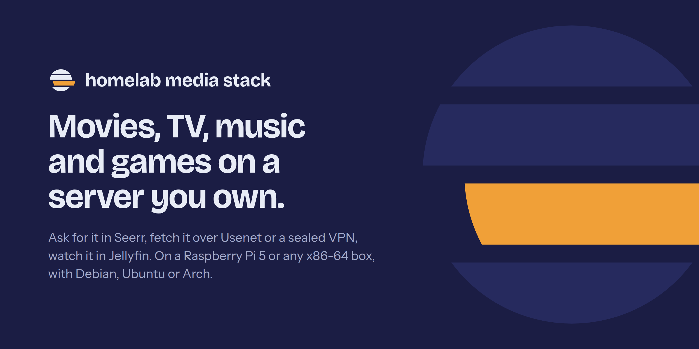
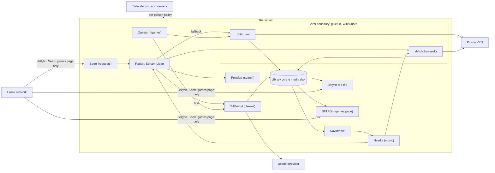

  

  
  
  
  
  

# homelab-media-stack

A media server for movies, TV, music and games, managed as code. You ask for a title in
Seerr and it downloads by itself: from Usenet first, and from torrents as a fallback, with
every peer-to-peer connection locked inside a WireGuard VPN. You watch in Jellyfin on a TV,
phone or browser, listen in Needle, and copy finished games to a PC from a read-only
download page. The home network reaches only Jellyfin, Seerr and the games page; everything
else is reachable over Tailscale alone, enforced by a host firewall, and nothing is
published to the internet. It runs on a Raspberry Pi 5 or any x86-64 machine with Docker
Compose, and updates, backups and health checks run on timers.

## Features

- **Requests that fetch themselves.** Seerr passes a request to Radarr or Sonarr, Prowlarr
  searches your indexers, SABnzbd (Usenet) is tried first and qBittorrent second, and Bazarr
  adds subtitles.
- **P2P stays in the VPN.** qBittorrent and slskd live inside gluetun's network namespace, so
  they have no route out except the WireGuard tunnel. Proton's forwarded port is synced into
  qBittorrent automatically, and a leak test proves the exit.
- **One copy on disk.** Downloads and the library share one filesystem, so imports are
  hardlinks: a title keeps seeding and still costs its size once.
- **Direct play first.** Quality profiles aim at 1080p files your players decode themselves,
  with sidecar subtitles. Intel and AMD graphics can add hardware transcoding.
- **Music and games as modules.** Lidarr, slskd, Navidrome and the Needle player for music;
  Questarr and a read-only SFTPGo download page for games.
- **Locked-down access.** A host firewall (IPv4 and IPv6, including Docker's published
  ports) gives the home network three apps; Tailscale gives you everything and viewers only
  what the policy lists. SSH is keys only, tailnet only.
- **Safe updates.** A daily check pushes a notice to your phone; one command snapshots the
  settings, updates, runs the health check and can roll back image and settings together.
- **Backups and monitoring.** Nightly encrypted restic backups of every setting (two copies,
  plus an optional offsite one), a health check every 6 hours, Uptime Kuma alerts through
  ntfy, Prometheus and Grafana, SMART history in Scrutiny, and live logs in Dozzle.
- **A drive you can switch off.** The stack follows a hand-switched USB disk: it starts when
  the disk mounts and stops when it goes, and never writes media to the system disk.
- **AI agent skills.** A plugin for Claude Code, Codex and pi that checks health, the VPN,
  the drive and the logs, and runs updates, backups and power changes with your approval.

## Platforms

| | Debian | Ubuntu | Arch |
|---|---|---|---|
| **arm64** (Raspberry Pi 5) | Tested (Raspberry Pi OS) | Supported | Supported |
| **amd64** (x86-64) | Supported | Supported | Supported |

"Tested" is the setup this stack runs on every day. "Supported" means `scripts/install-host`
knows the distribution's package names and the scripts avoid distribution-specific tools,
but nobody runs that combination day to day. Reports are welcome.

## Modules

The core always runs. Each module is a Compose profile you switch on with
`COMPOSE_PROFILES` in `.env` (`*` means all of them, the default).

| Module | Profile | Services |
|---|---|---|
| Core | always on | gluetun, qBittorrent, SABnzbd, Prowlarr, Radarr, Sonarr, Bazarr, Seerr, Jellyfin, Recyclarr, Byparr, Cleanuparr, socket-proxy |
| Music | `music` | Lidarr, slskd, Navidrome, Needle |
| Games | `games` | Questarr, SFTPGo |
| Monitoring | `monitoring` | Prometheus, Grafana, node-exporter, Scraparr, Uptime Kuma, Scrutiny, Dozzle |
| Stats | `stats` | Jellystat (with its Postgres), JellyDash |
| Dashboards | `dashboards` | Homepage, Glance, ChangeDetection.io |
| Plex | `plex` | Plex |

Every service, its port and who can reach it are in the
[services table](docs/architecture.md#services).

## Quick start

1. **Install the prerequisites:** Docker with Compose, Tailscale, restic and a few tools, and
   give your account passwordless sudo and the docker group.
   ([Prerequisites](docs/getting-started.md#install-the-prerequisites))
2. **Clone and configure:** clone this repository to `~/arr-stack`, copy `.env.example` to
   `.env`, fill it in and pick your modules.
   ([Configure .env](docs/getting-started.md#fill-in-env))
3. **Prepare storage and the VPN:** mount the media disk at `STORAGE_MOUNT`, create the data
   folders, and install a Proton WireGuard configuration.
   ([Storage](docs/getting-started.md#prepare-the-media-disk), [VPN](docs/getting-started.md#set-up-the-vpn))
4. **Install the host side:** run `scripts/install-host`, then enable the systemd units.
   ([Install the host side](docs/getting-started.md#install-the-host-side))
5. **Configure the apps and check:** run the configure scripts in order, then
   `scripts/health-check`. ([Configure the apps](docs/getting-started.md#configure-the-apps))

The full walkthrough is [Getting started](docs/getting-started.md).

## What to open

Use the server's Tailscale address, at home too. `<tailscale-ip>` is `TAILSCALE_IP` in `.env`;
logins are in `.env` as well.

| I want to | Open |
|---|---|
| Request a movie or show | Seerr, `http://<tailscale-ip>:5055` |
| Watch something | Jellyfin, `http://<tailscale-ip>:8096` |
| Listen to music | Needle, `https://<host>.<tailnet>.ts.net:4535` |
| Track and grab a game | Questarr, `http://<tailscale-ip>:5000` |
| Copy a finished game to a PC | Game downloads (SFTPGo), `http://<tailscale-ip>:8090`, or SFTP on port 2022 |
| See everything at a glance | Homepage, `http://<tailscale-ip>:3000` |
| A browser start page | Glance, `http://<tailscale-ip>:3005` |
| See what is playing, watch history | JellyDash, `http://<tailscale-ip>:3004` |
| Know when something is down | Uptime Kuma, `http://<tailscale-ip>:3003/status/stack` |
| Read a container's logs | Dozzle, `http://<tailscale-ip>:8888` |
| Watch a web page for changes | ChangeDetection.io, `http://<tailscale-ip>:3007` |
| Check that everything is healthy | `~/arr-stack/scripts/health-check` |
| Power the media drive off safely | `~/arr-stack/scripts/storage-off` |
| Give family or a friend access | [Viewers](docs/flows/viewers.md) |

From the home network without Tailscale, only Jellyfin (`http://<lan-ip>:8096`), Seerr
(`:5055`) and the games page (`:8090`) answer.

## Documentation

| Page | What it covers |
|---|---|
| [Docs home](docs/index.md) | Where to start |
| [Getting started](docs/getting-started.md) | Install on Debian, Ubuntu or Arch, arm64 or amd64: `.env`, modules, VPN, `install-host`, configure order |
| [Architecture](docs/architecture.md) | System context, containers and networks, the VPN boundary, storage layout, services table, design decisions |
| [Security](docs/security.md) | Threat model, access matrix, firewall, SSH, secrets, supply chain |
| **How it works** | |
| [Media requests](docs/flows/media-requests.md) | Request, search, download (Usenet first), import, subtitles, play |
| [Music](docs/flows/music.md) | Albums through Lidarr, single songs through slskd |
| [Games](docs/flows/games.md) | Questarr, Prowlarr, the downloaders and SFTPGo |
| [VPN and ports](docs/flows/vpn-and-ports.md) | gluetun, WireGuard, port forwarding, recovery, the leak test |
| [Storage and boot](docs/flows/storage-and-boot.md) | Drive power on and off, boot order, timers |
| [Updates](docs/flows/updates.md) | Check, notify, update with a snapshot, roll back |
| [Backups](docs/flows/backups.md) | restic, the two repositories, offsite, every restore path |
| [Monitoring](docs/flows/monitoring.md) | Prometheus, Grafana, Uptime Kuma, health checks, alerts |
| [Viewers](docs/flows/viewers.md) | Giving someone access: Tailscale invite, policy, accounts |
| [AI agent](docs/flows/ai-agent.md) | The always-on Telegram agent and the skills |
| **Using it** | |
| [Requesting](docs/using/requesting.md) | Asking for movies and shows in Seerr |
| [Watching](docs/using/watching.md) | Players, Jellyfin's look and plugins, watching away from home, Plex |
| [Music](docs/using/music.md) | Needle and Navidrome for listeners |
| [Games](docs/using/games.md) | Questarr and the games download page |
| [Dashboards](docs/using/dashboards.md) | Homepage, Glance, Grafana, Jellystat, JellyDash, Dozzle, Scrutiny, Uptime Kuma, ChangeDetection.io |
| **Running it** | |
| [Maintenance](docs/operations/maintenance.md) | Updates, Cleanuparr, drive care, common chores |
| [Indexers](docs/operations/indexers.md) | Prowlarr, Byparr, adding indexers, Usenet |
| [Terminal](docs/operations/terminal.md) | Aliases and terminal tools |
| [Host changes](docs/operations/host.md) | Every change made to the host and how to re-apply it |
| [Releasing](docs/operations/releasing.md) | How this repository is released |
| **Reference** | |
| [Scripts](docs/reference/scripts.md) | Every script: purpose, how it runs, root, state, idempotence |
| [systemd](docs/reference/systemd.md) | Every unit, timer and udev rule, with a boot timeline |
| [Configuration](docs/reference/configuration.md) | Every `.env` key and every Compose profile |
| [Troubleshooting](docs/troubleshooting.md) | How to diagnose, and an index of known issues |

## AI agents

`ai/homelab-plugin/` is a skills plugin that lets an AI coding agent operate the stack.
[`AGENTS.md`](AGENTS.md) is the guide every agent reads first (`CLAUDE.md` imports it): the
layout, the safety rules and what needs your approval.

| Skill | Use |
|---|---|
| `stack-health` | Is everything OK? (read-only diagnosis first) |
| `vpn-check` | Is P2P traffic confined to the VPN? (read-only) |
| `drive-health` | SMART status and temperature of the media drive (read-only) |
| `stack-logs` | Diagnose a service, with a list of solved problems |
| `stack-update` | Check, apply and roll back image updates (asks first) |
| `stack-backup` | Backup status, back up now, restore settings (restore asks first) |
| `stack-power` | Stop the stack or unmount the drive, and start it again (asks first) |

Start with read-only diagnosis: the full `stack-health` run writes a test file on the drive
and starts throwaway containers, so keep it for validation you have approved.

**Inside this repository** there is nothing to install: the skills are linked into
`.claude/skills` and `.agents/skills`. **Everywhere else:**

| Tool | Install | Update |
|---|---|---|
| Claude Code | `/plugin marketplace add bugrauluyurt/homelab-media-stack` (or a local path), then `/plugin install homelab@homelab-media-stack` | `/plugin marketplace update homelab-media-stack` |
| Codex | `codex plugin marketplace add bugrauluyurt/homelab-media-stack`, then install it from `/plugins` | `codex plugin marketplace upgrade` |
| pi | `pi install ~/arr-stack/ai/homelab-plugin` | Follows the folder: `git pull`, then `/reload` |

Ask in plain words ("is everything healthy?") or call a skill by name:
`/homelab:stack-health` in Claude Code, `$stack-health` in Codex, `/skill:stack-health` in pi.
For an agent you can message from your phone without a terminal open, see
[AI agent](docs/flows/ai-agent.md).

## Security

- The home network is treated as untrusted: it reaches Jellyfin, Seerr and the games page,
  each with its own login, and nothing else. SSH and every other app answer only on the
  tailnet.
- The server and its containers cannot open connections to other home devices or to your
  tailnet devices, so a compromised container cannot pivot.
- Torrents and Soulseek fail closed: if the tunnel drops, they have no route out.
- Secrets live in a `chmod 600` `.env` and app settings live outside the repository; a
  pre-commit hook blocks common key formats.

The threat model and every control are in [Security](docs/security.md). To report a
vulnerability, see [SECURITY.md](SECURITY.md).

## License

MIT. See [LICENSE](LICENSE).
