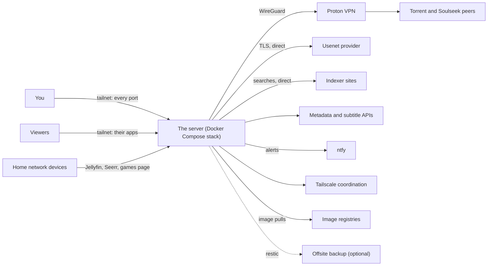
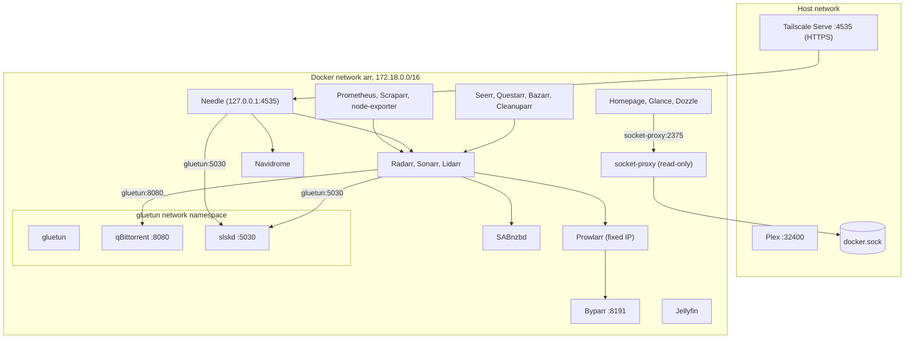
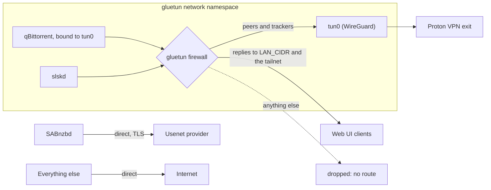
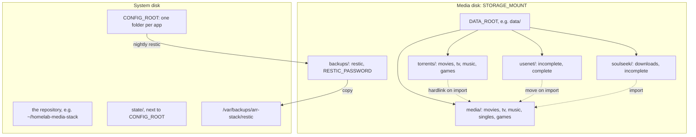

# Architecture

This page explains how the stack fits together: what talks to what, which network each
container lives on, where the VPN boundary runs, where data lives, and why it is built this
way. It is for anyone who wants to understand the stack before changing it. The step-by-step
stories (a request, a download, a boot) are in the flow pages linked below.

## System context

The server runs one Docker Compose project. People reach it through Tailscale or, for three
apps, the home network. It reaches out to the internet for downloads, searches and metadata,
and only peer-to-peer traffic goes through the VPN.

| Outside system | Used by | Through the VPN? |
|---|---|---|
| Torrent and Soulseek peers, trackers | qBittorrent, slskd | Yes, always |
| Usenet provider | SABnzbd | No, TLS and download only ([why](#usenet-outside-the-vpn)) |
| Indexer sites | Prowlarr, Byparr | No |
| Metadata and subtitles (TMDB, IGDB, subtitle sites) | Radarr, Sonarr, Lidarr, Jellyfin, Bazarr, Questarr | No |
| ntfy | the scripts, Uptime Kuma, the arr apps, JellyDash | No |
| Tailscale | the host's `tailscaled` | No |

## Containers and networks

Almost every container sits on one Docker bridge network, `arr` (`172.18.0.0/16`), and
reaches the others by name (`http://radarr:7878`). Four things differ: the VPN pair lives
inside gluetun's network namespace, Plex uses the host's network, Needle is published only
on the loopback address for Tailscale Serve, and nothing but socket-proxy touches the Docker
socket.

- **gluetun's namespace.** qBittorrent and slskd use `network_mode: "service:gluetun"`: they
  have no network of their own. Other containers reach them at `gluetun:8080` and
  `gluetun:5030`, and gluetun publishes those two ports for you. See
  [The VPN boundary](#the-vpn-boundary).
- **Prowlarr's fixed address** (`PROWLARR_IP`, default `172.18.0.200`). Questarr trusts
  Prowlarr's download links only when their host matches the indexer URL it was given, and
  Prowlarr writes the address it was called on into those links. Questarr connects by IP, so
  that IP must never change.
- **Plex on the host network** (`network_mode: host`), so its port 32400 is the host's own.
  Uptime Kuma reaches it at `host.docker.internal`.
- **Needle** publishes `127.0.0.1:4535` only. Tailscale Serve takes port 4535 on the tailnet
  addresses and serves it over HTTPS with a Tailscale certificate, so HTTPS is the only way
  in. Offline downloads, the iPhone home-screen app and Spotify need that HTTPS address.
- **socket-proxy** is the only container with the Docker socket. Homepage, Glance and Dozzle
  read container state through it ([why](#socket-proxy-instead-of-the-docker-socket)).
- **Docker only.** Byparr (`byparr:8191`), Scraparr (`scraparr:7100`), node-exporter
  (`node-exporter:9100`), jellystat-db, socket-proxy (`socket-proxy:2375`) and gluetun's
  control server (port 8000) publish nothing. The control server opens exactly one route
  without credentials, `GET /v1/portforward`, so Uptime Kuma can alert on a lost forwarded
  port.

## The VPN boundary

The boundary is a network namespace, not a setting inside each app. gluetun owns the
namespace, brings up the WireGuard tunnel (`tun0`) and runs a firewall that lets traffic
leave only through the tunnel. The one exception is replies to `LAN_CIDR` and the tailnet
(`100.64.0.0/10`, gluetun's `FIREWALL_OUTBOUND_SUBNETS`), so the web UIs answer you.

- **Fail closed.** If the tunnel drops, qBittorrent and slskd have no route out, and IPv6 is
  off in the namespace, so nothing leaks over it either. qBittorrent is also bound to the
  tunnel interface itself.
- **One forwarded port.** Proton forwards a single port. gluetun pushes it into qBittorrent
  whenever it changes, and `sync-port` reconciles it every 15 minutes.
- **Outside the boundary:** the host, Tailscale, SABnzbd, the arr apps, Prowlarr (so indexer
  searches go out directly), Jellyfin and Plex. Your own streams stay direct and fast.

Every gluetun setting and its reason, the recovery when Proton stops giving a port, and the
leak test are in [VPN and ports](flows/vpn-and-ports.md).

## Storage layout

Two places hold data. The media disk, mounted at `STORAGE_MOUNT`, holds downloads, the
library and the backup repository. The system disk holds the OS, Docker, the repository and
every app's settings, so the stack's state survives the media disk being switched off.

| Path | Holds |
|---|---|
| `DATA_ROOT/torrents/` | qBittorrent's downloads, which keep seeding after import |
| `DATA_ROOT/usenet/` | SABnzbd's downloads, moved into the library when complete |
| `DATA_ROOT/soulseek/` | slskd's downloads, imported by Lidarr or picked up by Needle |
| `DATA_ROOT/media/` | The clean library: `movies/`, `tv/`, `music/` (Lidarr's), `singles/` (Needle's), `games/` |
| `STORAGE_MOUNT/backups/` | The restic repository and a root-only copy of its password |
| `CONFIG_ROOT/<app>/` | Each app's database, settings and API keys |
| `state/` (beside `CONFIG_ROOT`) | Update results, rollback records, metrics for node-exporter, a small Python venv, timers' state |
| `/var/backups/arr-stack/restic` | A second copy of the backups on the system disk (root-only) |

Every container sees the same paths, so they all agree on where a file is:

| Inside the container | On the host |
|---|---|
| `/data` | `DATA_ROOT` |
| `/data/media` | `DATA_ROOT/media` (all that Jellyfin and Plex see) |
| `/config` (or the app's own folder) | `CONFIG_ROOT/<app>` |

When Radarr says `/data/media/movies`, that is the media disk. Lidarr owns
`media/music`; Needle writes only to `media/singles`, Navidrome's second library, so Lidarr
never manages Needle's single songs. Backups are covered in [Backups](flows/backups.md).

### Why one filesystem

A hardlink is a second name for the same file, and it only works within one filesystem.
Because `torrents/` and `media/` sit under one `DATA_ROOT` on one disk, Radarr and Sonarr
import a finished torrent by hardlinking it into the library: the file appears in both places,
uses its disk space once, and qBittorrent keeps seeding it. Split them across two mounts and
every import becomes a copy, so every title costs double. Moves are instant for the same
reason.

This is why `DATA_ROOT` must be inside `STORAGE_MOUNT`, why the health check tests a hardlink
across `data/` on every run, and why Cleanuparr's orphan cleanup stays off: seeding costs no
extra space here. Don't delete files from `torrents/` by hand; let Radarr and Sonarr manage
them.

## Services

This is the one list of every service. "Reachable from" follows the firewall and the
Tailscale policy: **home** is the home network, **you** is your own devices on the tailnet,
**viewers** is the people in `group:viewers`, and **Docker only** means no published port.
Logins in capitals are keys in `.env`.

| Service | Module | Port | Reachable from | Login | Role |
|---|---|---|---|---|---|
| Jellyfin | core | 8096 | home, you, viewers | `JELLYFIN_USER` / `JELLYFIN_PASSWORD`; viewers get their own | Media server |
| Seerr | core | 5055 | home, you, viewers | Your Jellyfin login | Requests |
| Radarr | core | 7878 | you | Chosen on first visit | Movies |
| Sonarr | core | 8989 | you | Chosen on first visit | TV |
| Prowlarr | core | 9696 | you | Chosen on first visit | Indexers, synced to the arr apps |
| Bazarr | core | 6767 | you | None | Subtitles |
| qBittorrent | core | `QBIT_PORT` (8080), via gluetun | you | None from the tailnet and Docker; anyone else logs in | Torrents, inside the VPN |
| SABnzbd | core | 8085 | you | `SABNZBD_USER` / `SABNZBD_PASSWORD` | Usenet, the preferred source |
| Cleanuparr | core | 11011 | you | `admin` / `CLEANUPARR_PASSWORD` | Removes stalled and fake downloads |
| gluetun | core | none (control server 8000) | Docker only | One open route, `GET /v1/portforward` | WireGuard VPN |
| Recyclarr | core | none | none | none | Syncs TRaSH Guides quality profiles into Radarr and Sonarr |
| Byparr | core | 8191 | Docker only | None | Solves Cloudflare challenges for Prowlarr |
| socket-proxy | core | 2375 | Docker only | None (read-only API) | Docker API for Homepage, Glance, Dozzle |
| slskd | music | 5030, via gluetun | you | `admin` / `SLSKD_PASSWORD` | Soulseek, inside the VPN |
| Lidarr | music | 8686 | you | Chosen on first visit | Music manager |
| Navidrome | music | 4533 | you | `NAVIDROME_USER` / `NAVIDROME_PASS` | Music server |
| Needle | music | 4535, HTTPS through Tailscale Serve | you, viewers | Navidrome account | Music player |
| Questarr | games | 5000 | you, viewers | `admin` / `QUESTARR_PASSWORD` | Games |
| SFTPGo | games | 8090 web, 2022 SFTP (IPv4 only) | home (8090), you, viewers | `GAMES_USER` / `GAMES_PASSWORD`; viewers get their own | Read-only game downloads |
| Plex | plex | 32400, host network | you | Your Plex account, claimed with `PLEX_CLAIM` | Optional second media server |
| Homepage | dashboards | 3000 | you | None (Host allow-list) | Dashboard with live widgets |
| Glance | dashboards | 3005 | you | None | Start page |
| ChangeDetection.io | dashboards | 3007 | you | None | Watches web pages for changes |
| Prometheus | monitoring | 9090 | you | None | Metrics, 30 days, at most 4 GB |
| Grafana | monitoring | 3001 | you | `GRAFANA_USER` / `GRAFANA_PASSWORD` | Graphs and history |
| node-exporter | monitoring | 9100 | Docker only | None | Host metrics |
| Scraparr | monitoring | 7100 | Docker only | None | Metrics from the arr apps |
| Uptime Kuma | monitoring | 3003 | you | `UPTIME_KUMA_USER` / `UPTIME_KUMA_PASSWORD` | Checks every service each minute, alerts to ntfy |
| Scrutiny | monitoring | 3006 | you | None | SMART history of the media disk |
| Dozzle | monitoring | 8888 | you | `DOZZLE_USER` / `DOZZLE_PASSWORD` | Live container logs, read-only |
| Jellystat | stats | 3002 | you | Its own, created on first visit | Watch statistics |
| jellystat-db | stats | 5432 | Docker only | `JELLYSTAT_DB_USER` / `JELLYSTAT_DB_PASSWORD` | Jellystat's Postgres |
| JellyDash | stats | 3004 | you | `JELLYDASH_USER` / `JELLYDASH_PASSWORD` | Now playing, watch history, requests |

Radarr handles movies and Sonarr TV; they are companions, not alternatives. Lidarr handles
music. Readarr (books) and Whisparr are left out on purpose. Which apps you will actually open
is covered in the [using pages](using/requesting.md).

### Service notes

Settings in `docker-compose.yml` whose reason is not obvious from the file:

| Service | Setting | Why |
|---|---|---|
| Byparr | chosen over FlareSolverr | TRaSH reports FlareSolverr broken against current Cloudflare; Byparr is its maintained replacement. It runs a real browser, so it is the heaviest container and runs only when an indexer needs it. |
| Byparr | `mem_limit: 2g`, `shm_size: 1gb` | The shared memory counts against the limit, and the browser was killed for lack of memory at 1.5 GB. |
| Byparr | healthcheck every 15 s while starting, then every 15 min | The image's own check fires before the browser is ready and reports unhealthy for up to 15 minutes after boot. Each probe launches a real browser (about 20 s and 400 MB), so the steady interval stays long. |
| Plex | `tmpfs: /transcode` (2 GB) | The rare transcode keeps its scratch files in RAM instead of wearing the system disk. It counts against Plex's 3 GB limit. |
| Needle | holds the Lidarr and slskd keys | Its server proxies Navidrome and calls Lidarr and slskd, so the browser never sees those keys. It also keeps the play history for listening stats. |
| Homepage, Glance | `DATA_ROOT` mounted read-only | The disk widgets report usage without being able to touch the files. |
| Glance | host's `/usr/share/zoneinfo` mounted | The image has no time zone data, so `TZ` would not work otherwise. |
| Scrutiny | `SYS_RAWIO`, `sat` device type | `smartctl` has to talk through a USB-SATA bridge to read the drive. |
| ChangeDetection.io | plain HTTP fetches | No browser container, so pages that need JavaScript to render will not work. |
| Cleanuparr | no `/data` mount | It acts only through the qBittorrent and arr APIs and cannot touch media. It also blocklists what it removes, so Radarr and Sonarr search for a different release. |
| Dozzle | actions and shell pinned off | They default off, but the first-run wizard could switch them on. The proxy would refuse them anyway. |
| JellyDash | full `DB_NAME` path | Without it the database lands inside the container and every update wipes the history. |
| JellyDash | admin made by `configure-jellydash.py` | The script writes the password as a hash, so the app's 8-character minimum does not apply. It also posts "started watching" and new requests to your ntfy topic. |
| Every service | `mem_limit`; `cpus: MEDIA_CPUS` for Jellyfin, Plex and Byparr | One runaway container cannot starve the rest. Limits need the kernel's memory cgroup, which the health check verifies. |

## Design decisions

### VPN confinement through network_mode

qBittorrent and slskd join gluetun's network namespace instead of each configuring a proxy or
a VPN client. An app cannot leak what it cannot route: there is no interface to fall back to,
so a dropped tunnel means no traffic rather than traffic from your home IP. A VPN on the host
would have routed everything, including Jellyfin streams and Tailscale, through Proton.

The cost is a coupling: when gluetun is restarted or recreated, qBittorrent and slskd keep
"running" with a dead network until they are recreated too. Compose's
`depends_on: {condition: service_healthy, restart: true}` covers restarts, and
`scripts/stack-up` and `scripts/sync-port` re-attach them whenever their web UIs stop
answering.

### Usenet outside the VPN

The VPN exists because a torrent swarm shows your IP to every peer and you upload to them.
Usenet has neither problem: SABnzbd downloads from your provider over TLS and shares nothing.
Keeping it outside the tunnel gives it the full line speed and keeps WireGuard's CPU cost off
it (on a Raspberry Pi 5, the VPN alone kept the CPU about 90% busy at 40 MB/s). The arr apps'
delay profile prefers Usenet and waits before falling back to torrents.

### A host firewall hooked into DOCKER-USER

Docker publishes a port by rewriting packets before they reach the host's `INPUT` chain, so a
rule in `INPUT` (and a tool like ufw that writes there) never sees traffic to a published
container port. `scripts/firewall` therefore installs the same policy twice: in `INPUT` for
the host's own services and in `DOCKER-USER` for containers, for IPv4 and IPv6. One script
owning the rules is also why ufw and firewalld must be off. Details are in
[Security: the firewall](security.md#the-firewall).

### The real mount point gate

The media disk can be switched off by hand, and a missing disk must never turn into media
quietly filling the system disk. So the stack refuses to run without it at every layer:

- `arr-stack.service` checks `mountpoint -q STORAGE_MOUNT` before starting, and
  `scripts/stack-up` checks again.
- The service is bound to the mount unit (`BindsTo=`), so unmounting stops the stack.
- The media bind mounts use `create_host_path: false`: a missing folder stops the container
  instead of Docker creating an empty one.
- The empty mount point is made immutable (`chattr +i`) while unmounted, so nothing can write
  there in the disk's place.
- The timers that need the disk (`arr-backup`, `arr-health`, `arr-watch`, `arr-throttle`)
  skip their run while it is not mounted.

On a machine with one disk, a bind mount onto `STORAGE_MOUNT` passes the same gate. The power
cycle itself is in [Storage and boot](flows/storage-and-boot.md).

### Config outside the repo

`CONFIG_ROOT` sits outside the git repository, so a stray `git add -A` cannot capture an API
key that was never inside it. The repository holds only configuration as code and templates;
files rendered with live keys (Scraparr's config, for example) are written to `CONFIG_ROOT`.
Keeping settings on the system disk also means they survive, and can be backed up, while the
media disk is off.

### 1080p and direct play

A Raspberry Pi 5 has no hardware video encoder: the Pi 4's H.264 encoder is gone, and only an
HEVC decoder remains. Live transcoding is close to impossible, so everything is tuned so that
nothing needs it:

- Quality profiles target 1080p. x265 is allowed (scored 0) because the Apple TV and iPhone
  decode HEVC, 10-bit included, in hardware, so it plays directly. Desktop browsers may not,
  and then Jellyfin would have to transcode. If HEVC causes trouble, set the x265 score back
  to `-10000` in `recyclarr/recyclarr.yml`.
- Bazarr fetches sidecar `.srt` subtitles even when a file has embedded ones: a browser can
  show embedded subtitles only after Jellyfin reads the whole file to extract them, and
  burned-in subtitles force a full re-encode.
- Plex counts the tailnet (`100.64.0.0/10`) as local (`configure-plex.py` sets it); otherwise
  it caps tailnet clients' bitrate and forces a transcode.
- Real-time folder watching is off in Jellyfin and Plex so the drive can sleep; the arr apps
  tell Jellyfin to rescan on every import instead.
- `watch-activity` sends an alert when a stream is being transcoded anyway.

A typical home upload also limits streaming away from home to about 1080p, so both limits
point the same way. With Intel or AMD graphics on an x86-64 machine, `compose.gpu.yml` and
`HWACCEL` give Jellyfin and Plex hardware transcoding, and browsers and odd formats stop being
a problem. The profiles still aim at 1080p unless you change `recyclarr/recyclarr.yml`
([Getting started](getting-started.md#optional-hardware-transcoding)).

### socket-proxy instead of the Docker socket

Anything that can reach `/var/run/docker.sock` controls Docker, which is root on the server.
Mounting the socket read-only (`:ro`) does not change that: it only makes the socket file
read-only, not the API behind it. Homepage has no login, so it must never hold the real
socket. socket-proxy holds it instead and answers only container list, inspect, stats and
logs, plus read-only system information for Dozzle; every write (`POST=0`) is refused. It
publishes no port, so only containers on the `arr` network can ask it. The health check
confirms that a write is refused, that log reads work, and that Homepage and Glance hold no
socket.

### Idempotent configure scripts

Every `configure-*.py` script reads the current state first and changes only what differs,
so a second run prints only `=` lines. That makes them safe to re-run after an update, a
restore or a change to `.env`, and it turns them into a check: a `+` on a re-run means
something drifted. They talk to each app's API wherever there is one, and edit a config file
only where the API cannot do it, with the app stopped while the file is written (Plex's
preferences, SABnzbd's list of local networks).
