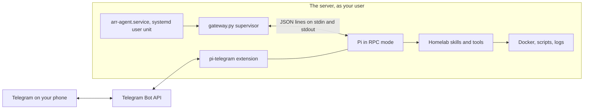
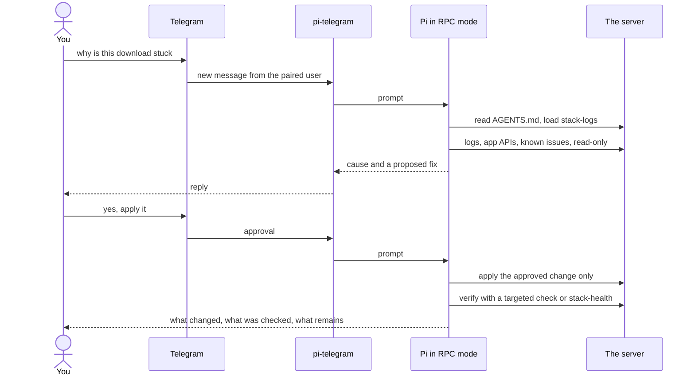

# The AI agent and its skills

This page explains how AI coding agents operate the stack: the skills that teach them the safe way to
check, update, back up and troubleshoot it, the rules they follow, and the optional always-on agent
you talk to over Telegram. It is for the owner who wants an assistant for maintenance, not for
viewers.

## The rules every agent reads

- **`AGENTS.md`** at the repository root is the guide every agent reads (Claude Code through
  `CLAUDE.md`, which imports it; Codex and Pi directly). It describes the project, the skills and
  the safety rules: ask first before restarting services, changing the VPN, editing `.env`,
  restoring data, applying updates or powering the stack or drive; check that nothing is playing
  before restarting Jellyfin; keep P2P inside gluetun and the VPN exit inside `VPN_COUNTRIES`;
  never open more to the home network; never print secrets.
- **`AGENTS.local.md`** is a gitignored file next to it for one deployment's own rules: the
  server's name, how to reach it from this checkout, and anything specific to that install.
  `AGENTS.md` tells agents to read it first when it exists. Keep personal details there, never in
  `AGENTS.md`.

Only two things may act without asking, both approved in `AGENTS.md`: `vpn-port-sync` restarting gluetun
after 15 minutes without a forwarded port ([VPN and ports](vpn-and-ports.md)), and
`downloads-throttle` capping downloads while someone watches ([Monitoring](monitoring.md#throttle-downloads-keeping-playback-smooth)).

## The skills

The skills live in `ai/homelab-plugin/skills/` and are linked into `.claude/skills` and
`.agents/skills`, so an agent started inside the repository has them with nothing to install. Run
them on the server.

| Skill | Use | Approval |
|---|---|---|
| `stack-health` | Is everything OK? Runs `stack-health` and explains each FAIL | Safe, but says so first when you asked for a look only (the check writes a test file and starts throwaway containers) |
| `vpn-check` | Is P2P traffic confined to the VPN, with a working kill switch? | Read-only |
| `drive-health` | SMART status, temperature and USB link of the media drive | Read-only |
| `stack-logs` | Diagnose a service from its logs and the known issues | Read-only; proposes fixes, applies none |
| `stack-update` | Check, apply and roll back image updates ([Updates](updates.md)) | Checking is safe; **applying or rolling back needs your yes, every time** |
| `stack-backup` | Backup status, back up now, restore ([Backups](backups.md)) | Status and backing up are safe; **restoring asks first** |
| `stack-power` | Stop the stack or unmount the drive, and start it again | **Asks first**, and checks nothing is playing |

`stack-logs` ships the
[known issues](https://github.com/bugrauluyurt/homelab-media-stack/blob/main/ai/homelab-plugin/skills/stack-logs/references/known-issues.md),
the list of every problem solved so far with its cause and fix.

To use them elsewhere, install the plugin:

| Tool | Install | Update |
|---|---|---|
| Claude Code | `/plugin marketplace add bugrauluyurt/homelab-media-stack` (or a local path), then `/plugin install homelab@homelab-media-stack` | `/plugin marketplace update homelab-media-stack` |
| Codex | `codex plugin marketplace add bugrauluyurt/homelab-media-stack`, then install it from `/plugins` | `codex plugin marketplace upgrade` |
| Pi | `pi install <repo>/ai/homelab-plugin` | Follows the folder: `git pull`, then `/reload` |

Ask in plain words ("is everything healthy?") or by name: `/homelab:stack-health` in Claude Code,
`/skill:stack-health` in Pi, `$stack-health` in Codex. Edit skills only in
`ai/homelab-plugin/skills/`, and bump `version` in `ai/homelab-plugin/plugin.json` when they change
(Codex needs it).

## The always-on Telegram agent

The optional always-on agent is **Pi** (the `pi` coding agent, `@earendil-works/pi-coding-agent`)
running headless on the server, so you can ask for help from your phone without keeping a terminal,
tmux session or SSH login open. It is the owner's maintenance assistant, not a bot for viewers and
not a replacement for Seerr.



### How it runs

- **`arr-agent.service`** is a systemd **user** unit, not a Compose service. It starts
  `ai/agent/gateway.py` in the repository, so `AGENTS.md` (and `AGENTS.local.md`) apply. It
  restarts on failure after 15 seconds, at most five times in five minutes, and files it creates are
  private (`UMask=0077`).
- **`gateway.py`** is a small Python supervisor. It opens no network listener. It:
  1. checks its config: absolute paths, and the **pinned** Pi and pi-telegram versions. If either
     package changed since the installer recorded it, it refuses to start until you run the
     installer and its check again;
  2. checks the Telegram pairing: the profile must already have a bot token and one paired user.
     It never pairs a first user unattended;
  3. takes a lock, so two supervisors can't share one session folder;
  4. starts Pi with `--mode rpc --offline --approve --session-dir ~/.local/state/arr-agent/sessions
     --continue`, so a restart resumes the service's most recent conversation and never an
     unrelated terminal session. `--approve` trusts loading the Pi resources already configured; it
     is not permission to restart the stack;
  5. confirms the model loaded along with the `telegram-connect` and `telegram-status` commands and
     the `stack-health` and `stack-logs` skills, or stops;
  6. sends `/telegram-connect <profile>` whenever Telegram is disconnected, at most once a minute,
     and never approves an ownership takeover;
  7. every 15 seconds writes a heartbeat, `~/.local/state/arr-agent/status.json`: the phase, the
     Telegram role, busy and pending state, model and context size, and counts of declined dialogs
     and extension errors. No conversation text or credentials.
- **pi-telegram** (`@llblab/pi-telegram`, installed in Pi's npm folder) owns everything Telegram:
  polling, the paired user, attachments and the chat controls. The supervisor is not a second
  Telegram client.
- **Privacy.** Dialogs Pi raises that Telegram can't answer (confirm, select, input, editor) are
  declined, never approved. The journal gets lifecycle lines only: never prompts, tool output,
  thinking or replies, and Pi's own stderr is discarded. Error messages name only the error type,
  because error values can hold secrets.
- **Stopping.** The supervisor sends Pi `SIGTERM` so it runs its shutdown hooks and releases the bot;
  after 30 seconds it kills the process group.

"Always-on" means **available for requests**. The model does not watch the server or repair it on
its own; the timers, Uptime Kuma and ntfy stay responsible for scheduled checks and alerts
([Monitoring](monitoring.md)).

### A support request



The usual exchange is **inspect, explain and propose, approve, apply, verify, report**. Be explicit
about scope: "read-only", "no restarts", which service may change. Editing the repository,
deploying live and pushing to Git are separate outcomes; ask for each one you want. The agent
reports what it actually checked, remaining risks and commit ids, rather than treating a proposed
fix as done.

| Send | Expected workflow |
|---|---|
| "Check the stack, read-only; don't change anything." | Inspect services, logs and monitoring; report without repairs |
| "Why is this download stuck?" | Load `stack-logs`, check the apps and known issues, propose a fix |
| "Is torrent traffic still inside the VPN?" | Load `vpn-check`; never run recovery scripts just to look |
| "Check for image updates, but don't apply them." | Report available updates; applying is a separate yes |
| "Add a monitoring dashboard; don't restart services." | Review provisioning, make scoped changes, validate and document them |
| "Review, commit and push the changes." | Check the diff for mistakes and secrets, run checks, commit with an explanatory body, verify the push |

### Controls on the phone

pi-telegram provides these. `/start` opens the operator menu; the others are shortcuts:

| Control | Use |
|---|---|
| `/status` | The current session's status |
| `/model` | Pick the model for this live session |
| `/thinking` | Pick the reasoning effort, without restarting the service |
| `/queue` | Prompts waiting while the agent is busy |
| `/settings` | Telegram rendering and activity visibility |
| `/abort` | Abort the running turn, keep waiting prompts |
| `/stop` | Abort and clear waiting prompts. **Not** a systemd or stack shutdown |

Aborting does not undo commands that already ran; check the outcome before asking for a retry.
Messages sent while it is busy queue for a later turn. The model and thinking level are choices for
the live session, not settings in this repository. Rendering preferences live outside Git in
`~/.pi/agent/telegram.json`.

### Safety

Pairing limits who can chat, but this is **not a sandbox**. The account it runs as has Docker access
and passwordless sudo, so the agent is effectively root. The approval rules are instructions the
agent follows, not a boundary the operating system enforces. Protect the paired Telegram account and
the bot token accordingly. Conversation context and selected diagnostic output go to the configured
model provider, and replies travel through Telegram: keep secrets out of prompts and tool output.

## Installing it

Requirements: Linux with systemd, Python 3.10 or later, Node and Pi installed and on `PATH`,
pi-telegram installed through Pi's npm folder, the homelab skills installed in Pi, and a Telegram
profile **already paired** in an interactive Pi session. The installer expects Pi's default
`~/.pi/agent` folder. It was first tested with Pi 0.87.0 and pi-telegram 0.50.1.

Run as your regular account, not root, from the repository:

```bash
scripts/agent-install --enable
python3 ai/agent/gateway.py --check
systemctl --user start arr-agent.service
python3 ai/agent/gateway.py --status
```

`scripts/agent-install`:

- validates the paths (no whitespace, quotes, backslashes or `%`), the installed versions and the
  pairing;
- writes `~/.config/arr-agent/config.json` (paths, profile, pinned versions), keeping the previous one
  as `config.previous.json`;
- renders `~/.config/systemd/user/arr-agent.service` from `ai/agent/arr-agent.service`, keeping the
  previous unit as `.previous`, and reloads the user manager;
- with `--enable`, enables the unit for the next user-manager start. It **never starts or restarts**
  the service, and never copies or replaces credentials;
- with `--profile NAME`, uses another existing pi-telegram profile (lowercase letters and digits, at
  most 32 characters).

So the user manager runs without a login, enable lingering once:

```bash
loginctl show-user "$USER" -p Linger
sudo loginctl enable-linger "$USER"
```

The unit uses absolute Node and Pi paths; rerun the installer after replacing Node.

`gateway.py --check` loads the real Pi, model configuration, Telegram commands and skills in a
temporary session, without connecting Telegram or calling a model.

### Handing over from an interactive session

If an interactive Pi already polls the same bot, the service stays `waiting-for-telegram` and
retries about once a minute without disturbing that conversation. Finish your work, exit the old Pi
normally, and the service connects on its next try. In threaded mode the extension may register the
service as a follower instead; pick the service's thread in Telegram. Send a message and check the
reply before calling the handover done.

The service's conversation is separate from any terminal session. Shared memory carries over; the
old transcript does not. Don't run another Pi against its session folder.

## Checking and recovering it

```bash
python3 ai/agent/gateway.py --status
systemctl --user status arr-agent.service
journalctl _SYSTEMD_USER_UNIT=arr-agent.service -n 40 --no-pager
```

- `--status` exits 0 only for a fresh (under 60 seconds old) `running` heartbeat. A green
  `systemctl is-active` only means the supervisor runs; `waiting-for-telegram` means it is not
  connected, and `unknown` (reconnecting, or a changed status format) must not be read as healthy.
- **Replies stop:** check `--status` and the journal over SSH on the tailnet. Don't ask the agent
  to restart its own service mid-task.
- **Startup fails:** check the config paths, the pinned versions, the paired profile and the
  extension, then run `--check`.
- **Rate-limited after crashes:** fix the cause, then
  `systemctl --user reset-failed arr-agent.service` and start it again.
- **A restart** restores the recorded conversation, not an interrupted tool run or an exactly-once
  Telegram delivery. Check what finished before retrying.

### Updating Pi or pi-telegram

Do this from a separate SSH shell, never through the agent being stopped.

1. Finish active work, check `/status` and `/queue`, then
   `systemctl --user stop arr-agent.service`.
2. Note the current versions from `~/.config/arr-agent/config.json`, and back up
   `~/.local/state/arr-agent` and `~/.pi/agent` somewhere private (they hold secrets).
3. Install the chosen version, for example
   `npm install -g @earendil-works/pi-coding-agent@<version>`.
4. `scripts/agent-install --enable`, `python3 ai/agent/gateway.py --check`, and
   `python3 ai/agent/smoke_test.py` (one small real model request, then a stop and resume of the
   same session; it never connects Telegram).
5. `systemctl --user start arr-agent.service`, `gateway.py --status`, and send a real Telegram
   message.

If a check fails, keep the service stopped, reinstall the recorded version and repeat steps 4 and
5. Review any state format change before reverting an extension or restoring the backup; a restore
can discard conversation since then. There is no unattended updater.

### Turning it off

```bash
systemctl --user disable --now arr-agent.service
```

Then start Pi interactively and connect Telegram there. Nothing is deleted: credentials, memory,
terminal sessions and the service's history stay.

### Tests

```bash
python3 -m py_compile ai/agent/*.py scripts/agent-install
python3 -m unittest discover -s ai/agent -p 'test_*.py' -v
systemd-analyze --user verify ~/.config/systemd/user/arr-agent.service
```

The unit tests use a fake RPC process: Unicode line separators, timeouts, unexpected exits,
privacy of logs, and declined takeover dialogs. None of them replaces a real Telegram message after
a handover.

## Scripts and units involved

| Name | Role | Reference |
|---|---|---|
| `ai/homelab-plugin/skills/` | The seven skills | [On GitHub](https://github.com/bugrauluyurt/homelab-media-stack/tree/main/ai/homelab-plugin/skills) |
| `gateway.py` | Supervises Pi in RPC mode, heartbeat, `--check`, `--status` | [On GitHub](https://github.com/bugrauluyurt/homelab-media-stack/blob/main/ai/agent/gateway.py) |
| `arr-agent.service` | The systemd user unit | [agent-install](../reference/scripts.md#agent-install) |
| `agent-install` | Pins versions, renders and enables the unit, never starts it | [scripts](../reference/scripts.md#agent-install) |
| `smoke_test.py` | One live model request and a session resume | [On GitHub](https://github.com/bugrauluyurt/homelab-media-stack/blob/main/ai/agent/smoke_test.py) |

## When it goes wrong

- **`--status` says `waiting-for-telegram`.** Another Pi owns the bot; see
  [Handing over from an interactive session](#handing-over-from-an-interactive-session).
- **The service won't start after a package update.** The pinned version changed on purpose; follow
  [Updating Pi or pi-telegram](#updating-pi-or-pi-telegram).
- **The agent wants to do something the rules forbid.** It should refuse on its own; the list is in
  [Things never to do](https://github.com/bugrauluyurt/homelab-media-stack/blob/main/ai/homelab-plugin/skills/stack-logs/references/known-issues.md#things-never-to-do).
- **You can't SSH in to diagnose.** See
  [SSH refused from a device of yours](https://github.com/bugrauluyurt/homelab-media-stack/blob/main/ai/homelab-plugin/skills/stack-logs/references/known-issues.md#ssh-refused-permission-denied-publickey-from-a-device-of-yours).
- For the stack itself, start with [Troubleshooting](../troubleshooting.md).
