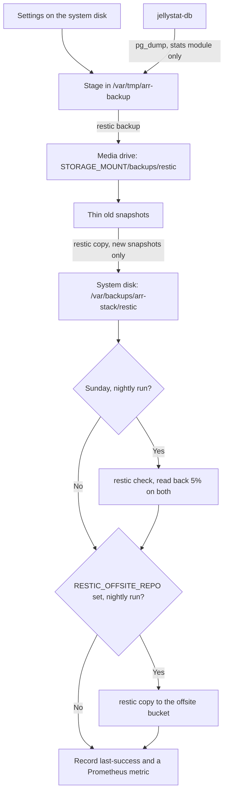
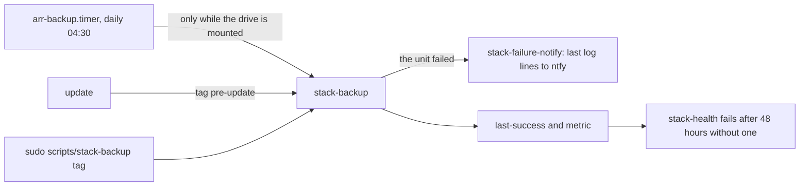

# Backups

This page explains how the stack backs up its settings every night, where the copies go, and how
to restore from them after anything from one broken setting to a dead disk. It is for whoever
looks after the server.

Every night the stack's **settings** (never media) are backed up with [restic](https://restic.net)
to the media drive, then copied to the system disk. Each disk holds a full, encrypted, independent
copy, so either one can die without losing the history. An offsite copy is optional.



## What is backed up

`scripts/stack-backup` runs as root (the app folders belong to several container users) and stages
these into `/var/tmp/arr-backup`, a private folder deleted after every run:

| What | From | Why |
|---|---|---|
| Every app's settings and databases | `$CONFIG_ROOT/<app>/` | The whole configured state of the stack |
| Update and rollback records, metrics, watcher state | `$STATE_ROOT` (the `state` folder next to `CONFIG_ROOT`) | Rollbacks and alerts keep working after a restore |
| Every secret: VPN key, API keys, logins | `.env` | Nothing works without it |
| Terminal tool configs | `~/.config/managarr`, `~/.config/qbt-tui` of `STACK_USER` | Hand-made |
| Hand-edited host files, when present | `/etc/fstab`, `/boot/firmware/cmdline.txt`, `/etc/docker/daemon.json`, `/etc/avahi/avahi-daemon.conf`, `~/.ssh/authorized_keys` | A reinstall would lose them ([host changes](../operations/host.md)) |
| Jellystat's watch history | `pg_dump -Fc` of the `jfstat` database in `jellystat-db` | Only while the `stats` module is on |

## What never is

- **Media and downloads.** They can be downloaded again.
- **What the apps rebuild themselves:** folders named `logs`, `cache`, `transcodes`, `Backups`
  (the apps' own backup folders), `Crash Reports`, `Codecs`, `Media`, `Metadata`, `MediaCover` and
  `venv`; `*.log` files and `logs.db`; sockets and FIFOs (qBittorrent's `ipc-socket`, for example).
- **These paths:** Grafana's plugins, Recyclarr's copy of the TRaSH guides, Scrutiny's SMART
  history database, gluetun's server list, Jellyfin's extracted subtitles, and Jellystat's raw
  Postgres files (the dump covers them).
- **What the repository reinstalls:** systemd units, the firewall and SSH hardening
  (`scripts/host-install`), the Docker images, and Tailscale's login.
- **The rest of the home folder.**

## Why the databases are copied carefully

Several apps (Radarr, Prowlarr, Jellyfin, Bazarr, Cleanuparr) run SQLite in WAL mode: their newest
writes sit in a separate `-wal` file, not in the `.db` file. Copying the `.db` alone silently loses
them. Cleanuparr is the extreme case: its `cleanuparr.db` can be 4 KB while its settings sit in a
2.4 MB WAL, so a plain copy would restore a blank Cleanuparr and look completely normal doing it.

So every `.db`, `.sqlite` and `.sqlite3` file is copied through SQLite's online backup API, which
reads through SQLite and produces a complete, consistent copy with no app stopped. The live
`-wal`, `-shm` and `-journal` files are left out because the copy already contains them. An app in
the middle of a checkpoint can hold its database for a moment, so each copy is retried up to five
times, three seconds apart, before the run fails. A file with a database suffix that is not SQLite
is copied as a plain file.

## The run, step by step

1. **Skip if the drive is off.** Without the media mount, the script prints a note and exits
   successfully. The drive is powered by hand, so this is not a failure.
2. **Key file.** The restic password from `RESTIC_PASSWORD` in `.env` is also written to
   `$STORAGE_MOUNT/backups/RESTIC_PASSWORD` (mode 600), next to the repository. If the password
   lived only in `.env` on the system disk, a dead system disk would leave these backups unreadable.
3. **First run.** If `$STORAGE_MOUNT/backups/restic` has no repository yet, it is created.
4. **Stage** everything listed above into `/var/tmp/arr-backup`, with the SQLite copies and the
   Jellystat dump.
5. **Back up** the staging folder: `restic backup --tag arr-stack` (plus any extra tag, such as
   `pre-update`), with `HOST_NAME` as the snapshot host. restic encrypts, deduplicates and
   compresses. The staging folder is then deleted, even if the backup failed.
6. **Thin** the media drive's repository (see [Retention](#retention)).
7. **Copy to the system disk.** `restic copy` sends only new snapshots to
   `/var/backups/arr-stack/restic` (root only), then thins it the same way. The first time, that
   repository is created with the same chunker parameters as the one on the drive, so copies
   deduplicate.
8. **Weekly check.** On a Sunday's nightly run, `restic check --read-data-subset=5%` reads back 5%
   of the stored data in both repositories, to catch a disk silently corrupting it.
9. **Offsite copy**, on nightly runs only, when `RESTIC_OFFSITE_REPO` is set (see [Offsite](#offsite)).
10. **Record success** in `/var/lib/arr-backup/last-success` and as the metric
    `arr_backup_last_success_timestamp_seconds` in `$STATE_ROOT/metrics/backup.prom` (written
    whole and renamed into place). The last lines printed are the number of databases and the
    snapshot id, which `stack-update` reads.

A "nightly run" means one without an extra tag. A `pre-update` snapshot from `stack-update` is copied to
the system disk but skips the weekly check and the offsite copy.

## When it runs



| When | How |
|---|---|
| Daily at 04:30 | [`arr-backup.timer`](../reference/systemd.md#arr-backuptimer), up to 15 minutes of random delay. `Persistent=true`: if the server or drive was off at 04:30, it runs at the next chance. The service runs at low CPU and idle I/O priority and is skipped, not failed, while the drive is unmounted. |
| Before every `stack-update` | The same run, tagged `pre-update`. `stack-update` stops if it fails, and `stack-update --rollback` restores from it ([Updates](updates.md)). |
| By hand | `sudo scripts/stack-backup` (about a minute). Add a tag to mark it: `sudo scripts/stack-backup pre-change`. It prints `snapshot <id>` at the end. |

A failed nightly run pushes its last log lines to ntfy through `arr-notify-failure@`.
`stack-health` fails once the last good backup is more than 48 hours old (checked only while the
drive is mounted), and also checks that the key file is on the drive and the system disk copy
exists. Prometheus keeps the last-success metric, so Glance and Grafana show its age.

## Retention

The same rules apply to the media drive, the system disk and the offsite copy:

| Kept | Snapshots |
|---|---|
| Daily | 7 |
| Weekly | 4 |
| Monthly | 6 |
| `pre-update` | The last 5, outside the thinning above |

The `pre-update` snapshots are exempt from the daily thinning, which would otherwise drop one taken
earlier the same day as the nightly run. On the reference install a snapshot restores to about
830 MB (roughly 1,800 files) and all snapshots together take about 700 MB per disk.

## The password

Encrypted backups need their password. It lives in `.env` **and** in
`$STORAGE_MOUNT/backups/RESTIC_PASSWORD`. The second copy is the one that matters: if the system
disk dies, `.env` dies with it. Save it in your password manager as well. The copy on the drive
protects against a disk failing, which is the goal, not against someone who takes the drive.

Pass the password to restic with `--password-file` or an environment variable, never on the
command line, where `ps` would show it.

## What survives what

| What fails | Live settings | Media drive backups | System disk copy | Restore from |
|---|---|---|---|---|
| The system disk | lost | kept | lost | [the media drive, with its key file](#a-dead-system-disk) |
| The media drive | kept | lost | kept | [nothing to restore; history is on the system disk](#a-dead-media-drive) |
| A setting you broke | kept | kept | kept | [any snapshot from either disk](#one-apps-settings) |
| Theft, fire, a power surge | lost | lost | lost | only an [offsite copy](#offsite) |

## Restoring

Restores change live data: stop the app first, and if an AI agent is doing it, it must ask you
first ([AI agent](ai-agent.md)).

### Where things are inside a snapshot

Everything sits under the staging path it was backed up from:

| Inside the snapshot | Came from |
|---|---|
| `/var/tmp/arr-backup/config/<app>/` | `$CONFIG_ROOT/<app>/` |
| `/var/tmp/arr-backup/home/.env` | `.env` |
| `/var/tmp/arr-backup/home/state/` | `$STATE_ROOT` |
| `/var/tmp/arr-backup/home/managarr/`, `home/qbt-tui/` | `~/.config/managarr`, `~/.config/qbt-tui` |
| `/var/tmp/arr-backup/host/...` | The host files, under their full path (`host/etc/fstab`, `host/home/<user>/.ssh/authorized_keys`) |
| `/var/tmp/arr-backup/jellystat.dump` | Jellystat's database |

Staged files are written by root, so restored files belong to root until you give them back.

### Listing snapshots

```bash
REPO=/mnt/storage/backups/restic   # $STORAGE_MOUNT/backups/restic
sudo restic -r "$REPO" --password-file /mnt/storage/backups/RESTIC_PASSWORD snapshots --compact
```

To read the password from `.env` instead (the system disk copy, for example):

```bash
export RESTIC_PASSWORD=$(sed -nE "s/^RESTIC_PASSWORD=(['\"]?)(.*)\1$/\2/p" .env)
sudo -E restic -r /var/backups/arr-stack/restic snapshots
```

The `sed` strips the quotes around a quoted value; a plain `cut -d= -f2-` would keep them, and
restic would reject the password.

### One app's settings

If an `stack-update` broke it, use `scripts/stack-update --rollback <service>`: it restores exactly that app's
folders from the snapshot taken just before the update ([Updates](updates.md#step-3-rolling-back)).
Otherwise:

1. Restore the app's folder from a snapshot into a temporary folder:

   ```bash
   sudo restic -r /mnt/storage/backups/restic --password-file /mnt/storage/backups/RESTIC_PASSWORD \
     restore <snapshot-id> --include /var/tmp/arr-backup/config/<app> --target /tmp/restore
   ```

2. Compare it with the live folder, and decide what to bring back.
3. Stop the app: `docker compose stop <app>`.
4. Delete the `-wal` and `-shm` files next to every database you are about to replace. The
   restored databases are complete copies; stale WAL files beside them would be replayed on top
   and corrupt them.
5. Copy the restored files over the live folder (`sudo cp -a`), rather than replacing the folder:
   caches and artwork were never backed up.
6. Give the folder back to its owner:
   `sudo chown -R "$(stat -c %u:%g "$CONFIG_ROOT/<app>")" "$CONFIG_ROOT/<app>"`.
7. Start the app (`docker compose up -d <app>`) and run `scripts/stack-health`.

### A dead system disk

`.env` and the system disk copy are gone; the media drive holds every snapshot and the key file.

1. Reinstall the operating system and Docker, and clone the repository, as in
   [Getting started](../getting-started.md). Mount the media drive.
2. Restore the latest snapshot with the key file on the drive:

   ```bash
   sudo restic -r /mnt/storage/backups/restic \
     --password-file /mnt/storage/backups/RESTIC_PASSWORD restore latest --target /tmp/r
   ```

3. Put `.env` back from `/tmp/r/var/tmp/arr-backup/home/.env` instead of writing a new one.
4. Compare the host files under `/tmp/r/var/tmp/arr-backup/host/` with the new system and carry
   over your changes by hand. Don't copy `/etc/fstab` or `cmdline.txt` wholesale: they name the
   old disk's partitions. `authorized_keys` can go back as it is.
5. Run `scripts/host-install` and let the stack start once, so every app creates its folders with
   the right owners. Then stop it: `docker compose stop`.
6. For each app, restore its folder as in [One app's settings](#one-apps-settings), steps 4 to 6,
   from `/tmp/r/var/tmp/arr-backup/config/<app>/`. Copy `home/state/` back to `$STATE_ROOT` and
   the terminal tool configs to `~/.config/`.
7. Start the stack, [restore Jellystat's history](#jellystats-history) if you use it, and run
   `scripts/stack-health`. The next nightly run recreates the system disk copy.

### A dead media drive

Your live settings are untouched, and the system disk copy holds the same snapshots:

```bash
export RESTIC_PASSWORD=$(sed -nE "s/^RESTIC_PASSWORD=(['\"]?)(.*)\1$/\2/p" .env)
sudo -E restic -r /var/backups/arr-stack/restic snapshots
```

Once a new drive is mounted ([Storage and boot](storage-and-boot.md)), the next nightly run
creates a fresh repository and key file on it. The system disk copy keeps the older snapshots and
receives the new ones.

### Jellystat's history

The dump is in Postgres's custom format. Restore it with `pg_restore` while Jellystat itself is
stopped:

```bash
docker compose stop jellystat
docker exec -i jellystat-db sh -c 'pg_restore -U "$POSTGRES_USER" -d "$POSTGRES_DB" --clean --if-exists' \
  < /tmp/r/var/tmp/arr-backup/jellystat.dump
docker compose up -d jellystat
```

If you use Grafana's watching dashboard, run `python3 scripts/configure-grafana-watch.py`
afterwards; it verifies (and if needed recreates) its read-only reader
([Monitoring](monitoring.md#the-watching-dashboard)).

## Offsite

Set `RESTIC_OFFSITE_REPO` in `.env` to a Backblaze B2 or any S3-compatible bucket
(`b2:<bucket>:arr` or `s3:<endpoint>/<bucket>/arr`), with that backend's credentials beside it:
`B2_ACCOUNT_ID` and `B2_ACCOUNT_KEY`, or `AWS_ACCESS_KEY_ID` and `AWS_SECRET_ACCESS_KEY`. Variables
starting with `AWS_`, `B2_`, `AZURE_`, `GOOGLE_` or `RCLONE_` are passed to restic. Each nightly
run then copies its new snapshots there, encrypted with the same `RESTIC_PASSWORD` and thinned the
same way; the first run creates the repository. A failure shows in `journalctl -u arr-backup` and
is pushed to ntfy.

## Scripts and units involved

| Name | Role | Reference |
|---|---|---|
| `stack-backup` | Stages, backs up, copies, checks, records success | [scripts](../reference/scripts.md#stack-backup) |
| `arr-backup.timer` / `.service` | Daily at 04:30, only with the drive mounted | [systemd](../reference/systemd.md#arr-backuptimer) |
| `arr-notify-failure@.service` | Pushes a failed run's log lines to ntfy | [systemd](../reference/systemd.md#arr-notify-failureservice) |
| `stack-update` | Takes the `pre-update` snapshot, restores from it on rollback | [scripts](../reference/scripts.md#stack-update) |
| `stack-health` | Backup age, key file, system disk copy | [scripts](../reference/scripts.md#stack-health) |
| `stack-backup` skill | Status, backup now, restore (restore asks first) | [AI agent](ai-agent.md#the-skills) |

## When it goes wrong

- **`stack-health` fails "last backup under 48h old".** The nightly run was skipped, usually
  because the drive was off at 04:30; it catches up once the drive is back. Otherwise read
  `journalctl -u arr-backup`.
- **A backup failed on a database.** An app held its database through five retries. Run it again;
  if it keeps failing, the message names the file.
- **restic says the password is wrong.** A quoted value in `.env` was passed with its quotes; use
  the `sed` line above, or the key file on the drive.
- **The drive won't mount.** See
  [The media drive won't mount](https://github.com/bugrauluyurt/homelab-media-stack/blob/main/ai/homelab-plugin/skills/stack-logs/references/known-issues.md#the-media-drive-wont-mount).
- For anything else, start with [Troubleshooting](../troubleshooting.md).
