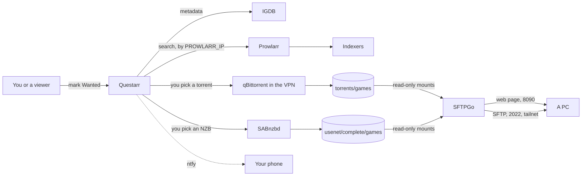
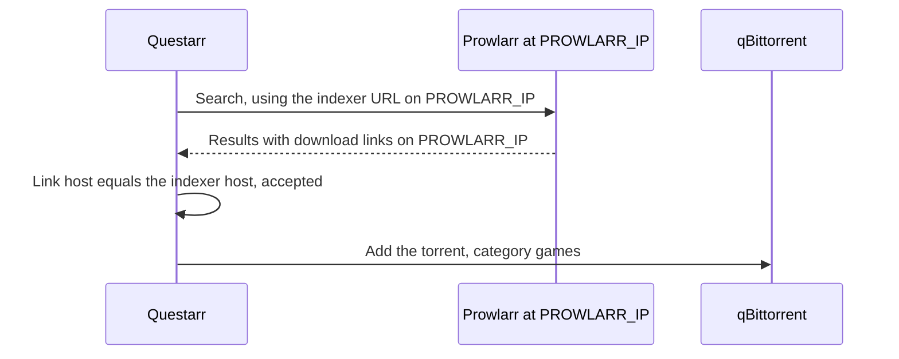

# Games: from Questarr to a PC

This page follows a PC game from the moment someone marks it wanted in Questarr until it is copied
to a computer from the read-only download page. It is for anyone running the `games` module. For
the screens themselves, see [Games for users](../using/games.md).

## The games module

The `games` compose profile runs `questarr` (port 5000) and `sftpgo` (ports 8090 and 2022). Leave
`games` out of `COMPOSE_PROFILES` (see
[Configuration](../reference/configuration.md#compose_profiles)) and neither runs;
`configure-questarr.py` and `configure-sftpgo.py` then say the module is off and stop. The
downloaders and Prowlarr are part of the core and are shared with movies and TV.

## The steps

1. **Add the game.** In Questarr, search for a game and mark it *Wanted*. Game details and covers
   come from IGDB, which needs `IGDB_CLIENT_ID` and `IGDB_CLIENT_SECRET` from your own Twitch
   developer app (steps in [Getting started](../getting-started.md)).
2. **Questarr searches Prowlarr's indexers.**
   [`configure-questarr.py`](../reference/scripts.md#configure-questarrpy) copies every Prowlarr
   indexer into Questarr, pointed at Prowlarr's fixed address (`http://PROWLARR_IP:9696`), and
   removes indexers that Prowlarr no longer has (Questarr's own sync adds and updates but never
   removes). Game searches include Usenet results when NZBgeek is set up. After adding an indexer
   in Prowlarr, run the script again.
3. **You pick a release.** Questarr doesn't choose for you: the game's page lists what the search
   found, and you pick one (a known release group with plenty of seeders). It pushes
   "Game Available" to ntfy when a wanted game has releases to pick from.
4. **The download.** A torrent goes to qBittorrent inside the VPN (category `games`, saved in
   `/data/torrents/games`); an NZB goes to SABnzbd (category `games`, finished in
   `/data/usenet/complete/games`). Questarr pushes "Download Started" and completion to ntfy.
   Questarr has one shared login and no approval step, so "Download Started" is how you learn that
   a viewer picked a release.
5. **The download page.** SFTPGo serves both folders read-only, as two folders named *Torrent* and
   *Usenet*: a web page on port 8090 (click a file, or tick several and download them as one zip)
   and SFTP on port 2022 for apps such as WinSCP or FileZilla, which copy whole folders and resume.
   The server can't run these games; it only stores them.

Nothing imports or renames games: the folder the downloader wrote is what SFTPGo shows.

### Why Prowlarr has a fixed address

Prowlarr writes the host it was called on into the download links it returns, and Questarr only
accepts a link whose host matches the indexer URL it was given. Questarr calls Prowlarr by IP
address, so the links carry that IP, and it must be one that never changes: Prowlarr gets a fixed
address on the `arr` network (`PROWLARR_IP`, in `172.18.0.0/16`), and `configure-questarr.py`
writes it into every indexer URL.

Called by name instead, every download failed with Prowlarr's "Failed to normalize provided link"
while Questarr still reported the game as queued in qBittorrent.

## Accounts

Every SFTPGo account is read-only, yours included, so your login grants nothing a viewer's
doesn't. [`games_accounts.py`](../reference/scripts.md#games_accountspy) is the only place
accounts are made, and it applies the same settings to each:

- permissions `list` and `download` on `/`, home `/srv/games` (the two read-only mounts);
- web client with writing, share links and two-factor sign-in turned off (a lost phone would
  lock a viewer out);
- FTP and WebDAV refused; only the web page and SFTP work.

[`configure-sftpgo.py`](../reference/scripts.md#configure-sftpgopy) creates the Usenet games
folder (compose mounts it but won't create it), starts SFTPGo, limits its admin and creates your
login from `GAMES_USER` and `GAMES_PASSWORD`.
[`viewer-add.py`](../reference/scripts.md#viewer-addpy) creates a viewer's (see
[Viewers](viewers.md)). Questarr's own login is `admin` with `QUESTARR_PASSWORD`, shared by
everyone, so the rule for viewers is: mark games *Wanted* and leave picking the release to you.

### How SFTPGo stays locked down

- **Game folders are mounted `read_only`**, so even a broken permission can't change them.
- **No web admin.** SFTPGo's admin exists only for the scripts, through its REST API, and may log
  in only from the server itself and Docker (`127.0.0.0/8`, `172.16.0.0/12`). Run the scripts on
  the server.
- **IPv4 only.** Its ports are published on `0.0.0.0` alone: over IPv6, Docker's proxy would make
  every client look like the Docker gateway, an address that admin allow-list trusts.
- **Home network:** the host firewall opens port 8090 (IPv4) to the home network, so copies run at
  full local speed; SFTP on 2022 stays tailnet only. Viewers reach 5000, 8090 and 2022 through
  Tailscale. See [Security](../security.md).

## Cleanuparr leaves games alone

Game releases always contain executables and archives, so Cleanuparr's malware rule would reject
every one of them. The `games` category is on its ignore list
([Media requests](media-requests.md#cleanup-cleanuparr)). Check a release's comments and uploader
before you run anything from it; public trackers carry fakes.

## Scripts and units involved

| Name | Role | Reference |
|---|---|---|
| `configure-questarr.py` | Questarr's admin, qBittorrent and SABnzbd clients, indexers from Prowlarr, IGDB, ntfy | [scripts](../reference/scripts.md#configure-questarrpy) |
| `configure-sftpgo.py` | Starts SFTPGo, locks its admin, creates your login | [scripts](../reference/scripts.md#configure-sftpgopy) |
| `games_accounts.py` | The read-only account settings, shared by both scripts | [scripts](../reference/scripts.md#games_accountspy) |
| `viewer-add.py` | A viewer's games login | [scripts](../reference/scripts.md#viewer-addpy) |
| `configure-sabnzbd.py` | SABnzbd's `games` category | [scripts](../reference/scripts.md#configure-sabnzbdpy) |
| `configure-cleanuparr.py` | Puts `games` on Cleanuparr's ignore list | [scripts](../reference/scripts.md#configure-cleanuparrpy) |
| `host-firewall` | Opens 8090 to the home network | [scripts](../reference/scripts.md#host-firewall) |

## When it goes wrong

- **Questarr says it queued a download, but nothing downloads:**
  [Questarr says "added to qBittorrent"](https://github.com/bugrauluyurt/homelab-media-stack/blob/main/ai/homelab-plugin/skills/stack-logs/references/known-issues.md#questarr-says-added-to-qbittorrent-but-nothing-downloads).
  Finished downloads may also stay untracked in Questarr; use *Claim* on its Downloads page.
- **A big download from the page started over:**
  [a zip can't resume](https://github.com/bugrauluyurt/homelab-media-stack/blob/main/ai/homelab-plugin/skills/stack-logs/references/known-issues.md#games-page-sftpgo-a-big-download-started-over).
  Download single files, or use SFTP.
- **qBittorrent unreachable:**
  [qBittorrent stops answering after gluetun restarts](https://github.com/bugrauluyurt/homelab-media-stack/blob/main/ai/homelab-plugin/skills/stack-logs/references/known-issues.md#qbittorrent-stops-answering-after-gluetun-restarts).
- **A viewer can't open the page:**
  [a viewer can't connect](https://github.com/bugrauluyurt/homelab-media-stack/blob/main/ai/homelab-plugin/skills/stack-logs/references/known-issues.md#a-viewer-family-friend-cant-connect).
- **No covers or search results:** IGDB isn't set; `configure-questarr.py` prints a line saying so.
