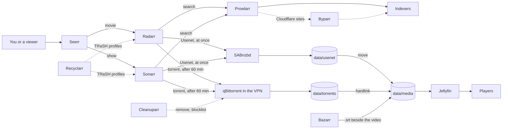
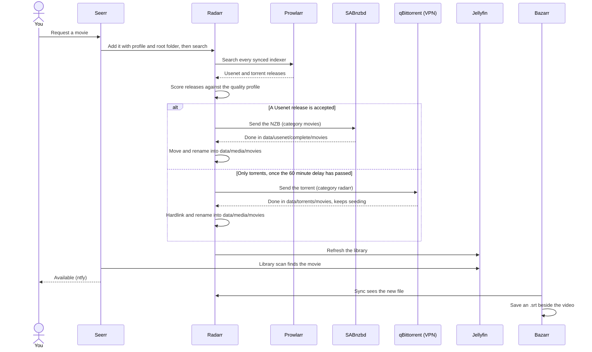

# Media requests: from Seerr to the player

This page follows a movie or show from the moment someone asks for it in Seerr until it plays in
Jellyfin: search, download (Usenet first, torrents as the fallback), import, subtitles and the
alerts along the way. It is for anyone who runs the stack or wants to know why a request behaves
the way it does. For the request screens themselves, see [Requesting](../using/requesting.md).

One request, end to end, when Usenet has a copy and when only a torrent does:

A show follows the same path through Sonarr, with its own categories and folders.

## The steps

1. **Request in Seerr.** Someone picks a title in Seerr (port 5055). Seerr knows your Jellyfin
   libraries, so a title already on disk shows as available instead of requestable: on its first
   run [`configure-seerr.py`](../reference/scripts.md#configure-seerrpy) enables every Jellyfin
   library in Seerr and syncs them once. A viewer's request waits for your approval unless the
   viewer was added with `--auto-approve` (see [Viewers](viewers.md)).
2. **Seerr hands it to Radarr or Sonarr.** Movies go to Radarr with the *HD Bluray + WEB* profile
   and root folder `/data/media/movies`; shows go to Sonarr with *WEB-1080p* and `/data/media/tv`,
   with season folders. Seerr asks for a search straight away. For movies it also sets the minimum
   availability to *released*, so Radarr only chases a film once it is out for home viewing.
3. **Radarr or Sonarr searches through Prowlarr.** Prowlarr holds the indexers and pushes them to
   every app it is linked to (full sync, by category: movies to Radarr, TV to Sonarr, audio to
   Lidarr). The app sends its search to Prowlarr, and Prowlarr asks each site. Sites behind
   Cloudflare's bot check are reached through Byparr (`byparr:8191`, a headless browser on the Docker
   network with no host port). Usenet results come from NZBgeek and NZBFinder once their API keys are set.
   Adding and testing indexers is covered in [Indexers](../operations/indexers.md).
4. **The app picks a release.** It scores every result against its quality profile and custom
   formats (synced from TRaSH Guides by [Recyclarr](#quality-rules-recyclarr)). Then the delay
   profile decides between sources: Usenet releases can be grabbed at once, torrent releases are
   held back for 60 minutes, so a Usenet copy that turns up in that window wins. Even a torrent of
   the highest quality waits (`bypassIfHighestQuality` is off). Series tagged `french` skip the
   wait: their new episodes come from the ratio trackers, where an early grab earns ratio.
5. **The download.** Usenet goes to SABnzbd, which runs outside the VPN on purpose: Usenet is SSL
   and download only, nothing is shared. Torrents go to qBittorrent, which lives inside gluetun's
   network and can only reach the internet through the tunnel (see
   [VPN and ports](vpn-and-ports.md)). Each app uses its own category, so every download lands in
   its own folder (table below).
6. **Import.** When the download completes, Radarr or Sonarr renames it and files it into
   `/data/media`. A torrent is **hardlinked**: the same file appears in `torrents/` and `media/`
   while using the disk space once, and it keeps seeding. A Usenet download is **moved**, since
   nothing seeds. Both are instant because downloads and library share one filesystem
   (`DATA_ROOT`, mounted as `/data` in every container). Extra files from the release, such as
   subtitles, are imported too. New series folders carry the TVDB id
   (`{Series Title} [tvdbid-{TvdbId}]`), so Jellyfin matches a show that it knows only by its
   original title.
7. **Jellyfin picks it up.** Radarr and Sonarr each hold a Jellyfin connection that refreshes the
   library on every import, upgrade and rename. Jellyfin's real-time folder watching is off so the
   media drive isn't woken all the time; without the connection, new files would wait for
   Jellyfin's 12-hourly scheduled scan.
8. **Seerr marks it available.** Seerr notices on its next library scan and pushes "available" to
   ntfy (it also pushes failed requests; new requests come from JellyDash instead). Radarr, Sonarr
   and Prowlarr push health errors, downloads that need a person, failed downloads and failed
   imports to the same topic.
9. **Subtitles.** Bazarr syncs with Radarr and Sonarr, sees the new file and fetches an external
   `.srt` into the same folder as the video. See [Subtitles](#subtitles-bazarr).
10. **Play.** Jellyfin serves the file to the players; see [Watching](../using/watching.md).

### Where each download lands

Container paths; `/data` is `DATA_ROOT` on the server.

| App | qBittorrent category and folder | SABnzbd category and folder | Library |
|---|---|---|---|
| Radarr | `radarr`, `/data/torrents/movies` | `movies`, `/data/usenet/complete/movies` | `/data/media/movies` |
| Sonarr | `sonarr`, `/data/torrents/tv` | `tv`, `/data/usenet/complete/tv` | `/data/media/tv` |
| Lidarr | `music`, `/data/torrents/music` | `music`, `/data/usenet/complete/music` | `/data/media/music` |
| Questarr | `games`, `/data/torrents/games` | `games`, `/data/usenet/complete/games` | none, served by SFTPGo ([Games](games.md)) |

SABnzbd downloads into `/data/usenet/incomplete` and moves finished jobs into
`/data/usenet/complete/<category>`. Don't delete things out of `torrents/` by hand; let the apps
manage them, or the library copy loses its seeding twin without saving any space.

## Quality rules (Recyclarr)

The Recyclarr container syncs [TRaSH Guides](https://trash-guides.info/) quality profiles from
[`apps/recyclarr/recyclarr.yml`](https://github.com/bugrauluyurt/homelab-media-stack/blob/main/apps/recyclarr/recyclarr.yml)
into Radarr (*HD Bluray + WEB*, plus the *Golden Rule HD* and *Unwanted Formats* groups) and
Sonarr (*WEB-1080p*), with TRaSH's quality sizes. Both profiles target 1080p, so a server
without a hardware video encoder (a Raspberry Pi 5 has none) never has to transcode; the reasoning
is in [Architecture](../architecture.md).

- **x265 is scored 0, not TRaSH's default of -10000.** Current TVs, phones and streaming boxes
  decode HEVC in hardware, so it direct plays; desktop browsers may not, and would then need a
  transcode. It is 0 rather than positive on purpose: the profiles' cutoff score is 10000 and the
  minimum upgrade step is 1, so any positive score would make every existing x264 file
  "upgradeable" and re-download the whole library. At 0, TRaSH's source and group tiers still
  decide: an x265 WEBRip re-encode scores 0 against a Tier 01 WEB-DL's 1775. If HEVC ever causes
  trouble on your players, set the score back to -10000.
- **Audio-description releases are rejected.** Some releases carry only a narrated
  audio-description track, with no way to switch it off. TRaSH has no format for this, so
  [`configure-arr.py`](../reference/scripts.md#configure-arrpy) adds a custom format that matches
  `Audio Description` in the release title and scores it -10000 in both profiles. A bare "AD" is
  not matched, since it would hit titles that start with "Ad". `recyclarr.yml` lists this format
  under `reset_unmatched_scores.except`; without that, every Recyclarr sync would reset it to 0.
- **Rejected releases.** In an interactive search some results are greyed out. That is usually
  TRaSH's rules at work: a low-quality or unknown release group, or a file below the minimum size
  for its runtime. Loosen the sizes in *Settings, Quality* if you want smaller encodes, or click a
  rejected release to force it.

## Cleanup (Cleanuparr)

Cleanuparr (port 11011) watches qBittorrent through its API, together with Radarr, Sonarr and Lidarr, and
removes downloads that will never finish. Each removal is **blocklisted**, so the app searches for
a different release. It has no access to the media folders: it acts only through the apps' APIs.

| Rule | What it does |
|---|---|
| Stalled | About one hour with no progress at all (12 strikes on 5-minute runs); any progress resets the count, so slow but moving downloads are never touched. Private torrents count too: a tracker that refuses peers, for a low ratio, stalls them for good |
| Failed import | Removed after 3 strikes |
| Stuck on metadata | A magnet that never resolves, removed after 3 strikes |
| Malware | Checks the files in each torrent against the `blacklist_permissive` list. The stricter list also matches `.srt`, `.sub` and `.idx`, which would strip subtitle files |
| Slow downloads | Off: slow is normal on public trackers |
| Seeding and orphan cleanup | Off: hardlinks mean seeding costs no disk space. The script refuses to go live if it is switched on |

The `games` category is ignored, because game releases legitimately ship executables and
archives. [`configure-cleanuparr.py`](../reference/scripts.md#configure-cleanuparrpy) sets all
of this up; `--dry-run` makes it log what it would do without acting. Day-to-day handling is in
[Maintenance](../operations/maintenance.md).

## Stuck requests

[`watch-activity`](../reference/scripts.md#watch-activity) runs every minute from
[`arr-watch.timer`](../reference/systemd.md#arr-watchtimer). It pushes "Request still not
downloaded" to ntfy, once per request, when a Seerr request was approved more than 48 hours ago
(`STUCK_HOURS`), is still pending or processing, and is actually out: for a movie, Radarr says it
is available but has no file; for a show, Sonarr counts episodes but none has a file. Films that
aren't released yet are skipped, because Radarr waits for them on purpose. The usual cause is that
no indexer carries the title; see [Indexers](../operations/indexers.md).

## Download speed

qBittorrent's downloads are capped at 20 MB/s while someone watches Jellyfin or Plex or the server
is busy, and uploads are always capped at 10 Mbps. That is
[`throttle-downloads`](../reference/scripts.md#throttle-downloads), explained in
[Monitoring](monitoring.md).

## Subtitles (Bazarr)

[`configure-bazarr.py`](../reference/scripts.md#configure-bazarrpy) connects Bazarr to Radarr and
Sonarr and sets these rules:

- **External `.srt` only.** Bazarr ignores subtitles embedded in the video
  (`use_embedded_subs` off). Image-based embedded subtitles (PGS, VobSub) would have to be burned
  into the picture, a full transcode; and a web player can only use embedded text subtitles after
  Jellyfin has read the whole file to extract them. A sidecar file avoids both.
- **Saved beside the video**, and upgraded when a better match appears.
- **English by default** for every movie and series.
- **Providers:** YIFY Subtitles and Subtitle Cat need no account. OpenSubtitles.com (the largest
  source, including machine-translated subtitles) and SubSource are enabled only when their keys
  are in `.env`. Podnapisi, TVsubtitles and subf2m were removed because they are gone or failed
  every search, which cost each search a timeout. Addic7ed is left out because Bazarr can only log
  in to it through a paid anti-captcha service.

### Optional example: French-language shows

The stack ships one per-language rule that you can copy for another language. English subtitles
for French TV rarely exist, so:

1. `configure-arr.py` adds a Sonarr auto-tagging rule: a series whose original language is French
   gets the tag `french` (removed again automatically if that changes).
2. `configure-bazarr.py` adds a second language profile, *French audio* (French, then English),
   selected by that tag.

To do the same for another language, change the language in the auto-tagging rule and in the
Bazarr profile. French trackers for the downloads themselves are covered in
[Indexers](../operations/indexers.md).

## Scripts and units involved

| Name | Role | Reference |
|---|---|---|
| `configure-seerr.py` | Connects Seerr to Jellyfin, Radarr and Sonarr; ntfy for available and failed requests | [scripts](../reference/scripts.md#configure-seerrpy) |
| `configure-arr.py` | Root folders, hardlinks, download clients, delay profiles, Jellyfin refresh, audio-description penalty, ntfy, Prowlarr links, the Usenet indexers, the `french` tag | [scripts](../reference/scripts.md#configure-arrpy) |
| `configure-sabnzbd.py` | Usenet server, download folders and one category per app | [scripts](../reference/scripts.md#configure-sabnzbdpy) |
| `add-indexers.py` | Adds the public and optional indexers to Prowlarr and tests them | [scripts](../reference/scripts.md#add-indexerspy) |
| `configure-bazarr.py` | Bazarr's connections, providers and language profiles | [scripts](../reference/scripts.md#configure-bazarrpy) |
| `configure-cleanuparr.py` | Cleanuparr's rules, live or dry run | [scripts](../reference/scripts.md#configure-cleanuparrpy) |
| `recyclarr.yml` | TRaSH quality profiles and scores | [file](https://github.com/bugrauluyurt/homelab-media-stack/blob/main/apps/recyclarr/recyclarr.yml) |
| `watch-activity` | Stuck-request alert | [scripts](../reference/scripts.md#watch-activity) |
| `arr-watch.timer` | Runs `watch-activity` every minute | [systemd](../reference/systemd.md#arr-watchtimer) |
| `throttle-downloads` | Download cap while someone watches | [scripts](../reference/scripts.md#throttle-downloads) |
| `check-indexers` | Tests every indexer on demand | [scripts](../reference/scripts.md#check-indexers) |

## When it goes wrong

Start at *Activity, Queue* in Radarr or Sonarr: it shows whether the download is running, stuck or
failed to import. Then:

- **Nothing found at all:** run `scripts/check-indexers`; public trackers are patchy for old or
  obscure titles.
  [Searches find nothing](https://github.com/bugrauluyurt/homelab-media-stack/blob/main/ai/homelab-plugin/skills/stack-logs/references/known-issues.md#searches-find-nothing-or-an-indexer-keeps-failing).
- **Results exist but nothing is grabbed:**
  [releases shown as rejected](https://github.com/bugrauluyurt/homelab-media-stack/blob/main/ai/homelab-plugin/skills/stack-logs/references/known-issues.md#releases-shown-as-rejected).
- **Stalled with no connections:** a poorly seeded release. Cleanuparr removes it after about an
  hour; or pick another one in the interactive search.
- **Radarr or Sonarr can't reach qBittorrent:**
  [qBittorrent stops answering after gluetun restarts](https://github.com/bugrauluyurt/homelab-media-stack/blob/main/ai/homelab-plugin/skills/stack-logs/references/known-issues.md#qbittorrent-stops-answering-after-gluetun-restarts).
- **A fake of a movie still in cinemas:**
  [Radarr downloaded a fake](https://github.com/bugrauluyurt/homelab-media-stack/blob/main/ai/homelab-plugin/skills/stack-logs/references/known-issues.md#radarr-downloaded-a-fake-of-a-movie-still-in-cinemas).
  Never start Radarr searches through its API for films that aren't released yet.
- **The show is in Jellyfin without a poster:**
  [a show has no poster or description](https://github.com/bugrauluyurt/homelab-media-stack/blob/main/ai/homelab-plugin/skills/stack-logs/references/known-issues.md#a-show-is-in-jellyfin-but-has-no-poster-or-description).
- **Subtitles:** [stuck on "Fetching additional data"](https://github.com/bugrauluyurt/homelab-media-stack/blob/main/ai/homelab-plugin/skills/stack-logs/references/known-issues.md#subtitles-stuck-on-fetching-additional-data-in-a-browser),
  [Bazarr "throttling"](https://github.com/bugrauluyurt/homelab-media-stack/blob/main/ai/homelab-plugin/skills/stack-logs/references/known-issues.md#bazarr-throttling-messages),
  [Bazarr busy for minutes](https://github.com/bugrauluyurt/homelab-media-stack/blob/main/ai/homelab-plugin/skills/stack-logs/references/known-issues.md#bazarr-uses-a-full-cpu-core-for-minutes-at-a-time).
- **Cloudflare-protected indexers fail:**
  [Byparr healthcheck fails](https://github.com/bugrauluyurt/homelab-media-stack/blob/main/ai/homelab-plugin/skills/stack-logs/references/known-issues.md#byparr-healthcheck-fails).
- **Playback stutters while downloading:**
  [slow playback or disk while downloading](https://github.com/bugrauluyurt/homelab-media-stack/blob/main/ai/homelab-plugin/skills/stack-logs/references/known-issues.md#slow-playback-or-disk-while-downloading).

The full list is in [Troubleshooting](../troubleshooting.md).
