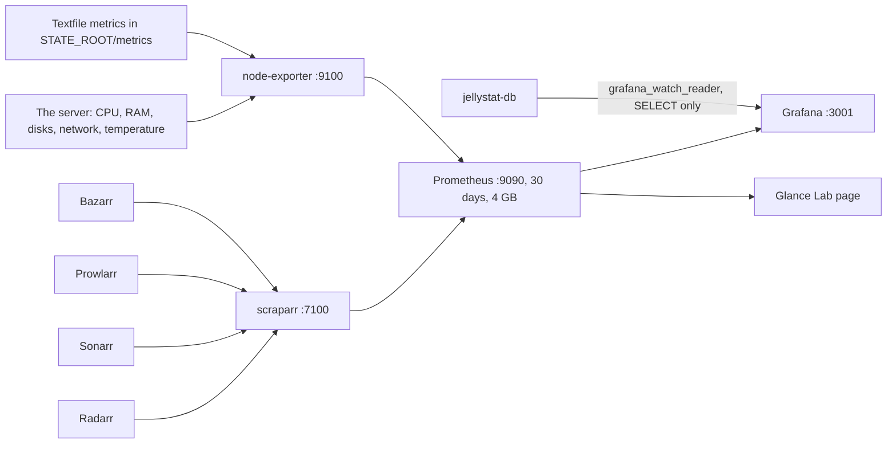
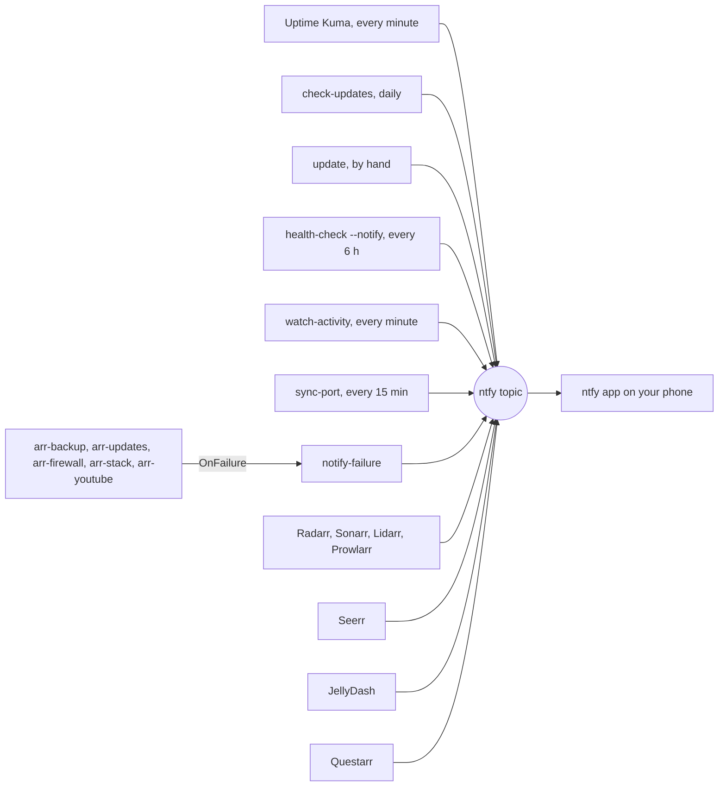

# Monitoring and alerts

This page explains how the stack watches itself: the metrics history in Prometheus and Grafana, the
always-on checks in Uptime Kuma, the scheduled health check, the per-minute watchers, and how every
alert reaches your phone through ntfy. It is for whoever looks after the server. What each
dashboard shows, from a user's point of view, is on [Dashboards](../using/dashboards.md).

Each piece answers a different question:

| Question | Answered by | When |
|---|---|---|
| How has the server behaved over time? | Prometheus and Grafana | Always, 30 days of history |
| Is every service up right now? | Uptime Kuma | Every 60 seconds |
| Is everything configured the way it should be? | `health-check --notify` | Every 6 hours |
| Is someone transcoding, or signing in from a new device? | `watch-activity` | Every minute |
| Will downloads make playback stutter? | `throttle-downloads` | Every minute |
| Did a scheduled job fail? | `notify-failure` | When a unit fails |

`health-check` and Uptime Kuma overlap on purpose. `health-check` is the deep check (hardlinks,
VPN binding, firewall, backups, plugins); Kuma is the always-on watcher that tells you *when*
something broke.

## Metrics: Prometheus and Grafana

These run in the `monitoring` module (`COMPOSE_PROFILES`).

1. **node-exporter** reads the server itself through a read-only mount of `/`, including thermal
   zones. Its textfile collector also exports the metrics the scripts write to
   `$STATE_ROOT/metrics` (the `state` folder next to `CONFIG_ROOT`). That folder is mounted on its
   own because node-exporter runs as `nobody`, which cannot pass through the home directory.

   | File | Metric | Written by |
   |---|---|---|
   | `updates.prom` | `arr_image_updates_available`, `arr_image_updates_checked_timestamp_seconds` | `check-updates` and `update` ([Updates](updates.md)) |
   | `backup.prom` | `arr_backup_last_success_timestamp_seconds` | `backup-config` ([Backups](backups.md)) |
   | `youtube.prom` | `arr_youtube_sync_timestamp_seconds` | `sync-youtube.py` (Glance's YouTube rows) |

   The update and backup files are written whole and renamed into place, so a scrape never sees
   half a file.
2. **scraparr** reads Radarr, Sonarr, Prowlarr and Bazarr from one container. It cannot read
   environment variables in its YAML, so `scripts/render-scraparr-config` fills the API keys from
   `.env` into `$CONFIG_ROOT/scraparr/config.yaml` (mode 600). The rendered file holds live keys,
   which is why it is written outside the repository.
3. **Prometheus** scrapes node-exporter every 30 seconds and scraparr every 60 seconds (with a
   45 second timeout, because the arr APIs are slow). It keeps **30 days**, capped at **4 GB**, so
   it cannot grow without bound. Scraparr publishes no port; Prometheus reaches it on the Docker
   network, and node-exporter, which runs on the host network so it sees the server's own
   traffic, at `host.docker.internal:9100`. Check collection at `http://<tailscale-ip>:9090/targets`: every row
   should be `UP`.
4. **Grafana** gets its Prometheus datasource and six dashboards from `grafana/` in the repository,
   in the **Media Stack** folder. It re-reads `grafana/dashboards/` every 60 seconds, so a new
   dashboard JSON appears without a restart. Edits made in the UI are allowed and survive, but for
   anything permanent export the JSON into `grafana/dashboards/`.
5. **Glance** queries Prometheus for its Lab page: disk space and growth, pending updates and the
   age of the last backup.

### The watching dashboard

"Media Server: Watching" reads Jellystat's recorded history from its Postgres database, not live
Jellyfin sessions. `scripts/configure-grafana-watch.py` connects it with the least access that
works (it needs both the `monitoring` and `stats` modules):

- It creates the Postgres role `grafana_watch_reader` with `SELECT` on eight columns of
  `jf_playback_activity` only (`Id`, `UserId`, `UserName`, `NowPlayingItemName`, `SeriesName`,
  `PlaybackDuration`, `ActivityDateInserted`, `PlayMethod`). Client IPs and other playback
  metadata stay unreadable.
- The role defaults to read-only transactions and a 10 second statement timeout.
- Its generated password goes only into Grafana's encrypted datasource settings
  (`jellystat-readonly`). `.env` is not changed, and no database port is published.
- It refuses to continue if the role has elevated rights or the existing datasource points
  elsewhere, then verifies that exactly the intended columns are readable and that no write
  privilege exists. It reports permission drift rather than silently revoking grants.
- Rerunning is idempotent. If the datasource is missing, it generates a new password and recreates
  the connection.

Offline tests: `python3 -m unittest discover -s tests -p 'test_grafana_watch.py' -v`. Anyone who can
query this datasource in Grafana sees all the permitted viewing records; there is no per-user
isolation.

## Uptime Kuma: is it up right now?

Uptime Kuma (`:3003`, `monitoring` module) checks every service once a minute. After three failed
checks in a row (one failure plus two retries, 60 seconds apart) it sends **DOWN** to ntfy, and
**UP** when the service recovers. The history is on the status page `/status/stack`.

`scripts/configure-uptime-kuma.py` sets it up, and derives the monitors from `docker-compose.yml`:

- **One HTTP monitor per published TCP port** of every service in an active module, at
  `http://<service>:<port>` on the Docker network, with a health path where the app has one
  (`/ping` for Navidrome, `/api/health` for Needle, `/healthz` for SFTPGo, and so on). Kuma's own
  port and SFTP (2022) are skipped. gluetun's published ports become **qbittorrent** and **slskd**,
  since both answer through the VPN container.
- **Services without a published port**: Byparr and scraparr over the Docker network, Plex and
  node-exporter through `host.docker.internal` (both run on the host network). Each only when its
  module is on.
- **media drive mounted:** node-exporter's metrics must mention the `STORAGE_MOUNT` mount point.
- **vpn forwarded port:** gluetun's `/v1/portforward` must report a port above 0. Proton sometimes
  stops handing one out while the tunnel stays up; torrents keep working but get no incoming peers
  and slow down, which no other check notices. gluetun's control server opens only that one
  read-only route, without credentials, and only to containers on the stack's network
  (`gluetun/auth.toml`). `sync-port` usually repairs it on its own
  ([VPN and ports](vpn-and-ports.md)).
- **gluetun healthy:** gluetun's own container health check, read through the read-only Docker
  socket proxy.

The script is idempotent. Re-run it after switching a module on or adding a service, and the new
one gets a monitor; a service removed from compose loses its monitor. Monitors you add by hand in
Kuma are never touched. It also:

- creates the admin account and sets its password from `UPTIME_KUMA_USER` and
  `UPTIME_KUMA_PASSWORD`. Kuma refuses weak passwords at setup, so the `.env` password is written as
  a bcrypt hash straight into Kuma's database, fed through stdin so it never shows in a process
  list;
- adds the ntfy notification as the default for every monitor;
- turns off Kuma's DNS cache (nscd), which kept a recreated container's old address and reported
  it down for good after every restart or update;
- builds the status page with every monitor on it.

Kuma 2 has no REST API, only socket.io, so the script re-runs itself in a small virtual
environment in `$STATE_ROOT/venv` with `python-socketio`.

## The health check every 6 hours

[`arr-health.timer`](../reference/systemd.md#arr-healthtimer) runs `scripts/health-check --notify` at
00:20, 06:20, 12:20 and 18:20 (up to 10 minutes later), as the stack user, only while the media drive
is mounted: the whole stack is down while the drive is off. Any failing check is pushed to ntfy as
**"media stack: N health check(s) failing"**, listing each one.

It prints sections with an `OK` or `FAIL` per check and exits 0 only when nothing failed. Checks of a
module that is switched off are skipped. A few of the less obvious ones, and why they exist:

| Section | Check | Why |
|---|---|---|
| STORAGE | SMART health, no bad sectors, under 55 °C | Any reallocated, pending or uncorrectable sector means failure is approaching. A drive behind a USB bridge needs `smartctl -d sat` |
| HARDWARE | Not throttled or under-voltage, SoC under 80 °C | Only where `vcgencmd` exists (a Raspberry Pi). The low four bits of `get_throttled` mean under-voltage, frequency capped, throttled or soft temperature limit, right now |
| SYSTEMD | Every container has a memory limit | A container created while the memory cgroup was unavailable silently loses its limit, and compose won't recreate it later because its config is unchanged |
| BACKUPS | Last backup under 48 hours old | Only while the drive is on, since it is powered by hand |
| SERVICES | Jellyfin plugins all Active | A Jellyfin update can disable plugins built for an older version without anything else failing |
| SERVICES | Radarr, Sonarr, Lidarr, Prowlarr report no errors | Errors each app raises about itself: unreachable indexers or download clients, missing root folders |
| MONITORING | Homepage sees container status; the socket proxy refuses writes but allows log reads | Homepage's status dots go through the proxy; if it breaks, every tile shows "API error". Dozzle needs log reads |
| CLEANUP | Cleanuparr's download cleaner off | It removes seeding downloads, which cost no disk here (hardlinks) |
| INDEXERS | Byparr healthy | Its `/health` launches a real browser and takes 15 to 20 seconds, so the container's own health result is read instead |
| VPN | qBittorrent bound to the tunnel, upload cap in both modes, forwarded port in sync | P2P must never leave the VPN ([VPN and ports](vpn-and-ports.md)) |

`health-check` is not read-only: it writes a hardlink test file on the drive and starts throwaway
`curlimages/curl` containers. Keep it for validating changes, not for a look-only investigation. Run
it first whenever something seems off: `scripts/health-check` (the `health` alias).

## watch-activity: things someone should know about

[`arr-watch.timer`](../reference/systemd.md#arr-watchtimer) runs `scripts/watch-activity` every
minute (from three minutes after boot, only while the drive is mounted). Each alert fires once;
what was already reported lives in `$STATE_ROOT/watch-activity.json`. The first run only records
the devices and log entries that already exist, so installing it does not flood your phone. If
Jellyfin or Seerr does not answer, the run ends quietly and tries again a minute later.

| Alert | Fires when |
|---|---|
| **"*Name* is transcoding"** | A Jellyfin stream is transcoded **in software**. The server may not keep up, so it can stutter. The message names the title, device and Jellyfin's reason. Hardware transcodes (`compose.gpu.yml`) are cheap and expected, so they don't alert |
| **"New device on Jellyfin"** | A device Jellyfin has never seen signs in |
| **"Failed Jellyfin login"** | Jellyfin's activity log records a failed sign-in |
| **"Request still not downloaded"** | A Seerr request approved more than 48 hours ago is out (Radarr says the movie is available; Sonarr has aired episodes) but nothing has downloaded. Films not yet released are skipped: Radarr waits for them on purpose. It may not be on any indexer |

## throttle-downloads: keeping playback smooth

At full speed (about 90 MB/s) decrypting the WireGuard tunnel takes most of the CPU; playback
stutters and qBittorrent drops the arr apps' requests. At 40 MB/s the VPN alone kept the CPU about
90% busy. [`arr-throttle.timer`](../reference/systemd.md#arr-throttletimer) runs
`scripts/throttle-downloads` every minute to prevent that:

- **The cap** is qBittorrent's alternative download limit, **20 MB/s**. It switches on while anyone
  plays something in Jellyfin or Plex, or while the 5 minute load average reaches **twice the number
  of CPU cores**. It switches off once nobody is watching **and** the load is under **the number of
  cores**. On a four-core Raspberry Pi 5 that is on at 8, off under 4.
- **The upload cap** is permanent: **10 Mbps** in both the normal and the alternative mode.
- Every run re-applies both limits if they drifted.
- **A limit you switch on by hand is left alone.** The script only switches off a limit it switched
  on itself (it marks that with `$STATE_ROOT/throttle-by-script`).

Downloads are otherwise unlimited by choice. This cap and `sync-port`'s VPN restart are the only
things allowed to act on their own; don't add other limits without deciding to. `health-check`
confirms the alternative limit is set (not qBittorrent's 10 KiB/s default, which would stall
downloads) and reads the upload cap from `throttle-downloads --upload-cap` rather than keeping its
own copy.

## notify-failure: when a scheduled job fails

The units below have `OnFailure=arr-notify-failure@%n.service`. When one fails,
`scripts/notify-failure` pushes **"media stack: *unit* failed"** with the unit's last eight log lines
and the `journalctl` command for the rest.

| Unit | Job |
|---|---|
| `arr-backup.service` | The nightly backup ([Backups](backups.md)) |
| `arr-updates.service` | The daily update check ([Updates](updates.md)) |
| `arr-firewall.service` | The host firewall ([Security](../security.md)) |
| `arr-stack.service` | Starting the stack ([Storage and boot](storage-and-boot.md)) |
| `arr-youtube.service` | The hourly sync of Glance's YouTube rows |

## Every alert into ntfy

| Alert | Source | Set up by |
|---|---|---|
| A service **DOWN** after three failed checks, **UP** when it recovers | Uptime Kuma | `configure-uptime-kuma.py` |
| "N update(s) available", each update once, **MAJOR** flagged | `check-updates` (`arr-updates.timer`) | [Updates](updates.md) |
| "update failed", "health check failed after update" | `update` | [Updates](updates.md) |
| "N health check(s) failing", including the media drive's SMART health, bad sectors and temperature | `health-check --notify` (`arr-health.timer`) | This page |
| Software transcode, new Jellyfin device, failed Jellyfin login, request stuck 48 hours | `watch-activity` (`arr-watch.timer`) | This page |
| "VPN forwarded port restored", "VPN still has no forwarded port" | `sync-port` (`arr-port-sync.timer`) | [VPN and ports](vpn-and-ports.md) |
| "*unit* failed", with its last log lines | `notify-failure` | This page |
| Health errors, a download that needs a manual import, failed downloads or imports | Radarr, Sonarr, Lidarr, Prowlarr | `configure-arr.py` |
| A request is available to watch, or failed to reach Sonarr or Radarr | Seerr | `configure-seerr.py` |
| Someone starts watching (any user), a new Seerr request | JellyDash (`NTFY_URL` and `NTFY_TOPIC` in compose) | [Dashboards](../using/dashboards.md) |
| "Game Available", "Download Started" | Questarr | `configure-questarr.py`, see [Games](games.md) |

Seerr leaves new requests out on purpose, because JellyDash already pushes them.

### Setting up ntfy

1. Install the free **ntfy** app (iPhone or Android), tap **+**, and subscribe to the topic in
   `NTFY_TOPIC` on the server in `NTFY_SERVER` (default `https://ntfy.sh`).
2. Treat the topic as a password: anyone who knows it can read the channel, which carries user
   names, titles, check names and log lines. To keep them off a public server, run your own ntfy
   and point `NTFY_SERVER` at it.
3. With no `NTFY_TOPIC`, every script skips its notifications silently.

Changing the topic later: the scripts and Seerr and Questarr pick it up on their next run, and
JellyDash when its container is recreated. Uptime Kuma and the arr apps keep the ntfy settings
they were given the first time, because their configure scripts only check that one exists;
change the topic in their notification settings by hand.

## Scripts and units involved

| Name | Role | Reference |
|---|---|---|
| `configure-uptime-kuma.py` | Admin, ntfy, monitors from compose, status page | [scripts](../reference/scripts.md#configure-uptime-kumapy) |
| `configure-grafana-watch.py` | Least-privilege Jellystat reader for Grafana | [scripts](../reference/scripts.md#configure-grafana-watchpy) |
| `render-scraparr-config` | Fills scraparr's config with API keys, outside the repo | [scripts](../reference/scripts.md#render-scraparr-config) |
| `health-check` | The deep check; `--notify` pushes failures | [scripts](../reference/scripts.md#health-check) |
| `arr-health.timer` / `.service` | Every 6 hours, with the drive mounted | [systemd](../reference/systemd.md#arr-healthtimer) |
| `watch-activity` | Transcodes, new devices, failed logins, stuck requests | [scripts](../reference/scripts.md#watch-activity) |
| `arr-watch.timer` / `.service` | Every minute, with the drive mounted | [systemd](../reference/systemd.md#arr-watchtimer) |
| `throttle-downloads` | The 20 MB/s cap and the permanent upload cap | [scripts](../reference/scripts.md#throttle-downloads) |
| `arr-throttle.timer` / `.service` | Every minute, with the drive mounted | [systemd](../reference/systemd.md#arr-throttletimer) |
| `notify-failure` | Pushes a failed unit's last log lines | [scripts](../reference/scripts.md#notify-failure) |
| `arr-notify-failure@.service` | The `OnFailure=` handler | [systemd](../reference/systemd.md#arr-notify-failureservice) |
| `stack-env.sh` / `stack_env.py` | The shared `notify` helpers and `write_update_metrics` | [scripts](../reference/scripts.md#stack-envsh) |

## When it goes wrong

- **Kuma says a service is down, but it runs.** See
  [Uptime Kuma says a service is down, but it's running](https://github.com/bugrauluyurt/homelab-media-stack/blob/main/ai/homelab-plugin/skills/stack-logs/references/known-issues.md#uptime-kuma-says-a-service-is-down-but-its-running).
- **"vpn forwarded port" DOWN.** See
  [No forwarded port at all](https://github.com/bugrauluyurt/homelab-media-stack/blob/main/ai/homelab-plugin/skills/stack-logs/references/known-issues.md#no-forwarded-port-at-all-vpn-forwarded-port-down-in-kuma).
- **Playback or the disk is slow while downloading.** See
  [Slow playback or disk while downloading](https://github.com/bugrauluyurt/homelab-media-stack/blob/main/ai/homelab-plugin/skills/stack-logs/references/known-issues.md#slow-playback-or-disk-while-downloading);
  `journalctl -u arr-throttle` shows when the cap switched.
- **"byparr (cloudflare solver) healthy" fails.** See
  [Byparr healthcheck fails](https://github.com/bugrauluyurt/homelab-media-stack/blob/main/ai/homelab-plugin/skills/stack-logs/references/known-issues.md#byparr-healthcheck-fails).
- **Dozzle can't open logs, or every Homepage tile shows "API Error".** The socket proxy refused
  the request; see
  [Dozzle lists containers but can't open their logs](https://github.com/bugrauluyurt/homelab-media-stack/blob/main/ai/homelab-plugin/skills/stack-logs/references/known-issues.md#dozzle-lists-containers-but-cant-open-their-logs)
  and `docker logs homepage | grep -i sock`.
- **A Prometheus target is DOWN.** Open `http://<tailscale-ip>:9090/targets`; for scraparr,
  rerun `scripts/render-scraparr-config` after an API key changed.
- For anything else, start with [Troubleshooting](../troubleshooting.md).
