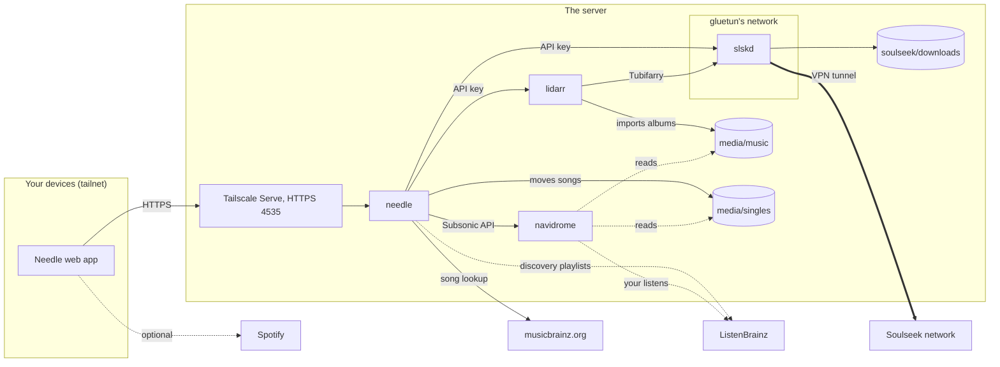
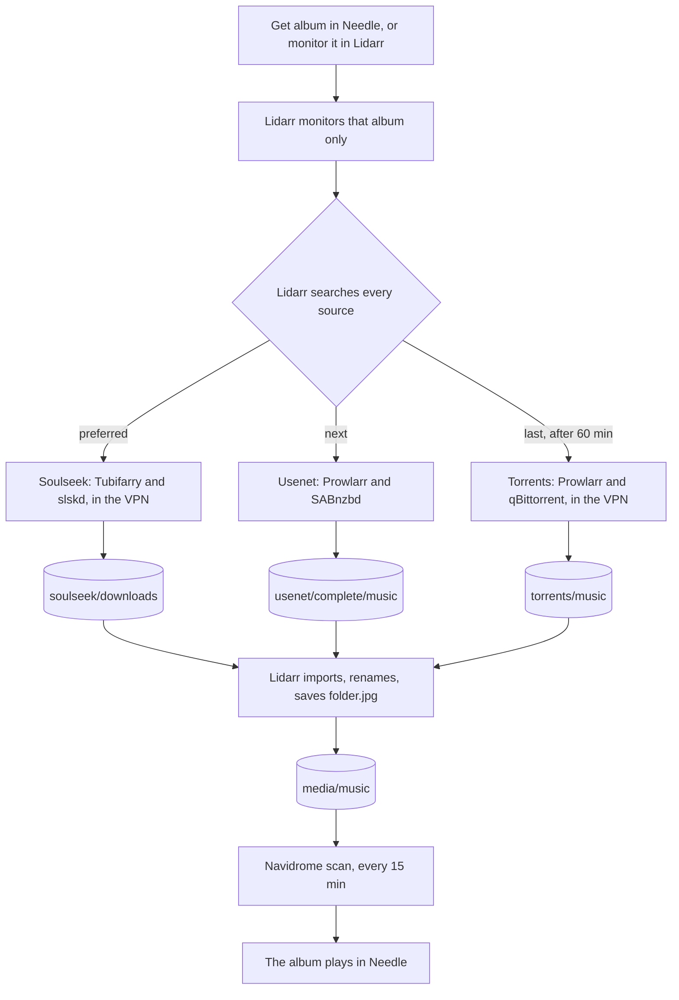
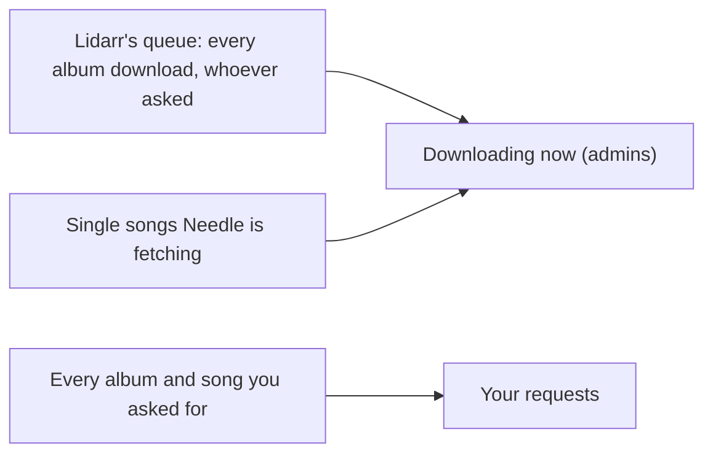
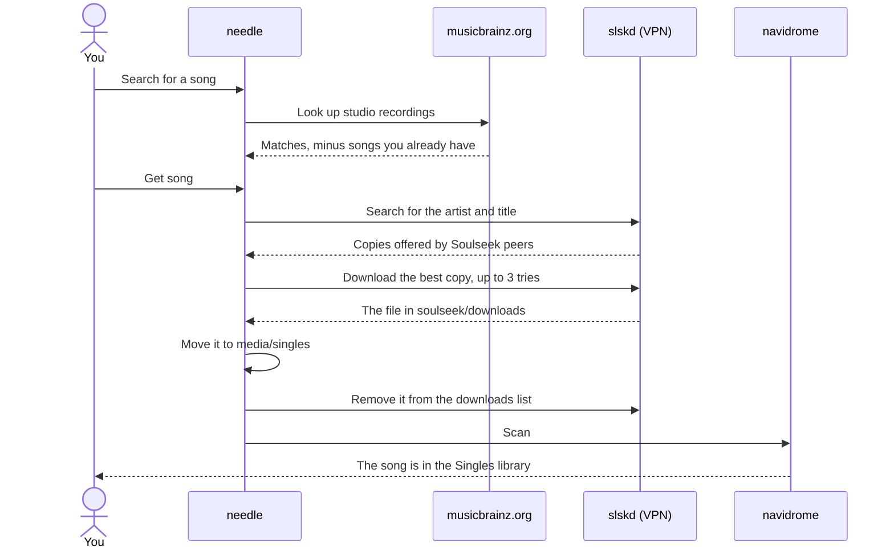
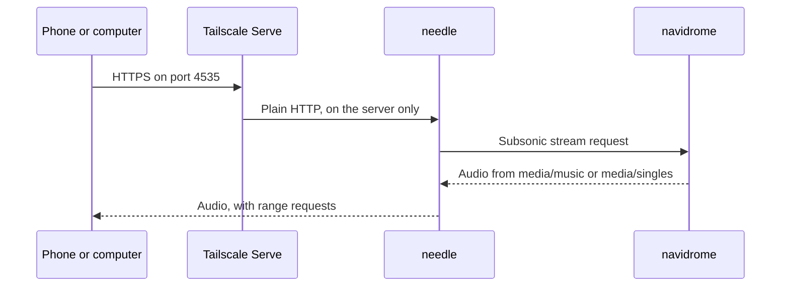
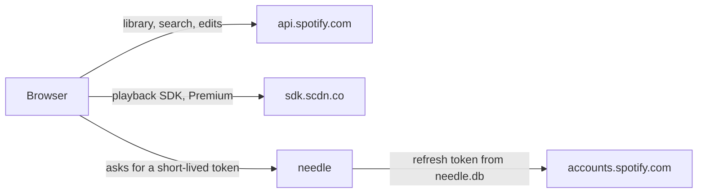
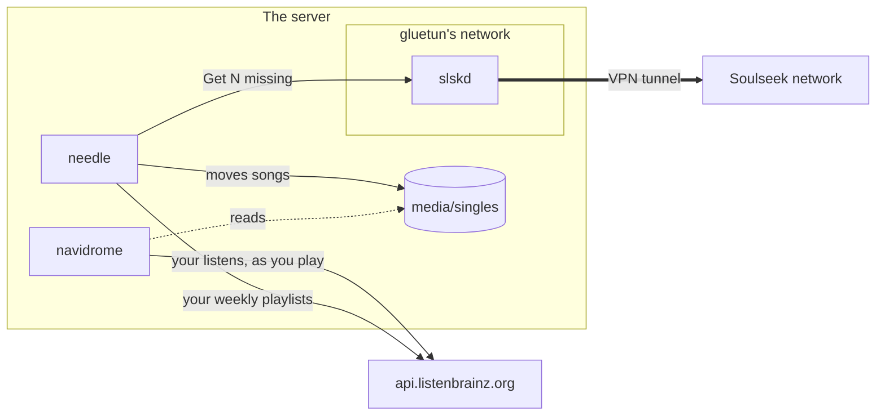

# Music: albums and single songs

This page explains how music reaches the server and how it is played: whole albums through
Lidarr, single songs through Needle, both mostly from Soulseek (slskd, inside the VPN), and
Navidrome and Needle to listen. It is for anyone running the `music` module. For the player
itself, see [Music for listeners](../using/music.md); for how Needle is built inside, see
[Needle's architecture](https://github.com/bugrauluyurt/needle/blob/main/docs/architecture.md).

## The pieces

| Piece | Where | What it keeps |
|---|---|---|
| Navidrome | `navidrome` container, port 4533 | Library index, users, playlists, likes. Two libraries: **Music Library** on `/music` (Lidarr's albums) and **Singles** on `/singles` (Needle's songs), both mounted read-only. Settings in `$CONFIG_ROOT/navidrome` |
| Needle | `needle` container, published on `127.0.0.1:4535` only, reached over HTTPS through Tailscale Serve | `$CONFIG_ROOT/needle/needle.db`: play history, requests, account photos, Spotify sign-in, ListenBrainz tokens, and what each person may do. It holds the Lidarr and slskd keys so no browser ever sees them |
| Lidarr | `lidarr` container, port 8686 | Which albums you want. Searches Soulseek, Usenet and torrents, imports into `$DATA_ROOT/media/music` |
| slskd | `slskd`, inside gluetun's network, reached as `gluetun:5030` | The Soulseek client. Downloads to `$DATA_ROOT/soulseek/downloads` (unfinished files in `soulseek/incomplete`) and shares `media/music` back to the network |
| Albums on disk | `$DATA_ROOT/media/music` | Lidarr's albums. Needle never writes here |
| Singles on disk | `$DATA_ROOT/media/singles` | Songs Needle fetched one by one, as `<Artist>/<Artist> - <Title>.<ext>`. Lidarr never sees this folder |

The Soulseek account is `SOULSEEK_USER` and `SOULSEEK_PASS` in `.env`; slskd registers it on its
first login, there is no sign-up page. slskd's own web page (port 5030, user `admin`,
`SLSKD_PASSWORD`) lets you search and download by hand. Because Proton forwards a single port and
qBittorrent holds it, slskd reaches only peers that accept incoming connections (see
[VPN and ports](vpn-and-ports.md)).

### The music module

Everything here is the `music` compose profile: `slskd`, `lidarr`, `navidrome` and `needle`. Leave
`music` out of `COMPOSE_PROFILES` (see [Configuration](../reference/configuration.md#compose_profiles))
and those containers don't run: `configure-arr.py` skips Lidarr, `configure-lidarr.py` and
`configure-navidrome.py` print that the module is off and stop, and a VPN re-attach recreates only
qBittorrent.

## Getting an album (Lidarr)

1. **Ask for it.** In Needle, search for an album and tap **Get album**: Needle asks Lidarr (which
   looks the album up on MusicBrainz), Lidarr monitors **only that album**, never the whole artist,
   and starts a search, and Needle writes a row on its Requests page. Searching an artist's exact
   name also lists their studio albums. Or add the artist in Lidarr itself and monitor what you want.
2. **Nothing downloads unless someone asks.** New artists arrive unmonitored and without a search
   (the root folder's defaults), and Lidarr's import lists are off. Spotify import lists once added
   hundreds of artists with every album monitored, pulling in albums nobody asked for, and later
   left a large unmonitored catalogue that made every artist refresh slow.
   [`configure-arr.py`](../reference/scripts.md#configure-arrpy) keeps it this way.
3. **Lidarr searches.** Soulseek is an indexer and a download client in Lidarr through the
   Tubifarry plugin (Lidarr's plugins branch image). Its indexer has priority 1 (the default is
   25), waits 20 seconds for answers instead of 5 because rare albums answer slowly, also searches
   without accents (their files often drop them), and retries with a looser search when the first
   finds nothing. Usenet (NZBgeek) and torrent indexers come from Prowlarr, with the audio
   categories.
4. **Lidarr picks a copy.** The delay profile prefers Soulseek, then Usenet, then torrents, and
   holds torrent releases back for 60 minutes. Public trackers rarely have seeders for music, so
   torrents are the last resort. New artists get the **Standard** quality profile, which is lossy
   only: a copy that exists only as FLAC is rejected ("FLAC is not wanted in profile"). Switch that
   artist to *Lossless* or *Any* in Lidarr to take it.
5. **The download.** slskd downloads into `soulseek/downloads`; SABnzbd and qBittorrent use the
   `music` category (folders in [Media requests](media-requests.md#where-each-download-lands)).
6. **Import.** Lidarr renames the tracks
   (`Artist/Album (Year)/Artist - Album - 01 - Title`) into `media/music` and saves the cover as
   `folder.jpg` (see [Covers](#covers)).
7. **Navidrome scans** every 15 minutes (`ND_SCANSCHEDULE`), so the album shows up in Needle within
   that.

When a download doesn't match the album ("Album match is not close enough"), Needle's Requests page
offers **Find another copy**, which blocklists that release and searches again.

### Seeing what's downloading

Needle's **Requests** page (account menu, or *You* on a phone) is the one place to watch both
kinds of download. It refreshes every few seconds while something is running.

*Downloading now* shows progress, importing and failures with their reason, including albums
Lidarr grabbed on its own. Only Navidrome admins see Lidarr's queue.

## Getting a single song (Soulseek)

Lidarr can only fetch whole albums, so Needle fetches single songs itself, straight from slskd:

1. **Search.** Needle looks songs up on MusicBrainz (one request a second, studio versions first,
   songs already in your library left out). When the search is exactly an artist's name it also
   lists that artist's popular songs (from Deezer).
2. **Get song.** Needle writes a request row and searches slskd for the artist and title.
3. **Pick and download.** Needle ranks the copies (lossless first, a length close to the original,
   no live, remix or cover versions, free upload slots and fast peers first) and downloads the
   best one, moving on to the next if a peer fails. The exact rules are in
   [Needle's architecture](https://github.com/bugrauluyurt/needle/blob/main/docs/architecture.md#requests-albums-and-single-songs).
4. **Move.** Needle moves the file from `soulseek/downloads` (mounted in Needle as `/soulseek`) to
   `$DATA_ROOT/media/singles/<Artist>/<Artist> - <Title>.<ext>` and removes it from slskd's list,
   so Lidarr never sees it.
5. **Scan.** Needle asks Navidrome to scan; the song appears in the **Singles** library.

[`configure-navidrome.py`](../reference/scripts.md#configure-navidromepy) creates
`media/singles` (owned by `PUID`:`PGID`), adds the Singles library on `/singles` (new users get
it by default) and gives every existing non-admin user access; admins see all libraries.

Navidrome admins can always request albums and songs. Anyone else can when it's switched on in
Needle's **Settings, People**; `add-viewer.py --music-requests` does it for a viewer (see
[Viewers](viewers.md)). Soulseek copies vary: if a song comes out wrong, delete the file from
`media/singles` and ask again.

## Why Lidarr and Needle own separate folders

Lidarr treats everything under its root folder as its own and matches files against whole albums.
A single song in `media/music` would show up in Lidarr as an unmatched file, part of an album you
never asked for, for Lidarr to manage. So each side has one folder:

- Lidarr owns `media/music`. Needle never writes there.
- Needle writes only to `media/singles`, a folder Lidarr doesn't know about, and clears each
  finished song from slskd's download list so Lidarr's Soulseek client never picks it up.
- Navidrome mounts both folders read-only, as two libraries.

`health-check` confirms that Needle can reach slskd and write to `media/singles`.

## Covers

Lidarr imports albums without writing tags, so the files carry no embedded cover and Navidrome
would show none. `configure-lidarr.py` turns on Lidarr's Kodi (XBMC) metadata writer with only
album images enabled: it saves `folder.jpg` (and a disc image, `discart.jpg`) in each album folder,
where Navidrome looks. No `.nfo` files, no artist images, tags untouched. Multi-disc albums get the
cover in a disc folder, which Navidrome finds. When the script switches this on, it refreshes every
artist so existing albums get their cover too.

## Listening

Needle passes Subsonic calls straight through to Navidrome, so any Navidrome account signs in to
Needle. HTTPS comes from Tailscale Serve (`tailscale serve --bg --https=4535
http://127.0.0.1:4535`, see [Host setup](../operations/host.md)); offline downloads, the phone
home-screen app and Spotify need it. `NEEDLE_PUBLIC_URL` in `.env` is that address.

## Spotify (optional)

- The server never downloads from Spotify. "Get song" on a Spotify song goes through Soulseek, as
  above.
- Spotify rate-limits personal ("development mode") apps. When it refuses (`429 QUOTA_EXCEEDED`),
  Needle stops calling it for as long as Spotify asks and hides Spotify until then.
- *Settings, Use Spotify in Needle* switches Spotify off for your account on every device without
  disconnecting it.
- The Spotify app's redirect URI is `<NEEDLE_PUBLIC_URL>/api/spotify/callback`; the keys are
  `SPOTIFY_CLIENT_ID` and `SPOTIFY_CLIENT_SECRET`.

Details are in [Needle's architecture](https://github.com/bugrauluyurt/needle/blob/main/docs/architecture.md#spotify).

## Discovery (ListenBrainz)

[ListenBrainz](https://listenbrainz.org) turns what you play into weekly playlists: **Weekly
Exploration** (songs you haven't heard), **Weekly Jams** and **Daily Jams** (songs you like, and
more like them). Needle 1.6 and later shows them on Home under *Made for you by ListenBrainz* and
fetches the songs you don't have through slskd, like any other single song.

1. **Each listener connects their own account** in Needle, *Settings, ListenBrainz*, with their
   ListenBrainz user token ([Listening to music](../using/music.md#discovery-with-listenbrainz)).
   Nothing in `.env` or the compose file changes.
2. **Navidrome sends the listens.** With the token linked in Navidrome (*Settings, Personal,
   ListenBrainz*), Navidrome scrobbles every song played through it, from Needle or any Subsonic
   app. Needle never sends listens itself, so nothing counts twice. When the listener types their
   Navidrome password while connecting, Needle signs in to Navidrome once to link the token and
   then drops the password: it is never stored or logged.
3. **Needle reads the playlists.** It asks ListenBrainz at most once a second, keeps the list of
   playlists for an hour and each playlist for a day, and matches every song to the library by its
   MusicBrainz recording ID, then by title and artist.
4. **Missing songs come from Soulseek.** *Get N missing* on a playlist asks slskd for up to 50
   songs, two downloads at a time, inside the VPN. They land in `media/singles` and show up after
   Navidrome's next scan. Only people allowed to request music see the button.
5. **Save as playlist** writes the songs you have to a Navidrome playlist.

Needle's *Settings, Connections* shows **ListenBrainz (discovery)**: working when Navidrome sent a
listen in the last 7 days, a warning with the fix when it hasn't.

Lidarr and Tubifarry are unchanged by this. A later option is Lidarr's nightly branch with
Tubifarry 2.2, which adds synced `.lrc` lyrics and a Queue Cleaner for stuck downloads; it stays
on the current versions until that is worth the move off Lidarr's stable releases.

## What's backed up

The nightly backup covers `$CONFIG_ROOT`, so Navidrome's database and `needle.db` (with the
ListenBrainz tokens) are safe. The
music itself, including `media/singles`, isn't backed up; it can be fetched again. See
[Backups](backups.md).

## Scripts and units involved

| Name | Role | Reference |
|---|---|---|
| `configure-arr.py` | Lidarr's root folder and defaults, hardlinks, qBittorrent and SABnzbd clients, the Soulseek-first delay profile, import lists off, the Prowlarr link | [scripts](../reference/scripts.md#configure-arrpy) |
| `configure-lidarr.py` | Tubifarry, slskd as indexer and download client, search settings, track renaming, covers, qBittorrent's `music` category, Navidrome's admin | [scripts](../reference/scripts.md#configure-lidarrpy) |
| `configure-navidrome.py` | `media/singles` and the Singles library | [scripts](../reference/scripts.md#configure-navidromepy) |
| `configure-sabnzbd.py` | SABnzbd's `music` category | [scripts](../reference/scripts.md#configure-sabnzbdpy) |
| `add-viewer.py` | A viewer's Navidrome account and music permissions | [scripts](../reference/scripts.md#add-viewerpy) |
| `stack-env.sh` | Re-attaches slskd to gluetun's network after a VPN restart | [scripts](../reference/scripts.md#stack-envsh) |
| `health-check` | Lidarr and Needle reach slskd, slskd is logged in, Needle can write singles | [scripts](../reference/scripts.md#health-check) |

## When it goes wrong

- **Lidarr never uses Soulseek:**
  [Lidarr ignores Soulseek](https://github.com/bugrauluyurt/homelab-media-stack/blob/main/ai/homelab-plugin/skills/stack-logs/references/known-issues.md#lidarr-ignores-soulseek).
- **Copies found, none taken:**
  ["X is not wanted in profile"](https://github.com/bugrauluyurt/homelab-media-stack/blob/main/ai/homelab-plugin/skills/stack-logs/references/known-issues.md#lidarr-finds-copies-but-takes-none-x-is-not-wanted-in-profile).
- **"Album match is not close enough":**
  [wrong copy downloaded](https://github.com/bugrauluyurt/homelab-media-stack/blob/main/ai/homelab-plugin/skills/stack-logs/references/known-issues.md#album-match-is-not-close-enough-491-vs-80-in-needles-downloading-now).
- **No cover:**
  [an album has no cover](https://github.com/bugrauluyurt/homelab-media-stack/blob/main/ai/homelab-plugin/skills/stack-logs/references/known-issues.md#an-album-has-no-cover-in-navidrome-or-needle).
- **Lidarr can't reach slskd:**
  ["Connection refused (gluetun:5030)"](https://github.com/bugrauluyurt/homelab-media-stack/blob/main/ai/homelab-plugin/skills/stack-logs/references/known-issues.md#lidarr-connection-refused-gluetun5030-from-slskddownloadmanager),
  harmless once per VPN restart.
- **Spotify missing in Needle:**
  [Spotify refused (429)](https://github.com/bugrauluyurt/homelab-media-stack/blob/main/ai/homelab-plugin/skills/stack-logs/references/known-issues.md#needle-hides-spotify-or-says-spotify-refused-429).

Needle's *Settings, Connections* checks the whole chain from the player's side.
