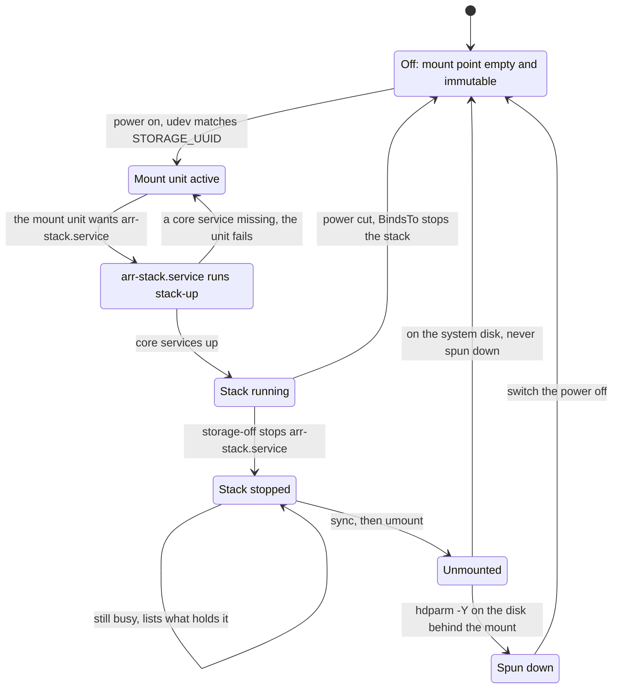
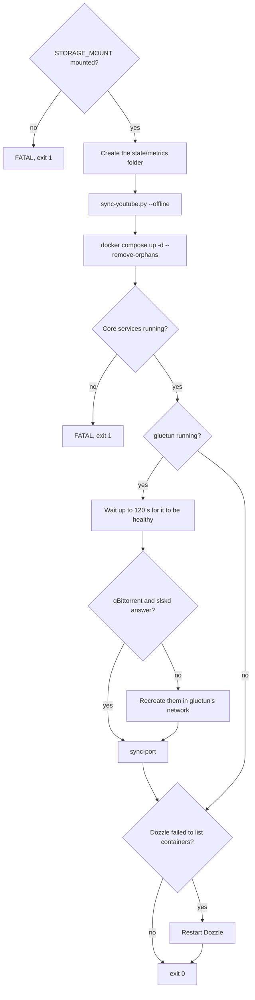

# Storage and boot

This page covers the media drive's life: how switching it on mounts it and starts the stack, how
to switch it off safely, what happens at boot, and when each timer runs. It is for anyone running
the server, and matters most if your media drive is powered on and off by hand.

The split is deliberate: the operating system, Docker and every app's settings (`$CONFIG_ROOT`)
live on the system disk, and only media and downloads (`$DATA_ROOT`) live on the media drive at
`STORAGE_MOUNT` (default `/mnt/storage`). Nothing the server needs to run is on the drive, so it
can be off. The full layout is in [Architecture](../architecture.md).

## The drive's lifecycle



### Switching it on

1. **udev.** [`99-arr-storage.rules`](../reference/systemd.md#99-arr-storagerules) matches a new
   block device by its filesystem UUID (`STORAGE_UUID`) and asks systemd for the mount unit.
   Matching by UUID puts the drive on `STORAGE_MOUNT` and nowhere else, whatever order devices
   appear in.
2. **The mount unit.** Its name comes from the mount path (`systemd-escape --path --suffix=mount`,
   so `mnt-storage.mount` for `/mnt/storage`). systemd builds it from the drive's line in
   `/etc/fstab`, a hand edit (see [Host setup](../operations/host.md)):

   ```
   UUID=<STORAGE_UUID>  /mnt/storage  ext4  defaults,noatime,nofail,x-systemd.device-timeout=60  0  2
   ```

   `nofail` lets the server boot normally while the drive is off.
3. **[`arr-stack.service`](../reference/systemd.md#arr-stackservice).** Installed as wanted by
   the mount unit (and by `multi-user.target`), it starts once the drive is mounted, after Docker.
   `BindsTo=` the mount unit means that if the mount goes away, the service stops with it. Before
   starting it checks the mount point again (`ExecStartPre=mountpoint -q`). It runs as the stack
   user, may take 600 seconds to start and 180 to stop (qBittorrent, Jellyfin and Jellystat's
   Postgres each get 30 seconds to shut down cleanly), and stops the stack with
   `docker compose stop`.
4. **[`stack-up`](../reference/scripts.md#stack-up)** starts the containers; see
   [What stack-up does](#what-stack-up-does).

### Switching it off

Run [`storage-off`](../reference/scripts.md#storage-off) **first**, then flip the switch. Cutting
power to a mounted filesystem risks losing data and a journal recovery on the next mount. In order,
it:

1. Stops `arr-stack.service` (`docker compose stop`).
2. Stops there, saying it's safe, if `STORAGE_MOUNT` is already unmounted.
3. Works out, while the drive is still mounted, which whole disk sits behind the mount and which
   one `/` lives on (a bind mount is followed back to its disk).
4. Flushes writes with `sync`.
5. Unmounts, trying 3 times, 3 seconds apart. If something still holds the drive, it lists what
   (`lsof`, or `fuser`) and exits 1 without touching the disk.
6. Stops there if the mount is on the system disk: that disk is never spun down.
7. Spins the drive down with `hdparm -Y`, then tells you it is safe to switch off.

If the power goes without `storage-off`, `BindsTo=` still stops the stack, but only after the
drive has gone, so writes in flight can be lost.

### The empty mount point

While the drive is off, nothing may land on the system disk in its place:

- The empty mount point is made immutable once, with the drive unmounted
  (`sudo chattr +i /mnt/storage`), so nothing can write into it.
- The media bind mounts in `docker-compose.yml` set `create_host_path: false`, so Docker refuses to
  start a container whose media path is missing instead of creating an empty folder.
- `arr-stack.service` and `stack-up` both refuse to start unless `STORAGE_MOUNT` is a mount point.
- The timers that need the drive skip their run while it's off (see [the table](#the-timers)).

### An always-on disk

If your media disk is always connected, leave `STORAGE_UUID` empty:

- [`install-host`](../reference/scripts.md#install-host) then skips the udev rule (and removes one
  installed earlier): there is nothing to hot-plug.
- `/etc/fstab` mounts the disk at boot. On a single-disk machine, bind-mount a folder instead
  (`/srv/media /mnt/storage none bind 0 0`); `STORAGE_MOUNT` must still be a real mount point.
- `arr-stack.service` starts at boot through `multi-user.target` and is still bound to the mount.
- `storage-off` still stops the stack and unmounts, and never spins down the system disk.

`STORAGE_DEVICE` (the whole disk, ideally a `/dev/disk/by-id/` path) tells Scrutiny which disk to
read SMART data from. The keys are in [Configuration](../reference/configuration.md#storage_uuid).

## What stack-up does



1. **Refuses to start without the drive** (`mountpoint -q "$STORAGE_MOUNT"`).
2. **Creates `$STATE_ROOT/metrics`** as the stack user, before Docker would create it as root for
   node-exporter.
3. **Seeds Glance's YouTube lists** (`sync-youtube.py --offline`), since Glance won't start without
   them.
4. **Starts every container** in the active profiles (`docker compose up -d --remove-orphans`).
5. **Checks the core library services** are running: Prowlarr, Radarr, Sonarr, Lidarr, Bazarr,
   Seerr, Plex, Jellyfin and Navidrome, each only if its module is on. A missing one fails the unit.
   The VPN pair is allowed to be down: gluetun retries on its own, and a VPN-only failure must not
   fail the unit, or systemd would mark it failed and the drive binding would stop working.
6. **Settles the VPN** if gluetun is running: waits up to 120 seconds for it to be healthy,
   recreates qBittorrent and slskd if they don't answer, and runs `sync-port`, because after a
   boot qBittorrent starts on a stale forwarded port (see [VPN and ports](vpn-and-ports.md)). A
   failed sync is only a warning; the timer retries.
7. **Restarts Dozzle** if its log since start says "failed to list containers": Dozzle lists
   containers once at start and never retries, so when Docker was too busy it shows no CPU or
   memory for them.
8. **Exits 0** when the core services are up, even if `docker compose` itself reported an error
   (usually the VPN still connecting).

## At boot

Nothing needs starting by hand:

1. Docker and Tailscale start (both enabled).
2. [`arr-firewall.service`](../reference/systemd.md#arr-firewallservice) loads the host firewall
   once Docker, Tailscale and the network are up. It's a one-shot job, so `systemctl` shows it
   *inactive* afterwards; the rules stay. See [Security](../security.md).
3. The drive mounts (from `/etc/fstab` if it is on, or later through udev), and
   `arr-stack.service` runs `stack-up`.
4. The timers take over, as below. `arr-port-sync.service` is ordered after `arr-stack.service`.

### The timers

| Timer | When (from `systemd/`) | Runs | Skipped while the drive is off |
|---|---|---|---|
| [`arr-firewall.timer`](../reference/systemd.md#arr-firewalltimer) | `OnBootSec=30sec`, then `OnUnitActiveSec=15min` | `firewall` (rebuilds only when the rules changed) | no |
| [`arr-port-sync.timer`](../reference/systemd.md#arr-port-synctimer) | `OnBootSec=90sec`, then `OnUnitActiveSec=15min` | `sync-port` | no: the run fails, without an alert |
| [`arr-throttle.timer`](../reference/systemd.md#arr-throttletimer) | `OnBootSec=3min`, then `OnUnitActiveSec=1min` | `throttle-downloads` | yes |
| [`arr-watch.timer`](../reference/systemd.md#arr-watchtimer) | `OnBootSec=3min`, then `OnUnitActiveSec=1min` | `watch-activity` | yes |
| [`arr-health.timer`](../reference/systemd.md#arr-healthtimer) | `OnCalendar=00/6:20` (00:20, 06:20, 12:20, 18:20), up to 10 min later | `health-check --notify` | yes |
| [`arr-backup.timer`](../reference/systemd.md#arr-backuptimer) | `OnCalendar=*-*-* 04:30:00`, up to 15 min later | `backup-config` | yes |
| [`arr-updates.timer`](../reference/systemd.md#arr-updatestimer) | `OnCalendar=*-*-* 06:00:00`, up to 30 min later | `check-updates` | no |
| [`arr-youtube.timer`](../reference/systemd.md#arr-youtubetimer) | `OnCalendar=Sun *-*-* 05:00:00`, up to 30 min later | `sync-youtube.py` | no |

- "Up to N min later" is `RandomizedDelaySec`. The throttle and watch timers use `AccuracySec=10s`
  so they really run every minute.
- The backup, update and YouTube timers have `Persistent=true`: a run missed while the server was
  off happens at the next boot.
- The units that need the drive carry `ConditionPathIsMountPoint=` on it, so they are skipped, not
  failed, while it's off.
- `arr-port-sync`'s automatic VPN restart counts how long the port has been missing from this boot
  on, not how many runs failed, so the quick runs at boot can't trigger it.
- When `arr-stack`, `arr-backup`, `arr-updates`, `arr-firewall` or `arr-youtube` fails,
  `OnFailure=` starts [`arr-notify-failure@.service`](../reference/systemd.md#arr-notify-failureservice),
  which pushes the unit's last log lines to ntfy.

What each timer's job does is in [Monitoring](monitoring.md), [Backups](backups.md) and
[Updates](updates.md).

### Installing the units

The files in [`systemd/`](https://github.com/bugrauluyurt/homelab-media-stack/tree/main/systemd)
are templates. [`install-host`](../reference/scripts.md#install-host) fills in `@REPO@`,
`@STACK_USER@`, `@STACK_GROUP@`, `@STORAGE_UUID@`, `@STORAGE_MOUNT@` and `@STORAGE_UNIT@` from
`.env`, installs units into `/etc/systemd/system` and the udev rule into `/etc/udev/rules.d`, and
reloads both. It enables nothing: a new unit needs `sudo systemctl enable --now <unit>` once (the
list is in [Getting started](../getting-started.md)). Check them with
`systemctl list-timers 'arr-*'`.

## Scripts and units involved

| Name | Role | Reference |
|---|---|---|
| `99-arr-storage.rules` | Asks for the mount unit when the drive with `STORAGE_UUID` appears | [systemd](../reference/systemd.md#99-arr-storagerules) |
| `arr-stack.service` | Starts the stack with the drive, stops it without | [systemd](../reference/systemd.md#arr-stackservice) |
| `stack-up` | Starts the containers and settles the VPN | [scripts](../reference/scripts.md#stack-up) |
| `storage-off` | Stops, unmounts and spins the drive down | [scripts](../reference/scripts.md#storage-off) |
| `install-host` | Renders and installs the units and the udev rule | [scripts](../reference/scripts.md#install-host) |
| `stack-env.sh` | `STORAGE_MOUNT`, profiles, and the disk behind a mount | [scripts](../reference/scripts.md#stack-envsh) |
| `arr-firewall.service` | Loads the firewall at boot | [systemd](../reference/systemd.md#arr-firewallservice) |
| `arr-notify-failure@.service` | Pushes a failed unit's log to ntfy | [systemd](../reference/systemd.md#arr-notify-failureservice) |

## When it goes wrong

- **The drive won't mount:**
  [the media drive won't mount](https://github.com/bugrauluyurt/homelab-media-stack/blob/main/ai/homelab-plugin/skills/stack-logs/references/known-issues.md#the-media-drive-wont-mount).
  After reformatting, put the new UUID (`lsblk -f`) in `STORAGE_UUID` and in `/etc/fstab`, and
  re-run `install-host`.
- **`storage-off` says the drive is busy:** it lists the processes holding it; stop them (often a
  shell sitting in the folder) and run it again.
- **The stack didn't start:** `systemctl status arr-stack.service` and
  `journalctl -u arr-stack.service` show `stack-up`'s output, including which core service was
  missing.
- **"forwarded port is in sync" fails just after a boot:** it fixes itself within minutes; see
  [qBittorrent stops answering after gluetun restarts](https://github.com/bugrauluyurt/homelab-media-stack/blob/main/ai/homelab-plugin/skills/stack-logs/references/known-issues.md#qbittorrent-stops-answering-after-gluetun-restarts).
- **Dozzle shows no CPU or memory:**
  [Dozzle lists containers too early](https://github.com/bugrauluyurt/homelab-media-stack/blob/main/ai/homelab-plugin/skills/stack-logs/references/known-issues.md#dozzle-shows-no-cpu-or-memory-avg-cpumemory-empty).
