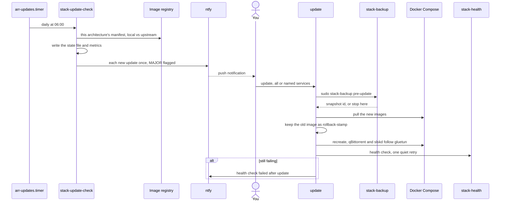
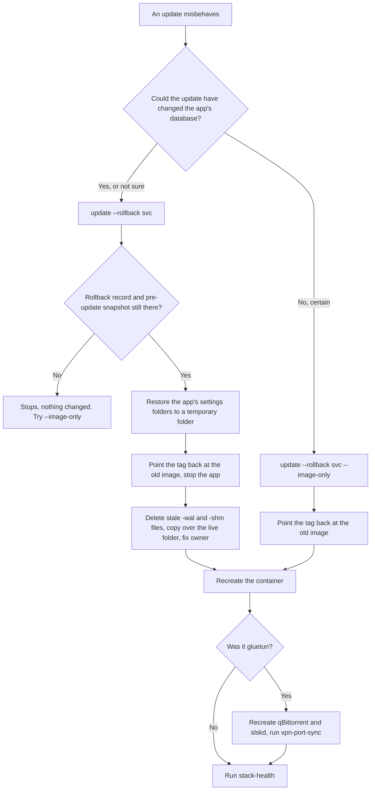

# Updates

This page follows a container image update from the moment a new version is published to the
moment it runs on the server, and back again if it misbehaves. It is for whoever looks after the
server: what checks for updates, what `stack-update` does step by step, and how to roll back.

Nothing updates itself. A daily check tells you what is new; you decide when to apply it, with one
command that takes a settings snapshot first and runs the health check afterwards.

**Why not automatic:** these apps depend on each other, and one release can break several at once.
A single Jellyfin major release once broke logins in Seerr, Sonarr, Radarr and Homepage together.
You would rather see that coming. (Watchtower, the usual auto-updater, was also abandoned in
December 2025.)



## Step 1: the daily check

`scripts/stack-update-check` runs every day at 06:00 from
[`arr-updates.timer`](../reference/systemd.md#arr-updatestimer) (with up to 30 minutes of random
delay, and at the next boot if the server was off). It only reports: it never pulls or restarts
anything. It does not need the media drive, so it runs while the stack is powered down too.

1. It lists the image of every running container (`docker compose ps`) and checks six at a time.
2. For each image it compares **this machine's architecture only**, not the whole image. Most
   images are published for several CPU types under one multi-arch index, and that index changes
   whenever any architecture is rebuilt. Comparing indexes would claim an update when only the
   amd64 build changed on an arm64 server (the Postgres image did exactly this). So the script
   asks the registry which manifest for this architecture (`docker version`'s server arch) the
   local index points at, and compares it with the one the tag points at now.
3. Each image gets one line in `$STATE_ROOT/updates` (the `state` folder next to `CONFIG_ROOT`):
   `current`, `update <image> <old> <new>`, or `unknown` when the registry could not answer.
   Versions come from the image's `org.opencontainers.image.version` or `build_version` label.
   An image labelled only `latest`, or not at all, falls back to its build date (`built-2026-09-01`),
   so a notice never reads "latest -> latest".
4. It writes two Prometheus metrics to `$STATE_ROOT/metrics/updates.prom`:
   `arr_image_updates_available` and `arr_image_updates_checked_timestamp_seconds`. The file is
   written whole and renamed into place, so a scrape never sees half a file. Glance's Lab page and
   Grafana read them through Prometheus (see [Monitoring](monitoring.md#metrics-prometheus-and-grafana)).
5. Updates it has not reported before go to ntfy in one message, one line per service:

   ```
   media stack: 2 update(s) available
   jellyfin: 10.11.2 -> 11.0.0  MAJOR
   sonarr: 4.0.15 -> 4.0.16
   Apply with: update
   ```

   **MAJOR** means the first number of the version changed. Those are the releases that break
   things, so read their release notes first. The list of what was already reported lives in
   `$STATE_ROOT/updates.notified`, so each update notifies once.

`scripts/stack-health` reads the same state file and prints a yellow `UPDATES` line. It is
information, not a failure:

```
  UPDATES 2 available (checked 2026-09-22 06:00):
           lscr.io/linuxserver/jellyfin:latest
```

To check right now, run `scripts/stack-update-check` (about one to two minutes). It prints each
`update available:` line and any image it `could not check`.

## Step 2: applying updates

Run `update` (the alias for `scripts/stack-update` from `scripts/aliases.zsh`) from the repository:

```bash
scripts/stack-update                   # every service the last check found an update for
scripts/stack-update jellyfin sonarr   # or just these
```

Before you run it:

- **Read the release notes of anything marked MAJOR.**
- **Check that nothing is playing in Jellyfin** before updating it; recreating Jellyfin stops every
  stream. The `stack-update` skill has a one-line check that reads the API key into a variable.
- After a qBittorrent update, expect `scripts/vpn-leak-test` to be inconclusive for about a minute:
  dozens of torrents re-announcing at once briefly swamp the VPN's DNS. It recovers by itself.

What it does, in order:

1. **Settings snapshot.** It runs `sudo scripts/stack-backup pre-update`, a normal
   [backup](backups.md) tagged `pre-update`. If the backup fails, or prints no snapshot id (the
   media drive is not mounted), it stops and updates nothing.
2. **Notes the current images.** It records the image ID each service runs now.
3. **Pull and recreate.**
   - `docker compose pull` for the named services. If the pull fails, nothing was restarted.
   - For each service whose image **actually changed**, the old image is tagged
     `<repository>:rollback-<YYYYmmdd-HHMM>`, older rollback tags of that repository are removed
     (one rollback image per app is enough), and a rollback record goes to
     `$STATE_ROOT/rollback/<service>`: image, old image ID, time stamp and snapshot id. Only a
     changed image replaces the record, so running `stack-update` twice never leaves the new image as
     the one to roll back to.
   - `docker compose up -d` recreates the services. qBittorrent and slskd share gluetun's network
     namespace and lose it when gluetun is recreated, so when gluetun is in the list they follow
     it (slskd only when the music module is on). The script then force-recreates them, waits up
     to three minutes for gluetun to be healthy and runs `scripts/vpn-port-sync`, because the new
     tunnel usually brings a new forwarded port (see [VPN and ports](vpn-and-ports.md)).
   - If recreating fails, ntfy gets **"media stack: update failed"** and the script exits.
   - The updated images are marked `current` in the state file and the metrics are rewritten.
4. **Health check.** Freshly recreated apps can take a minute to answer, so the first
   `stack-health` runs quietly. If it fails, the script gives the updated containers up to two
   minutes to finish starting, waits 30 seconds more, and runs it again with output. If it
   still fails, ntfy gets **"media stack: health check failed after update"** with the rollback
   command, and `stack-update` exits non-zero.

After a Jellyfin update, the health check also confirms every Jellyfin plugin is still
`Active`: a Jellyfin release can disable plugins built for an older one ("NotSupported",
"Malfunctioned") without anything else failing.

`stack-update` needs passwordless `sudo` for the snapshot and for restoring settings during a rollback.

## Step 3: rolling back



```bash
scripts/stack-update --rollback jellyfin               # previous image and its settings
scripts/stack-update --rollback jellyfin --image-only  # previous image, keep current settings
```

**The default restores settings as well as the image.** Updates often migrate an app's database,
and the older version cannot open a migrated one. The settings come from the snapshot taken just
before the update, so anything changed in that app since then is lost. Use `--image-only` only
when you are sure the update did not touch the database.

How a settings rollback works:

1. It reads `$STATE_ROOT/rollback/<service>`. Without a record (the image did not change in an
   update) it says so and stops.
2. It finds the service's settings folders (its volumes under `CONFIG_ROOT`) and restores just
   those from the pre-update snapshot into a temporary folder, using the key file on the media
   drive. If the restore fails, or the snapshot holds nothing for that app, nothing changes.
3. It points the image tag back at the old image and stops the app.
4. For each folder it deletes the `-wal` and `-shm` files next to every restored database: the
   restored databases are complete copies, and stale WAL files beside them would be replayed on
   top and corrupt them. It then copies the restored files **over** the live folder rather than
   swapping it in, because backups leave out caches and artwork, which would otherwise be lost.
   Ownership is set back to the folder's owner. An empty folder is not in a snapshot, so it is
   skipped with a note.
5. It recreates the container. If any folder could not be restored it prints
   **SETTINGS NOT FULLY RESTORED** and exits non-zero.

A settings rollback needs the media drive mounted (the snapshots live there). Only the last five
`pre-update` snapshots are kept, so an old record can point at a snapshot that is gone; the
restore then fails safely and `--image-only` is the remaining option.

After a rollback the next daily check reports the same update again. Until a fixed release
arrives, name the services you want when you run `stack-update`, so the bad version is not applied again.

## Needle's image

Needle's default image, `ghcr.io/bugrauluyurt/needle:1` (`NEEDLE_IMAGE` in `.env` overrides it),
follows every 1.x release. Minor and patch releases move the `:1` tag, so they arrive through the
same daily check and `stack-update` with no change to the repository. A new major version needs a new
tag in `docker-compose.yml`, and arrives as a Dependabot pull request. If you set
`NEEDLE_IMAGE=needle:local` to run your own build, the check cannot compare it with a registry and
lists it under "could not check".

## Scripts and units involved

| Name | Role | Reference |
|---|---|---|
| `stack-update-check` | Daily comparison, state file, metrics, ntfy | [scripts](../reference/scripts.md#stack-update-check) |
| `arr-updates.timer` / `.service` | Runs `stack-update-check` daily at 06:00; a failure goes to `stack-failure-notify` | [systemd](../reference/systemd.md#arr-updatestimer) |
| `stack-update` | Snapshot, pull, rollback tags, recreate, health check, rollback | [scripts](../reference/scripts.md#stack-update) |
| `stack-backup` | The `pre-update` snapshot | [scripts](../reference/scripts.md#stack-backup) |
| `stack-health` | Verifies the result | [scripts](../reference/scripts.md#stack-health) |
| `vpn-port-sync` | Re-syncs the forwarded port after gluetun is recreated | [scripts](../reference/scripts.md#vpn-port-sync) |
| `stack-env.sh` | `notify`, `write_update_metrics`, `reattach_vpn_apps` | [scripts](../reference/scripts.md#stack-envsh) |
| `stack-update` skill | Lets an AI agent check, apply and roll back, with your yes each time | [AI agent](ai-agent.md#the-skills) |

## When it goes wrong

- **`stack-update` stops at step 1, saying the backup failed or no snapshot was taken.** The media
  drive is not mounted, or the backup itself failed. Nothing was changed. See
  [Backups](backups.md#when-it-goes-wrong).
- **Radarr, Sonarr or Lidarr say "connection refused" to `gluetun:8080` after an update or a
  rollback of gluetun.** qBittorrent and slskd lost gluetun's network. `stack-update` re-attaches them,
  but `stack-update --rollback gluetun` does not: run
  `docker compose up -d --force-recreate qbittorrent slskd` and `scripts/vpn-port-sync`. See
  [qBittorrent stops answering after gluetun restarts](https://github.com/bugrauluyurt/homelab-media-stack/blob/main/ai/homelab-plugin/skills/stack-logs/references/known-issues.md#qbittorrent-stops-answering-after-gluetun-restarts).
- **A Jellyfin plugin shows as not Active.** The new Jellyfin disabled a plugin built for the
  old one. Wait for the plugin's update, or roll Jellyfin back.
- **Uptime Kuma reports an updated service down although it runs.** See
  [Uptime Kuma says a service is down, but it's running](https://github.com/bugrauluyurt/homelab-media-stack/blob/main/ai/homelab-plugin/skills/stack-logs/references/known-issues.md#uptime-kuma-says-a-service-is-down-but-its-running).
- **An image is always "could not check".** Its registry refused the lookup, or it is a local
  build with no registry digest.
- For anything else, start with [Troubleshooting](../troubleshooting.md).
