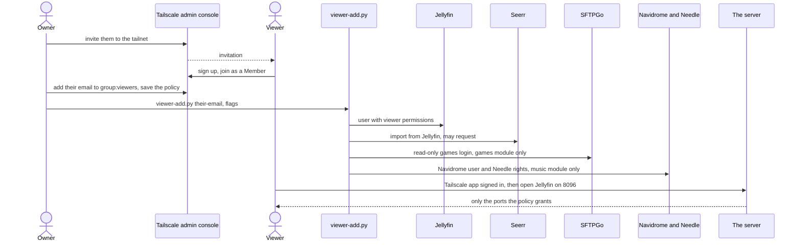

# Giving someone access

This page is for the owner who wants family or a friend to watch, request, listen or download games
from their own home. It covers the Tailscale invite, the access policy that limits what they reach,
and `scripts/viewer-add.py`, which creates their accounts in every app with one password.

Four steps: you do the first two in Tailscale's admin console and the third on the server; they do
the fourth. Nothing is published to the internet: viewers come in through your tailnet, and the
policy lets them reach only the apps meant for them.



## 1. Invite them to your tailnet

In Tailscale's admin console, open **Users**, then **Invite**. They sign up with their own
account and join as a **Member**.

## 2. Limit what they reach

The access policy lives in Tailscale's admin console; the reference copy is
[`host/tailscale-policy.hujson`](https://github.com/bugrauluyurt/homelab-media-stack/blob/main/host/tailscale-policy.hujson),
with placeholder emails. Replace them, add the viewer's email to `group:viewers` (and to a test
line if you like), and paste it into **Access controls**, **JSON editor**. The editor runs the
tests before saving.

The server must carry `tag:media`: **Machines**, the server, **⋯**, **Edit ACL tags**. You do this
once.

What the policy says:

| Who | Reaches | Why |
|---|---|---|
| You (every device you sign in to) | Everything on every device | Your own access |
| `group:viewers` | Only `tag:media` on these TCP ports: 8096 (Jellyfin), 5055 (Seerr), 5000 (Questarr), 8090 (games web page), 2022 (games SFTP), 4535 (Needle) | Watching, requesting, games and music, nothing else |
| The server (`tag:media`) | Nothing: it has no grant as a source | If it were compromised, it couldn't reach your laptops or phones |

Navidrome itself (4533) stays closed to viewers: Needle passes their music through. Tailscale SSH
is limited to each member's own devices (`autogroup:self`), with a `check` that asks for a
re-login. The policy's tests prove a viewer gets the six ports and is refused Sonarr (8989),
qBittorrent (8080), Glance (3005), Scrutiny (3006), ChangeDetection (3007), Navidrome (4533) and
SSH (22).

**Never put back Tailscale's default grant (`"src": ["*"], "dst": ["*"]`).** Rules only ever add
access, so it would cancel everything above.

### Devices

- **Access follows the person, not the device.** Every device they sign in to gets the same apps,
  and you change nothing per device.
- **Don't tag a viewer's device.** A tagged device stops belonging to its person, so it stops
  counting as a member of `group:viewers`.
- **Apple TV** (tvOS 17 or later) and **Android or Google TV** run the Tailscale app. Then a
  Jellyfin player such as JellySee (Jellyfin and Seerr in one), Swiftfin, Infuse or Neptune, with
  server `http://<tailscale-ip>:8096`, and Seerr at `http://<tailscale-ip>:5055`. The tunnel pauses
  while the TV sleeps and reconnects when an app opens.
- **Windows or Mac:** the Tailscale app, then a browser: Jellyfin `:8096`, Seerr `:5055`, Questarr
  `:5000` and the games page `:8090`, all on `<tailscale-ip>`. For whole game folders, an SFTP
  client (WinSCP, FileZilla) on port 2022 with their games login; an interrupted copy continues
  where it stopped.
- **Samsung and LG smart TV apps** can't run Tailscale. Use a streaming box that can (Apple TV,
  Google TV, Fire TV), or Jellyfin in a browser.
- **A computer already on another tailnet** (a work laptop) can't join a second one: a Tailscale
  app is on one tailnet at a time. Run Tailscale in a container on it instead, in userspace mode
  with `TS_SOCKS5_SERVER=:1055` published on `127.0.0.1:1055`, signed in to the account that should
  have access. Point one browser at it (Firefox: SOCKS v5 `127.0.0.1:1055`, "Proxy DNS when using
  SOCKS v5"); the rest of that computer stays on its own network.

People who live with you can also use Jellyfin, Seerr and the games page from the home network
without Tailscale (`http://<lan-ip>:8096`, `:5055`, `:8090`); the host firewall allows nothing else
there ([Security](../security.md)). Those apps are reachable by guests on that network too, so give
everyone a password guests can't guess.

## 3. Create their accounts

On the server, from the repository:

```bash
scripts/viewer-add.py their@example.com --auto-approve --music-requests
```

It asks for a password (or reads one line from stdin) and uses that one password everywhere:

| App | What it creates | When |
|---|---|---|
| **Jellyfin** | A user named exactly as given. Watches every library, may play remotely; can search, download and upload subtitles; not an administrator; can't delete media or subtitles or manage collections or live TV. Their own watch history and *Continue watching* | Always |
| **Seerr** | The same user imported from Jellyfin (they sign in with the Jellyfin login), allowed to request. Requests **wait for your approval** in Seerr's *Requests* unless you pass `--auto-approve` | Always |
| **Games page (SFTPGo)** | A login with the same name: list and download only, over the web page or SFTP; no uploads, no share links, no FTP or WebDAV, and no two-factor (a lost phone would lock them out) | Only with the `games` module on |
| **Navidrome, for Needle** | A non-admin Navidrome user named after the part before "@" (`their@example.com` signs in to Needle as `their`). Their own likes, playlists, stats and mixes; the whole library; not Navidrome's settings | Only with the `music` module on |
| **Needle rights** | `--music-requests` lets them get albums and songs (straight to Lidarr and slskd, no approval step; you see everyone's requests on Needle's Requests page). `--spotify` lets them connect their own Spotify | Only with those flags |

It is idempotent: an account that exists keeps its password, and the flags only switch rights on.
To switch one off, use Seerr's *Users* page, or Needle's **Settings, People** (they appear there
after their first sign-in). Spotify's development mode also needs their Spotify email under *User
Management* in the Spotify developer dashboard ([Music](music.md)).

For existing active Jellyfin viewers, `configure-jellyfin-plugins.py` enables subtitle management
without changing their other permissions. In the browser, **⋯ → Edit subtitles** offers search
and **Download** for playback; Open Subtitles results also have **Save to device** for an `.srt`
file. Viewers need no browser extension ([Subtitles](../using/watching.md#subtitles)).

Games accounts are managed only through
[`scripts/games_accounts.py`](https://github.com/bugrauluyurt/homelab-media-stack/blob/main/scripts/games_accounts.py),
which `viewer-add.py` calls. SFTPGo's admin API answers only the server and Docker
(`127.0.0.0/8` and `172.16.0.0/12`), which is why the script runs on the server.

**Questarr** has one shared login (`admin` and `QUESTARR_PASSWORD`) and no approval step. Tell
viewers the house rule: in Questarr, only mark a game as *Wanted*, never click a release to download
it. You get "Game Available" on ntfy and pick a release yourself; if someone starts a download
anyway, you get "Download Started" and can cancel it in qBittorrent ([Games](games.md)).

## 4. On their side

They install Tailscale on each device and sign in to **their** account. Then:

- Jellyfin at `http://<tailscale-ip>:8096` and Seerr at `http://<tailscale-ip>:5055`
  ([Watching](../using/watching.md), [Requesting](../using/requesting.md)).
- Needle at `https://<host>.<tailnet>.ts.net:4535` ([Music for listeners](../using/music.md)).
- Questarr at `:5000` and the games page at `:8090` ([Games for players](../using/games.md)).

Their streams use your home **upload** bandwidth; see [Watching](../using/watching.md).

## Removing someone

Delete them under **Users** in Tailscale and take their email out of `group:viewers`. Without the
tailnet they can no longer reach the server, except Jellyfin, Seerr and the games page from your own
home network. Their app accounts can stay or go; delete them in Jellyfin, Seerr, SFTPGo and
Navidrome if you want them gone.

## Scripts and units involved

| Name | Role | Reference |
|---|---|---|
| `viewer-add.py` | Jellyfin, Seerr, games and music accounts with one password | [scripts](../reference/scripts.md#viewer-addpy) |
| `games_accounts.py` | The only way games accounts are created; keeps them read-only | [scripts](../reference/scripts.md#games_accountspy) |
| `host/tailscale-policy.hujson` | Reference copy of the access policy | [Host changes](../operations/host.md) |
| `host-firewall` | Keeps the home network to Jellyfin, Seerr and the games page | [scripts](../reference/scripts.md#host-firewall) |

## When it goes wrong

- **They can't connect at all.** Check, in order: their device is signed in to Tailscale with an
  email in `group:viewers`; the device is not tagged; the server still carries `tag:media`
  (`tailscale status --json`, `Self.Tags`); on a TV, the Tailscale app is connected. See
  [A viewer (family, friend) can't connect](https://github.com/bugrauluyurt/homelab-media-stack/blob/main/ai/homelab-plugin/skills/stack-logs/references/known-issues.md#a-viewer-family-friend-cant-connect).
- **"Account disabled".** Jellyfin locks a non-admin account after 3 wrong passwords, and Seerr signs
  in through Jellyfin, so both stop working. Re-enable it in Jellyfin, *Users*.
- **Their requests never download.** They wait for your approval in Seerr unless they were added
  with `--auto-approve` (or given Auto-Approve in Seerr, *Users*).
- **An app won't open from the home network.** By design only Jellyfin, Seerr and the games page
  do; see
  [An app won't open from home Wi-Fi](https://github.com/bugrauluyurt/homelab-media-stack/blob/main/ai/homelab-plugin/skills/stack-logs/references/known-issues.md#an-app-wont-open-from-home-wi-fi-only-jellyfin-seerr-and-the-games-page-do).
- **A big game download started over.** See
  [Games page (SFTPGo): a big download started over](https://github.com/bugrauluyurt/homelab-media-stack/blob/main/ai/homelab-plugin/skills/stack-logs/references/known-issues.md#games-page-sftpgo-a-big-download-started-over).
- **Needle hides Spotify.** See
  [Needle hides Spotify, or says Spotify refused (429)](https://github.com/bugrauluyurt/homelab-media-stack/blob/main/ai/homelab-plugin/skills/stack-logs/references/known-issues.md#needle-hides-spotify-or-says-spotify-refused-429).
- For anything else, start with [Troubleshooting](../troubleshooting.md).
