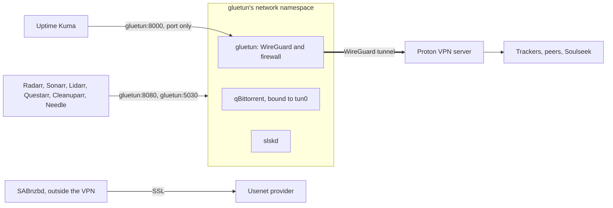
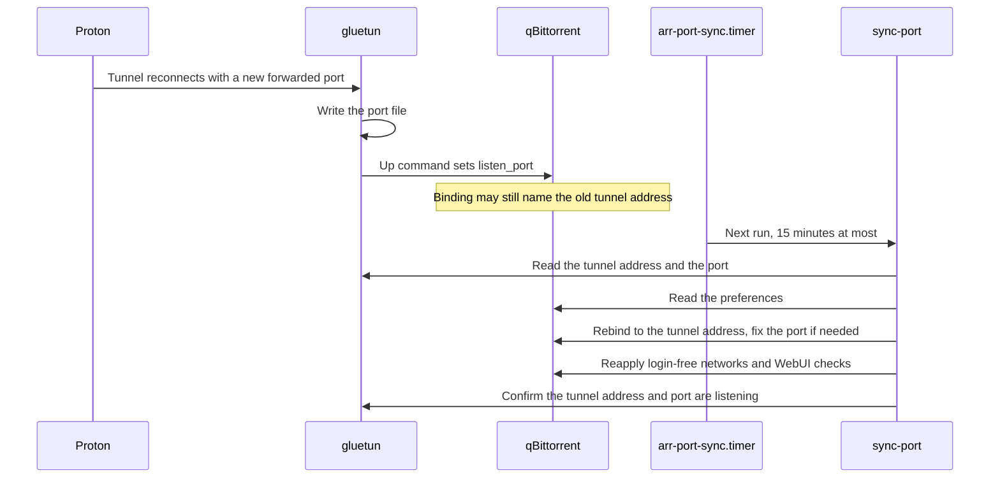
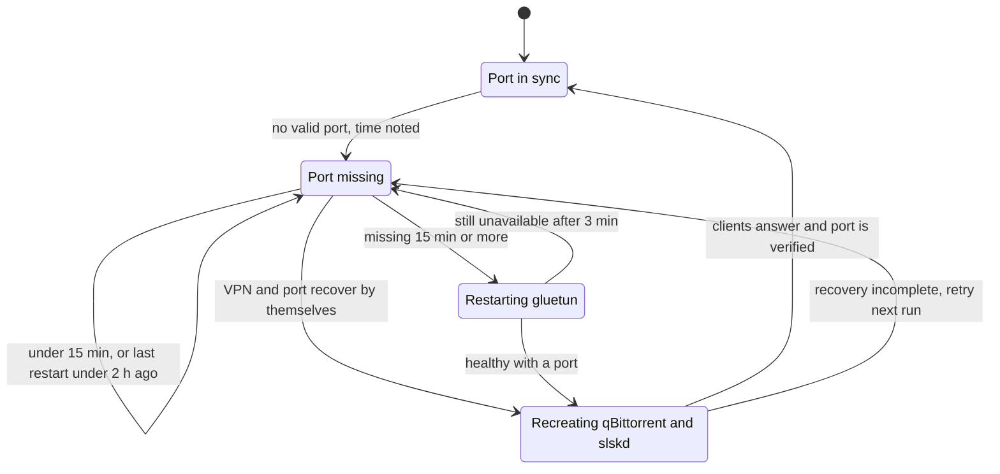

# VPN and ports

This page explains how torrent and Soulseek traffic is kept inside the VPN, how Proton's forwarded
port reaches qBittorrent, and how the stack repairs itself when the tunnel reconnects or the port
goes missing. It is for anyone running the stack or debugging the downloaders. Setting the VPN up
for the first time is in [Getting started](../getting-started.md).



## gluetun

The VPN runs inside the `gluetun` container, not on the server itself. The server, Tailscale,
Jellyfin, Plex and the arr apps are untouched by it, so your own streams stay direct.

- **Custom WireGuard.** gluetun runs with `VPN_SERVICE_PROVIDER=custom` and
  `VPN_TYPE=wireguard`. The client private key lives only in `.env` (`WIREGUARD_PRIVATE_KEY`); the
  Proton server's endpoint and public key are in `$CONFIG_ROOT/gluetun/wireguard/wg0.conf`
  (mode `0600`), without a `PrivateKey` line, because values in that file override the environment.
  Use a dedicated Proton configuration for a P2P server with NAT-PMP on and Moderate NAT off (they
  conflict). Custom mode has no automatic server failover: changing the endpoint or key, and
  recreating gluetun with its downloaders, is a deliberate step.
- **Exit country.** `VPN_COUNTRIES` lists the countries the exit may be in. It doesn't choose a
  server (the endpoint in `wg0.conf` does); `health-check` reads the country from gluetun's log and
  fails if it isn't listed, and always fails for the United States.
- **Port forwarding.** `VPN_PORT_FORWARDING=on` with Proton's provider. gluetun asks the server for
  a port over NAT-PMP and writes it to `/tmp/gluetun/forwarded_port` inside the container.
- **`VPN_PORT_FORWARDING_UP_COMMAND`.** Each time gluetun gets a port, it posts it straight to
  qBittorrent's local API as `listen_port` (random port and UPnP off). This works without a login
  because qBittorrent's `LocalHostAuth` is off. A line in gluetun's log saying the up command exited
  with status 4 only means qBittorrent wasn't up yet.
- **The shared namespace.** qBittorrent and slskd run with `network_mode: service:gluetun`: they
  have no network of their own, only gluetun's, and start once gluetun is healthy. gluetun publishes
  their ports (`QBIT_PORT` and 5030), and other containers reach them as `gluetun:8080` and
  `gluetun:5030`.
- **The kill switch.** gluetun's firewall drops everything that doesn't go through the tunnel. If
  the tunnel drops, qBittorrent and slskd lose the internet instead of falling back to your home
  address. `FIREWALL_OUTBOUND_SUBNETS` lets them answer your home network (`LAN_CIDR`) and the
  tailnet (`100.64.0.0/10`), so their web pages still work.
- **IPv6 off.** The namespace has IPv6 disabled (`net.ipv6.conf.all.disable_ipv6=1`), since the
  tunnel carries none. `DOT_IPV6: "off"` stops gluetun's DNS from handing out AAAA records: those
  addresses have no route out, and every tracker would fail with "Operation not permitted".
- **`BLOCK_MALICIOUS: "off"`.** gluetun's malicious-domain blocklist also blocks public torrent
  trackers, which then fail DNS with NXDOMAIN.
- **One forwarded port.** Proton forwards a single port and qBittorrent holds it, so slskd reaches
  only Soulseek peers that accept incoming connections.
- **SABnzbd stays outside.** Usenet is SSL and download only, nothing is shared, so SABnzbd runs on
  the normal Docker network at full line speed. Adding Usenet changed nothing about the torrents'
  VPN. See [Media requests](media-requests.md).

## qBittorrent's side

The seed config,
[`apps/qbittorrent/qBittorrent.conf`](https://github.com/bugrauluyurt/homelab-media-stack/blob/main/apps/qbittorrent/qBittorrent.conf),
is copied into `$CONFIG_ROOT/qbittorrent/qBittorrent/` before the first start, and
[`sync-port`](../reference/scripts.md#sync-port) keeps the live settings in line with it.

- **Bound to the tunnel.** qBittorrent binds to `tun0` and its current address. gluetun routes
  anything sent from the container's Docker bridge address back out `eth0`, so the published web
  page can reply; a qBittorrent bound there would send tracker traffic outside the tunnel, where the
  firewall drops it, and every tracker would report "Operation not permitted". Bound to the tunnel
  address, traffic goes through `tun0`, and it can't leak if the tunnel disappears.
- **DHT remains enabled.** Both DHT-on established sessions and DHT-off cold starts passed
  testing, while a reboot with DHT on failed. These observations do not isolate DHT as the cause;
  startup traffic volume and transient upstream issues remain hypotheses. Recovery scripts do
  not override DHT or impose new peer, queueing or bandwidth limits. Before replacing credentials
  or changing peer discovery, inspect the tunnel and traffic evidence. See the
  [troubleshooting notes](https://github.com/bugrauluyurt/homelab-media-stack/blob/main/ai/homelab-plugin/skills/stack-logs/references/known-issues.md#vpn-fails-shortly-after-torrents-start-then-recovers-about-an-hour-later).
- **Login-free networks.** The Docker network (`172.16.0.0/12`: the arr apps, Homepage) and the
  tailnet (`100.64.0.0/10`: your phone) skip the login, so the apps need no stored credential. The
  home network always has to log in; `health-check` fails if a login-free range overlaps
  `LAN_CIDR`.
- **CSRF and Host checks stay on.** Without them, any web page open on a tailnet device could forge
  requests to the login-free API. The accepted host names are `gluetun`, `127.0.0.1`, `HOST_NAME`,
  `HOST_NAME.local`, `HOST_NAME.*.ts.net` and the server's own IPv4 addresses. Dashboard links still
  work because Homepage and Glance send no Referer; browser extensions that send torrents are
  refused, since their Origin is the extension.
- **A known limit.** qBittorrent matches accepted hosts as substrings, so a targeted DNS rebinding
  attack (a page on a name like `gluetun.attacker.example` that resolves to the server) isn't
  stopped. Only a login on the tailnet would close that.

## sync-port

[`sync-port`](../reference/scripts.md#sync-port) reconciles qBittorrent with the live tunnel. It
runs from [`arr-port-sync.timer`](../reference/systemd.md#arr-port-synctimer) 90 seconds after boot
and then every 15 minutes, from `stack-up` as soon as the tunnel is healthy after the stack starts,
and by hand. In order, it:

1. Reads VPN health, the tunnel address (`tun0` inside gluetun) and the forwarded port.
2. Requires a healthy VPN, a tunnel address and a port between 1024 and 65535. Otherwise it
   follows the [missing-port rules](#when-proton-gives-no-port). Once ready, it reattaches stopped
   or detached downloaders, even after spontaneous VPN recovery, without restarting other
   services. It refuses to change preferences if qBittorrent's API response is invalid.
3. Binds qBittorrent to `tun0` and the current tunnel address, if it isn't already.
4. Sets `listen_port` to the forwarded port, if it differs.
5. Sets the login-free networks to exactly the tailnet and the Docker network.
6. Turns the web page's CSRF and Host checks on with the current host names.
7. Checks, inside gluetun, that something listens on the tunnel address and port; it exits 1 with
   a warning if not.

A run with nothing to change prints "already in sync". Every step only writes when the value
differs, so running it again is harmless.

## A reconnect

Proton hands out a new forwarded port when the tunnel reconnects, and the tunnel address can change
too. gluetun's up command fixes the port at once; the next `sync-port` run fixes the rest:



After a boot, qBittorrent starts on its saved port, which is stale by then. `stack-up` runs
`sync-port` as soon as gluetun is healthy, and the timer runs 90 seconds after boot, so a
`health-check` in the first minute may catch "forwarded port is in sync" failing mid-flight.

## When Proton gives no port

Proton sometimes stops answering NAT-PMP after a reconnect while the tunnel stays up. gluetun gives
up after nine tries. Torrents stay inside the VPN but no peers can connect in, so they slow down;
Usenet is unaffected. `sync-port` heals this by itself:



- The 15 minutes (`MISSING_LIMIT`) are measured by the clock from when a run first saw the port
  missing, not by counting failed runs: at boot two runs come a minute apart. A time noted before
  the last boot is ignored, so the count starts again with each boot.
- At most one restart every two hours (`HEAL_EVERY`), so a long Proton outage doesn't mean a
  restart and a push every half hour.
- The restart is `docker compose restart --no-deps gluetun`; it waits up to 3 minutes for a tunnel address,
  a valid port and a healthy gluetun. Only then may it recreate qBittorrent and slskd in the new
  namespace (see [below](#re-attaching-qbittorrent-and-slskd)). A failed wait leaves them untouched.
- Every later run can reattach missing downloaders after the tunnel recovers, without another
  VPN restart. This uses the existing timer, not an additional watcher.
- It pushes **"VPN forwarded port restored"** only after clients answer and their port is verified,
  or **"VPN still unavailable"** if the restart did not restore readiness.
- The state lives in `$STATE_ROOT/port-forward-missing-since` and
  `$STATE_ROOT/port-forward-last-heal`.

To do it by hand (it pauses torrents and Soulseek for about a minute):

```bash
docker compose restart gluetun                    # wait until it's healthy
docker compose up -d --force-recreate qbittorrent slskd
./scripts/sync-port && ./scripts/leak-test
```

## Re-attaching qBittorrent and slskd

qBittorrent and slskd share gluetun's network namespace. When gluetun is restarted or recreated
under them, they keep "running" with a dead network, and the apps get "connection refused" until
they are recreated. [`stack-env.sh`](../reference/scripts.md#stack-envsh) holds the two helpers
every script uses:

- `vpn_apps_attached` asks qBittorrent's web page (`127.0.0.1:QBIT_PORT`) and, when the music module
  is on, slskd's `/health` on port 5030.
- `reattach_vpn_apps` runs `docker compose up -d --force-recreate qbittorrent` (plus `slskd` when
  the music module is on; naming a service would start it even with its profile off).

`stack-up` re-attaches them at boot when they don't answer, `sync-port` after its gluetun restart,
and `update` after updating gluetun (see [Updates](updates.md)).

## Leak test

[`leak-test`](../reference/scripts.md#leak-test) proves the torrent traffic leaves through Proton:

1. It asks `https://api.ipify.org` (plain text for every client; some services send HTML to `wget`,
   which silently breaks the comparison) for the public IPv4 address three times: from the server,
   from gluetun and from qBittorrent.
2. **LEAK** (exit 1) if gluetun's address equals the server's, or qBittorrent's differs from
   gluetun's. **INCONCLUSIVE** (exit 2) if any of the three couldn't reach the service. **PASS**
   otherwise.
3. It then compares gluetun's forwarded port with qBittorrent's `listen_port` and suggests
   `sync-port` on a mismatch. It reads gluetun's port file, because gluetun's control-server API
   requires authentication.

Right after qBittorrent restarts, expect an inconclusive result for about a minute: many torrents
re-announcing at once briefly swamp the VPN's DNS.

## The forwarded-port monitor

gluetun's control server (port 8000, not published) requires authentication on every route.
[`apps/gluetun/auth.toml`](https://github.com/bugrauluyurt/homelab-media-stack/blob/main/apps/gluetun/auth.toml)
opens exactly one route without credentials, read-only: `GET /v1/portforward`. Only containers on
the `arr` network can reach it.
[`configure-uptime-kuma.py`](../reference/scripts.md#configure-uptime-kumapy) adds a
**"vpn forwarded port"** JSON monitor on `http://gluetun:8000/v1/portforward` that expects `port`
above 0, next to gluetun's Docker health and the qBittorrent and slskd ports. When Proton stops
handing out a port, Kuma sends DOWN, then UP once a new one is in place. See
[Monitoring](monitoring.md).

`health-check` covers the rest: gluetun running, the exit country, qBittorrent answering and
reachable from Radarr, bound to the tunnel, the forwarded port in sync, the home network required to
log in, and cross-site requests refused.

## Scripts and units involved

| Name | Role | Reference |
|---|---|---|
| `sync-port` | Binds qBittorrent to the tunnel, syncs the port and WebUI settings, heals a missing port | [scripts](../reference/scripts.md#sync-port) |
| `arr-port-sync.timer` | Runs `sync-port` 90 seconds after boot, then every 15 minutes | [systemd](../reference/systemd.md#arr-port-synctimer) |
| `arr-port-sync.service` | The `sync-port` job, after `arr-stack.service` | [systemd](../reference/systemd.md#arr-port-syncservice) |
| `stack-up` | Re-attaches the VPN apps and syncs the port at boot | [scripts](../reference/scripts.md#stack-up) |
| `stack-env.sh` | Tunnel, port and re-attach helpers | [scripts](../reference/scripts.md#stack-envsh) |
| `leak-test` | Proves qBittorrent exits through Proton | [scripts](../reference/scripts.md#leak-test) |
| `configure-uptime-kuma.py` | The forwarded-port monitor | [scripts](../reference/scripts.md#configure-uptime-kumapy) |
| `health-check` | The VPN checks | [scripts](../reference/scripts.md#health-check) |
| `apps/gluetun/auth.toml` | The one open control-server route | [file](https://github.com/bugrauluyurt/homelab-media-stack/blob/main/apps/gluetun/auth.toml) |

## When it goes wrong

- **Apps say "Failed to connect to qBittorrent":**
  [qBittorrent stops answering after gluetun restarts](https://github.com/bugrauluyurt/homelab-media-stack/blob/main/ai/homelab-plugin/skills/stack-logs/references/known-issues.md#qbittorrent-stops-answering-after-gluetun-restarts).
- **Port out of sync:**
  [forwarded port out of sync](https://github.com/bugrauluyurt/homelab-media-stack/blob/main/ai/homelab-plugin/skills/stack-logs/references/known-issues.md#forwarded-port-out-of-sync).
- **"vpn forwarded port" DOWN in Kuma:**
  [no forwarded port at all](https://github.com/bugrauluyurt/homelab-media-stack/blob/main/ai/homelab-plugin/skills/stack-logs/references/known-issues.md#no-forwarded-port-at-all-vpn-forwarded-port-down-in-kuma).
  Act only if ntfy said "VPN still has no forwarded port".
- **Torrents at 0 peers, "Operation not permitted":**
  [trackers say "Operation not permitted"](https://github.com/bugrauluyurt/homelab-media-stack/blob/main/ai/homelab-plugin/skills/stack-logs/references/known-issues.md#torrents-stuck-at-0-peers-trackers-say-operation-not-permitted).
- **Trackers say "Host not found":**
  [BLOCK_MALICIOUS or a dead tracker](https://github.com/bugrauluyurt/homelab-media-stack/blob/main/ai/homelab-plugin/skills/stack-logs/references/known-issues.md#trackers-say-host-not-found).
- **Lidarr can't reach slskd:**
  ["Connection refused (gluetun:5030)"](https://github.com/bugrauluyurt/homelab-media-stack/blob/main/ai/homelab-plugin/skills/stack-logs/references/known-issues.md#lidarr-connection-refused-gluetun5030-from-slskddownloadmanager).
- **Never** move the exit to the US or take qBittorrent or slskd out of gluetun's network:
  [things never to do](https://github.com/bugrauluyurt/homelab-media-stack/blob/main/ai/homelab-plugin/skills/stack-logs/references/known-issues.md#things-never-to-do).
