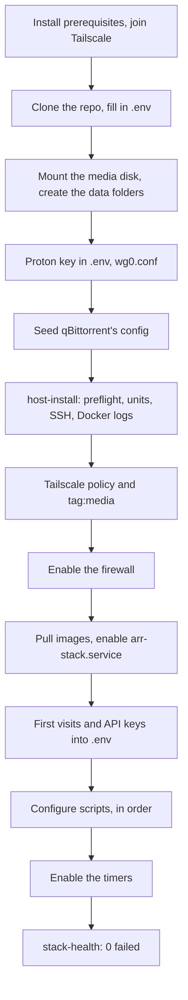

# Getting started

This page takes you from a bare machine to a running, healthy stack. It is for anyone
installing the stack on a Raspberry Pi 5 (arm64) or an x86-64 (amd64) machine running
Debian, Ubuntu or Arch.



## Before you start

You need:

- **The server:** a Raspberry Pi 5 or any x86-64 machine, with a system disk for the OS,
  Docker and app settings, and a disk (or a large folder) for media.
- **A Tailscale account.** Everything except three home apps is reached through it.
- **A Proton VPN account** that can use P2P servers with port forwarding. Torrents and
  Soulseek run only through it.
- **Optional:** a Usenet provider and indexer (preferred over torrents when set), and the
  ntfy app on your phone for alerts.

The server is called "the server" throughout. `<host>` is its hostname, `<tailscale-ip>` its
Tailscale address and `<lan-ip>` its home-network address.

## Install the prerequisites

`scripts/host-install` checks for all of these and prints the exact install command for
anything missing, so you can also run it first and copy what it prints.

| Needed for | Debian and Ubuntu | Arch |
|---|---|---|
| Docker Engine, Compose, Buildx | `docker-ce`, `docker-compose-plugin`, `docker-buildx-plugin` from [Docker's apt repository](https://docs.docker.com/engine/install/) | `docker`, `docker-compose`, `docker-buildx` |
| Backups | `restic` | `restic` |
| Drive health (`smartctl`) | `smartmontools` | `smartmontools` |
| Spinning the drive down, finding what holds it | `hdparm`, `lsof` | `hdparm`, `lsof` |
| The host firewall | `iptables` | `iptables-nft` |
| Remote access | `tailscale` from [Tailscale's repository](https://tailscale.com/download/linux) | `tailscale` |
| `<host>.local` names | `avahi-daemon`, `libnss-mdns` | `avahi`, `nss-mdns` |
| The scripts | `python3` (3.9 or newer) | `python` |

On Debian or Ubuntu, install Docker by following docs.docker.com for your distribution,
add Tailscale's repository, then:

```bash
sudo apt-get install restic smartmontools hdparm lsof iptables avahi-daemon libnss-mdns python3
```

On Arch:

```bash
sudo pacman -S --needed docker docker-compose docker-buildx restic smartmontools hdparm lsof \
  iptables-nft tailscale avahi nss-mdns python
sudo systemctl enable --now docker tailscaled avahi-daemon
```

On Arch, also add `mdns_minimal [NOTFOUND=return]` before `resolve` on the `hosts:` line of
`/etc/nsswitch.conf`, or `<host>.local` names will not resolve.

Then join your tailnet and note the address:

```bash
sudo tailscale up
tailscale ip -4        # this is TAILSCALE_IP
```

### Passwordless sudo and the docker group

The account that runs the stack needs both:

```bash
echo "$USER ALL=(ALL) NOPASSWD: ALL" | sudo tee /etc/sudoers.d/homelab-media-stack
sudo usermod -aG docker "$USER"      # then log out and in again
```

The timers run the health check and the firewall checks with `sudo`, unattended, and every
script calls `docker` directly. Both rights make this account equivalent to root, which is
why SSH is locked to keys, to the tailnet and to pinned sources. See
[Security: SSH](security.md#ssh) before you add a key.

## Clone the repository

```bash
git clone https://github.com/bugrauluyurt/homelab-media-stack.git ~/homelab-media-stack
cd ~/homelab-media-stack
git config core.hooksPath .githooks
```

`~/homelab-media-stack` is the default path of the terminal aliases in `scripts/aliases.zsh` (`MEDIA_STACK_DIR`
overrides it); the scripts themselves work from any path. The hook blocks commits that contain keys (see
[Security: secrets](security.md#secrets)).

## Prepare the media disk

`STORAGE_MOUNT` (default `/mnt/storage`) must be a real mount point, and `DATA_ROOT` must be a
folder inside it. The stack refuses to start otherwise, so media can never land on the
system disk by accident. Why this gate exists is in
[Architecture: the real mount point gate](architecture.md#the-real-mount-point-gate).

Use a Linux filesystem such as ext4: imports rely on hardlinks and Unix permissions, which
exFAT and NTFS do not give you. Pick one of three setups.

**A USB drive you switch on and off by hand.** Add it to `/etc/fstab` by UUID with `nofail`,
and put the same UUID in `STORAGE_UUID`. `host-install` then installs a udev rule that mounts
the drive when it powers on, and the stack starts and stops with it
([Storage and boot](flows/storage-and-boot.md)).

```bash
lsblk -f                  # find the filesystem UUID
sudo mkdir -p /mnt/storage
echo 'UUID=<uuid>  /mnt/storage  ext4  defaults,noatime,nofail,x-systemd.device-timeout=60  0  2' | sudo tee -a /etc/fstab
sudo chattr +i /mnt/storage   # while unmounted: nothing can write to the empty mount point
sudo systemctl daemon-reload
sudo mount /mnt/storage
```

**An always-on disk.** The same `/etc/fstab` line, and leave `STORAGE_UUID` empty.
`host-install` then skips the udev rule.

**A single-disk machine.** Bind-mount a folder onto the mount point, and leave `STORAGE_UUID`
empty:

```bash
sudo mkdir -p /srv/media /mnt/storage
echo '/srv/media /mnt/storage none bind 0 0' | sudo tee -a /etc/fstab
sudo systemctl daemon-reload
sudo mount /mnt/storage
```

Set `STORAGE_DEVICE` to the disk's stable name (`ls -l /dev/disk/by-id/`) so Scrutiny reads
the right drive's SMART data.

Then create the data folders, owned by the stack user. Compose is told never to create a
missing media folder (a missing one stops the container instead), so they must exist first:

```bash
DATA_ROOT=/mnt/storage/data
sudo mkdir -p "$DATA_ROOT" && sudo chown "$USER:$USER" "$DATA_ROOT"
mkdir -p "$DATA_ROOT"/torrents/{movies,tv,music,games} \
         "$DATA_ROOT"/usenet/complete/games \
         "$DATA_ROOT"/soulseek/downloads \
         "$DATA_ROOT"/media/{movies,tv,music,singles,games}
```

What each folder holds, and why they share one filesystem, is in
[Architecture: storage layout](architecture.md#storage-layout).

## Fill in .env

```bash
cp .env.example .env && chmod 600 .env
```

`.env.example` explains every key in a line or two, and
[Configuration](reference/configuration.md) is the full reference. Wrap a value in single
quotes when it contains `$`, and in quotes when it contains spaces. Generate random values
with `openssl rand -hex 24`.

**This machine**

| Key | What to put |
|---|---|
| [`STACK_USER`](reference/configuration.md#stack_user) | The account that owns the repo and runs the stack |
| [`HOST_NAME`](reference/configuration.md#host_name) | `hostname`; also its MagicDNS name |
| [`TAILSCALE_IP`](reference/configuration.md#tailscale_ip) | `tailscale ip -4` |
| [`STORAGE_MOUNT`](reference/configuration.md#storage_mount), [`STORAGE_UUID`](reference/configuration.md#storage_uuid), [`STORAGE_DEVICE`](reference/configuration.md#storage_device) | From [Prepare the media disk](#prepare-the-media-disk) |
| [`QUESTARR_ALLOWED_ORIGINS`](reference/configuration.md#questarr_allowed_origins) | Every URL you open Questarr on, port 5000 |

**Identity, paths and network**

| Key | What to put |
|---|---|
| [`PUID`](reference/configuration.md#puid), [`PGID`](reference/configuration.md#pgid) | Your `id -u` and `id -g`; they must own `DATA_ROOT` |
| [`UMASK`](reference/configuration.md#umask) | Keep `002`, so every app can import the others' files |
| [`TZ`](reference/configuration.md#tz), [`WEATHER_LOCATION`](reference/configuration.md#weather_location) | Your time zone; the town for Glance's weather |
| [`DATA_ROOT`](reference/configuration.md#data_root) | A folder inside `STORAGE_MOUNT`, such as `/mnt/storage/data` |
| [`CONFIG_ROOT`](reference/configuration.md#config_root) | App settings on the system disk, outside the repo, such as `/home/<you>/homelab-media-stack-data/config` |
| [`LAN_CIDR`](reference/configuration.md#lan_cidr) | Your home network, such as `192.168.1.0/24` |
| [`ARR_SUBNET`](reference/configuration.md#arr_subnet), [`PROWLARR_IP`](reference/configuration.md#prowlarr_ip), [`QBIT_PORT`](reference/configuration.md#qbit_port) | Keep the defaults unless they clash; `host-install` reports a subnet another Docker network already uses |
| [`COMPOSE_PROFILES`](reference/configuration.md#compose_profiles) | Your modules, see [Pick your modules](#pick-your-modules) |
| [`MEDIA_CPUS`](reference/configuration.md#media_cpus) | Cores Jellyfin, Plex and Byparr may each use; below your core count |
| [`HOMEPAGE_ALLOWED_HOSTS`](reference/configuration.md#homepage_allowed_hosts) | Every `host:3000` you open Homepage on; SABnzbd and Jellyfin's plugins reuse this list |

**VPN:** [`WIREGUARD_PRIVATE_KEY`](reference/configuration.md#wireguard_private_key) and
[`VPN_COUNTRIES`](reference/configuration.md#vpn_countries), from [Set up the VPN](#set-up-the-vpn).

**Logins you choose now.** Each app's user and password:
[`JELLYFIN_USER`](reference/configuration.md#jellyfin_user) and `JELLYFIN_PASSWORD`,
[`GRAFANA_USER`](reference/configuration.md#grafana_user), [`UPTIME_KUMA_USER`](reference/configuration.md#uptime_kuma_user),
[`DOZZLE_USER`](reference/configuration.md#dozzle_user), [`JELLYDASH_USER`](reference/configuration.md#jellydash_user),
[`GAMES_USER`](reference/configuration.md#games_user), [`SABNZBD_USER`](reference/configuration.md#sabnzbd_user)
(each with its `_PASSWORD`), [`CLEANUPARR_PASSWORD`](reference/configuration.md#cleanuparr_password),
[`QUESTARR_PASSWORD`](reference/configuration.md#questarr_password), [`SLSKD_PASSWORD`](reference/configuration.md#slskd_password),
[`NAVIDROME_USER`](reference/configuration.md#navidrome_user) and `NAVIDROME_PASS`.

**Random secrets.** [`SFTPGO_ADMIN_PASSWORD`](reference/configuration.md#sftpgo_admin_password),
[`SLSKD_API_KEY`](reference/configuration.md#slskd_api_key), [`JELLYSTAT_DB_PASSWORD`](reference/configuration.md#jellystat_db_password),
[`JELLYSTAT_JWT_SECRET`](reference/configuration.md#jellystat_jwt_secret), [`RESTIC_PASSWORD`](reference/configuration.md#restic_password)
and the Soulseek account ([`SOULSEEK_USER`](reference/configuration.md#soulseek_user) and `SOULSEEK_PASS`: any
unused name; slskd registers it on first login). Keep a copy of `RESTIC_PASSWORD` somewhere
safe: without it the backups cannot be read.

**Notifications.** [`NTFY_TOPIC`](reference/configuration.md#ntfy_topic): anyone who knows the
topic name can read it, so make it long and random.

**Filled in later.** The API keys the apps create on first start (`RADARR_API_KEY` and the
rest) come in [First visits and API keys](#first-visits-and-api-keys). Some keys are written by
the scripts themselves: `SABNZBD_API_KEY`, `JELLYSTAT_API_KEY`, `CHANGEDETECTION_API_KEY`,
`JELLYDASH_JELLYFIN_API_KEY` and `YOUTUBE_REFRESH_TOKEN`.

**Optional accounts.** Each is used only when its key is filled; after changing one, re-run
the script named here.

| Key | Enables | Script |
|---|---|---|
| [`USENET_HOST`](reference/configuration.md#usenet_host) and the other `USENET_*`, [`NZBGEEK_API_KEY`](reference/configuration.md#nzbgeek_api_key) or [`NZBFINDER_API_KEY`](reference/configuration.md#nzbfinder_api_key) | A Usenet provider and indexer, preferred over torrents | `configure-sabnzbd.py`, `configure-arr.py` |
| [`OPENSUBTITLES_USER`](reference/configuration.md#opensubtitles_user) and `_PASS`, [`SUBSOURCE_API_KEY`](reference/configuration.md#subsource_api_key) | Subtitle sources for Bazarr (OpenSubtitles' free tier allows about 20 downloads a day) | `configure-bazarr.py` |
| [`TMDB_API_KEY`](reference/configuration.md#tmdb_api_key), [`MDBLIST_API_KEY`](reference/configuration.md#mdblist_api_key) | Reviews, "where to stream" and ratings in Jellyfin | `configure-jellyfin-plugins.py` |
| [`IGDB_CLIENT_ID`](reference/configuration.md#igdb_client_id) and `_SECRET` | Game search and covers in Questarr | `configure-questarr.py` |
| [`SPOTIFY_CLIENT_ID`](reference/configuration.md#spotify_client_id) and `_SECRET`, [`NEEDLE_PUBLIC_URL`](reference/configuration.md#needle_public_url) | Spotify in Needle | recreate `needle` |
| [`RESTIC_OFFSITE_REPO`](reference/configuration.md#restic_offsite_repo) | An offsite copy of every backup | none; the next backup uses it |

For the IGDB key, turn on two-factor authentication on your Twitch account, register an
application at <https://dev.twitch.tv/console> (a unique name, OAuth redirect
`http://localhost`, category Application Integration, client type Confidential), then copy
its Client ID and a new Client Secret (shown only once) into `.env`.
`configure-questarr.py` prints `+ IGDB credentials` when it took them.

## Pick your modules

The core (VPN, downloaders, Prowlarr, Radarr, Sonarr, Bazarr, Seerr, Jellyfin) always runs.
`COMPOSE_PROFILES` adds modules: `*` switches every one on, and a list such as
`music,monitoring` picks some: `music`, `games`, `monitoring`, `stats`, `dashboards` and
`plex`. The [services table](architecture.md#services) shows which module each service
belongs to, and [Configuration](reference/configuration.md) describes every profile.

Docker Compose reads `COMPOSE_PROFILES` from `.env` itself, so plain `docker compose`
commands follow it. The scripts do too: a configure script whose service is off prints
`~ <service> is off (COMPOSE_PROFILES in .env); skipped` and exits cleanly, and the health
check skips checks for services that are off.

## Set up the VPN

gluetun connects to Proton VPN over WireGuard in custom mode, and asks Proton for a forwarded
port so peers can reach your torrents. How the tunnel, the port and its recovery work is in
[VPN and ports](flows/vpn-and-ports.md).

1. At account.protonvpn.com, open **Downloads**, then **WireGuard configuration**.
2. Create a configuration dedicated to this server (so you can revoke it alone), for a
   **P2P server** in a country you will list in `VPN_COUNTRIES`, with **NAT-PMP (port
   forwarding) on** and **Moderate NAT off** (the two conflict). Download it.
3. Copy its `PrivateKey` value into `.env` as `WIREGUARD_PRIVATE_KEY`.
4. Set `VPN_COUNTRIES` to the countries the exit may be in, comma separated, as gluetun
   names them (for example `Switzerland`).
5. Write the rest of the configuration to `$CONFIG_ROOT/gluetun/wireguard/wg0.conf`, IPv4
   only and **without** the `PrivateKey` line:

   ```bash
   set -a; . ./.env; set +a        # loads CONFIG_ROOT and the other values into this shell
   install -d -m 700 "$CONFIG_ROOT/gluetun/wireguard"
   install -m 600 /dev/null "$CONFIG_ROOT/gluetun/wireguard/wg0.conf"
   nano "$CONFIG_ROOT/gluetun/wireguard/wg0.conf"
   ```

   ```ini
   [Interface]
   Address = 10.2.0.2/32

   [Peer]
   PublicKey = <server public key from the downloaded config>
   Endpoint = <server IPv4 address from the downloaded config>:51820
   AllowedIPs = 0.0.0.0/0
   PersistentKeepalive = 25
   ```

   Take `Address` from the downloaded file's IPv4 part and leave out its IPv6 addresses: the
   tunnel carries no IPv6. Keep `PrivateKey` out of the file, because a value in the file
   overrides the one in `.env`.

Custom mode has no automatic failover to another server, and `VPN_COUNTRIES` selects
nothing: the health check verifies the exit against it, and always fails for the United
States.

**Other VPN providers.** gluetun supports many providers, and you can change
`VPN_SERVICE_PROVIDER` and its settings in `docker-compose.yml`. Port forwarding here is
Proton-specific, though: `VPN_PORT_FORWARDING_PROVIDER` is `protonvpn`, and `vpn-port-sync`,
`vpn-leak-test` and the health check expect Proton's forwarded port. Without a forwarded port,
torrents still run inside the VPN but reach only peers that accept incoming connections.

## Seed qBittorrent's config

qBittorrent starts from the settings in `apps/qbittorrent/`: bound to the tunnel interface, login
free only for the tailnet and Docker, CSRF and Host checks on, and categories that save into
`/data/torrents`. Copy them into place before its first start (in the shell where you loaded `.env`):

```bash
install -d "$CONFIG_ROOT/qbittorrent/qBittorrent"
cp apps/qbittorrent/qBittorrent.conf apps/qbittorrent/categories.json "$CONFIG_ROOT/qbittorrent/qBittorrent/"
```

Why each setting matters is in [Security: qBittorrent](security.md#qbittorrents-web-ui).

## Install the host side

First make sure no other firewall owns the rules. `scripts/host-firewall` refuses to apply while
ufw or firewalld is active (either would drop what its rules allow), or while Docker uses its
nftables firewall backend (which ignores the `DOCKER-USER` chain the rules hook into):

```bash
sudo ufw disable                            # if ufw is installed
sudo systemctl disable --now firewalld      # if firewalld is installed
docker info --format '{{.FirewallBackend.Driver}}'   # anything but nftables
```

Also check that your SSH key is in `~/.ssh/authorized_keys` and pinned with `from="..."`
([Security: SSH](security.md#ssh)): the next step turns SSH passwords off.

Then run `host-install` as the stack user (it uses `sudo` itself):

```bash
./scripts/host-install
```

It first checks the prerequisites. When something is missing it prints what to run and stops,
for example on Debian:

```text
  ! missing packages: sudo apt-get install restic hdparm
  ! <you> is not in the docker group: sudo usermod -aG docker <you>, then log in again
```

When everything is there it installs the host side:

```text
  = prerequisites present (debian)
  installed /etc/systemd/system/arr-backup.service
  ...
  - skipped 99-arr-storage.rules (no STORAGE_UUID: the media disk is always mounted)
  installed SSH hardening (keys only)
  installed Docker log rotation; applies after 'sudo systemctl restart docker' (restarts every container)
  rpcbind off (no NFS here)
```

That is: the systemd units and the udev rule from `host/systemd/`, filled in from `.env`; SSH
set to keys only with root login off; Docker's log rotation in `/etc/docker/daemon.json`;
and `rpcbind` disabled and masked. It enables nothing, and it is safe to re-run after
changing `.env`. Restart Docker once (`sudo systemctl restart docker`) so the log rotation
applies.

A few host changes are made by hand and depend on the machine, such as the memory cgroup on
Raspberry Pi OS (without it Docker ignores every container's memory limit) and limiting
avahi to your real network interfaces. They are in [Host changes](operations/host.md).

## Tailscale policy and tag

Tailscale enforces who reaches which port from its admin console, not from the server. The
reference policy is
[`host/tailscale-policy.hujson`](https://github.com/bugrauluyurt/homelab-media-stack/blob/main/host/tailscale-policy.hujson):

1. Replace `YOU@example.com` with your login, and list viewers (if any) in `group:viewers`.
2. Paste it into the admin console under **Access controls**, in the JSON editor. The
   editor runs the policy's tests before it saves.
3. Tag the server: **Machines**, the server, **Edit ACL tags**, `tag:media`. A tagged machine
   belongs to the tag rather than a person, may start no connections to anyone's devices, and
   its key does not expire.

Never add back the default grant that allows everything to everything: grants only add
access, so it would cancel the rest. What viewers get is in [Viewers](flows/viewers.md).

With the music module, Needle is served over HTTPS by Tailscale Serve (it needs MagicDNS and
HTTPS certificates switched on for your tailnet):

```bash
sudo tailscale serve --bg --https=4535 http://127.0.0.1:4535
```

Put the address it serves, `https://<host>.<tailnet>.ts.net:4535`, in `NEEDLE_PUBLIC_URL`.

## Start the stack

Make sure you are connected over Tailscale (or at a keyboard and screen), because the
firewall closes SSH to the home network. Then:

```bash
sudo systemctl enable --now arr-firewall.service arr-firewall.timer
docker compose pull
sudo systemctl enable --now arr-stack.service arr-port-sync.timer arr-backup.timer arr-updates.timer
```

Pulling first keeps the first start within `arr-stack.service`'s 10-minute start limit on a
slow connection. With the Plex module, fill `PLEX_CLAIM` from <https://plex.tv/claim> just
before the first start: the token expires in about 4 minutes and is not needed afterwards.

`arr-stack.service` runs `scripts/stack-up`, which checks the mount, starts every enabled
container, waits for the VPN and syncs the forwarded port. Watch it with
`docker compose ps`.

## First visits and API keys

Some values exist only once the apps have started:

1. Run `./scripts/configure-jellyfin.py` to finish Jellyfin's setup wizard (admin from
   `JELLYFIN_USER` and `JELLYFIN_PASSWORD`, Movies and TV libraries). Then in Jellyfin, under
   **Dashboard**, **API Keys**, create a key for `JELLYFIN_API_KEY`, and with the stats module
   a second one for `JELLYSTAT_JELLYFIN_API_KEY`.
2. Open Radarr, Sonarr, Prowlarr and Lidarr once each and choose their login. Copy each API
   key (**Settings**, **General**) into `RADARR_API_KEY`, `SONARR_API_KEY`,
   `PROWLARR_API_KEY` and `LIDARR_API_KEY`, and Bazarr's into `BAZARR_API_KEY`.
3. Run `docker compose up -d` so Recyclarr, Homepage and Glance get the keys.

## Configure the apps

Each configure script sets its app up through the app's API (or its config file where there is
none), checks what is already right, and changes only the rest. A line starting with `+` is a
change, `=` was already right, `~` was skipped because its module is off, and `!` is a
warning. A second run prints only `=` lines, so re-running any of them is safe. Run them in
this order, since each builds on the ones before:

| Step | Script | Needs before it |
|---|---|---|
| 1 | `./scripts/configure-sabnzbd.py` | nothing; stores `SABNZBD_API_KEY` |
| 2 | `./scripts/configure-arr.py` | SABnzbd configured; `JELLYFIN_API_KEY` |
| 3 | `./scripts/configure-bazarr.py` | Radarr and Sonarr set up |
| 4 | `./scripts/configure-lidarr.py` (music) | step 2; creates the Navidrome admin |
| 5 | `./scripts/configure-indexers.py` | Prowlarr linked in step 2 |
| 6 | `./scripts/configure-plex.py` (plex) | Plex started once |
| 7 | `./scripts/configure-seerr.py` | Jellyfin, Radarr and Sonarr; then copy Seerr's API key (**Settings**, **General**) into `SEERR_API_KEY` |
| 8 | `./scripts/configure-jellyfin-plugins.py` | `JELLYFIN_API_KEY` and `SEERR_API_KEY` |
| 9 | `./scripts/configure-cleanuparr.py` | the downloaders and the arr apps |
| 10 | `./scripts/configure-questarr.py` (games) | indexers from step 5 |
| 11 | `./scripts/configure-sftpgo.py` (games) | nothing |
| 12 | `./scripts/configure-jellydash.py` (stats) | `JELLYFIN_API_KEY`, `SABNZBD_API_KEY` |
| 13 | `./scripts/configure-dozzle.py` (monitoring) | nothing |
| 14 | `./scripts/configure-glance.py` (dashboards) | with stats on: Jellystat's first visit (below) |
| 15 | `./scripts/configure-grafana-watch.py` (monitoring and stats) | Jellystat's first visit; gives Grafana read-only viewing history |
| 16 | `./scripts/configure-navidrome.py` (music) | the Navidrome admin from step 4 |
| 17 | `./scripts/configure-uptime-kuma.py` (monitoring) | last: one monitor per published port |
| 18 | `./scripts/configure-scraparr` (monitoring), then `docker compose restart scraparr` | the Radarr, Sonarr, Prowlarr and Bazarr keys in `.env` |

Jellystat's first visit (stats module): open `http://<tailscale-ip>:3002`, create its own
login, and connect it to Jellyfin with URL `http://jellyfin:8096` and the
`JELLYSTAT_JELLYFIN_API_KEY` key.

What each script does, and its flags, is in [Scripts](reference/scripts.md).

## Enable the timers

With the apps configured, switch on the timers that watch them:

```bash
sudo systemctl enable --now arr-health.timer arr-watch.timer arr-throttle.timer
sudo systemctl enable --now arr-youtube.timer      # dashboards module only
```

They are enabled last because `activity-watch` and `downloads-throttle` read Jellyfin and
Seerr with the API keys from the previous steps. Every unit and when it runs is in
[systemd](reference/systemd.md).

## Optional: hardware transcoding

On an x86-64 machine with Intel or AMD graphics, Jellyfin and Plex can transcode in hardware.
A Raspberry Pi 5 has no video encoder, so this does not apply there. Uncomment both lines in
`.env`:

```bash
COMPOSE_FILE=docker-compose.yml:compose.gpu.yml
HWACCEL=vaapi        # Intel or AMD; qsv also works on Intel
```

`compose.gpu.yml` passes `/dev/dri` to Jellyfin and Plex (the linuxserver images join its
group themselves). Recreate them with `docker compose up -d`, then run
`./scripts/configure-jellyfin-plugins.py`, which switches on hardware transcoding and prints
`+ hardware transcoding (vaapi)`. Why the stack is otherwise built around direct play is in
[Architecture: 1080p and direct play](architecture.md#1080p-and-direct-play).

## Check that it is healthy

```bash
./scripts/stack-health
```

It checks the drive, the systemd units, the firewall and SSH, the backups, every enabled
service, monitoring, the indexers and the VPN, printing `OK` or `FAIL` per line and a summary
at the end. It is not read-only: it writes a hardlink test file on the drive and starts
throwaway containers. All OK looks like this:

```text
STORAGE
  OK   /mnt/storage is mounted
  OK   DATA_ROOT is on the media mount
  OK   hardlinks work across data/
  ...
VPN
  OK   VPN exits in VPN_COUNTRIES, never the US
  OK   qbittorrent bound to the tunnel
  OK   forwarded port is in sync

  UPDATES  all images current (checked <date>)
  <n> passed, 0 failed
```

It exits non-zero when anything fails. On a new install, expect a few failures until the
first night has passed: the backup checks want a backup under 48 hours old (run
`sudo ./scripts/stack-backup` once to satisfy them now), and the port sync can lag a minute
behind a fresh VPN connection. The health check also runs every 6 hours by itself and pushes
failures to ntfy. When a check stays red, see [Troubleshooting](troubleshooting.md).

## Reach the apps

Use the Tailscale address for everything, at home too:

| From | Address | Reaches |
|---|---|---|
| Any device on your tailnet | `http://<tailscale-ip>:<port>` or `http://<host>:<port>` | Every app (viewers: the ones the policy lists) |
| The home network, by name | `http://<host>.local:8096`, `:5055`, `:8090` | Jellyfin, Seerr and the games page only |
| The home network, by address | `http://<lan-ip>:8096`, `:5055`, `:8090` | The same three; use this on TVs and Android |

`<host>.local` relies on mDNS: iPhones, Macs, Windows and Linux resolve it, Android is
unreliable, and smart-TV apps usually do not. The home-network address comes from your
router and can change after a router reboot, so add a DHCP reservation for the server (your
router may call it a static lease). The Tailscale address never changes.

A computer signed in to another tailnet (a work laptop, say) can reach yours through a
Tailscale container in userspace mode with `TS_SOCKS5_SERVER=:1055`, published on
`127.0.0.1:1055` and signed in to your account; point one browser's SOCKS v5 proxy (with
remote DNS) and SSH (`ProxyCommand nc -X 5 -x 127.0.0.1:1055 %h %p`) at it.

Every app, its port and its login are in the
[services table](architecture.md#services). To let someone else in, see
[Viewers](flows/viewers.md).
