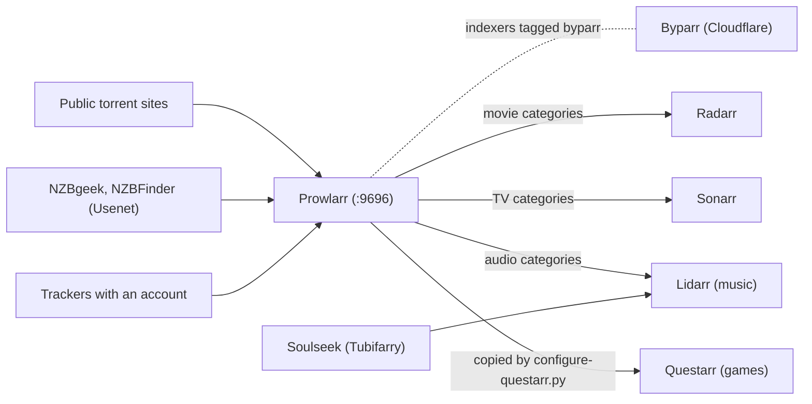

# Indexers

This page is for the owner: how searching works. It covers Prowlarr and how it feeds the other
apps, Byparr for sites behind Cloudflare, the two scripts that add and test indexers, the Usenet
indexer, and optional trackers that need an account.

## Prowlarr: one list for every app

**Prowlarr** (`http://<tailscale-ip>:9696`) is the arr app for indexers: the sites that are
searched for releases. It holds the one list and pushes it to the apps that search. You never add
an indexer to Radarr or Sonarr directly; add it once in Prowlarr and it appears in each app whose
categories it carries.



- **Radarr, Sonarr and Lidarr** are linked as Prowlarr applications by `configure-arr.py`, with
  full sync: Prowlarr adds, updates and removes their indexers itself. Each gets only the
  categories it uses (movies, TV or audio), which is why a movies-only site such as YTS appears in
  Radarr alone and a TV-only site such as EZTV in Sonarr alone. Lidarr is linked only when the
  `music` module is on.
- **Questarr** has no Prowlarr sync of its own. `configure-questarr.py` copies Prowlarr's indexers
  into it and removes the ones Prowlarr no longer has, so re-run it after adding an indexer.
  Questarr reaches Prowlarr at its fixed address, `PROWLARR_IP`, never by name: Prowlarr writes
  the host it was called on into its download links, and Questarr refuses links whose host
  differs from the indexer's address
  ([known issue](https://github.com/bugrauluyurt/homelab-media-stack/blob/main/ai/homelab-plugin/skills/stack-logs/references/known-issues.md#questarr-says-added-to-qbittorrent-but-nothing-downloads)).
- **Soulseek** is not a Prowlarr indexer: `configure-lidarr.py` adds it to Lidarr directly
  through the Tubifarry plugin, searched first ([Music flow](../flows/music.md)).

### Does it notice broken indexers?

Yes, continuously and on its own:

- Every query and grab is recorded per indexer: successes, failures and response time.
- An indexer that keeps failing is **disabled automatically** with exponential backoff, and
  re-enabled when it recovers.
- Persistent problems appear under **Prowlarr → System → Health**, with a banner in the UI.

You see it in three places: Glance's Lab page counts the indexers **backing off** and says when
each retries; `health-check` fails when no indexer passes a test; and `check-indexers` shows the
detail on demand (below).

## Sites behind Cloudflare: Byparr

Several big public sites sit behind Cloudflare's bot protection. A plain request gets a challenge
page instead of results, and the indexer fails, often while it is being added.

The traditional answer, FlareSolverr, no longer works against current Cloudflare (TRaSH Guides
reports it broken). This stack runs **Byparr** instead, its maintained drop-in replacement: a
headless browser that solves the challenge and hands the page back.

- It answers only on the Docker network, at `byparr:8191`; no port is published.
- Prowlarr uses it as a **FlareSolverr-compatible proxy** tagged `byparr`, and only indexers
  carrying that tag go through it. EZTV does; everything else connects directly.
- A search through Byparr takes about **15 to 20 seconds** while the challenge clears. That is
  normal, not a fault.
- It is the heaviest container when it works, being a browser (up to 2 GB of memory), and idles
  cheaply. Its health probe launches a real browser each time, so it runs often only while the
  container starts, then every 15 minutes.

No script registers the proxy. Do it once in Prowlarr: **Settings → Indexers → Indexer Proxies
→ + → FlareSolverr**, host `http://byparr:8191/`, tag `byparr`. Then give the tag to any indexer
that fails with a Cloudflare error.

1337x is deliberately left out: its Cloudflare setup often blocks home addresses outright
(error 1006), which no solver gets past. Knaben indexes its listings, so little is lost.

## Adding indexers: add-indexers.py

```bash
scripts/add-indexers.py
```

It adds the indexers in its `WANTED` list to Prowlarr, then tests each one with a real search and
prints the result. It is idempotent: indexers already present are left alone. The list:

| Indexer | Kind |
|---|---|
| The Pirate Bay, YTS, EZTV, LimeTorrents, TorrentProject2, Knaben | Public, general |
| Torrent9, World-torrent | Public, French |
| Draupnirr, TR4KER | Semi-private, French; added only once their API key is in `.env`, for new releases only |

To add more, edit `WANTED` at the top of the script (the names are Prowlarr's definition names)
and run it again, or add them by hand in **Prowlarr → Indexers → Add Indexer**, which lists every
definition Prowlarr ships. A Cloudflare-protected site commonly fails to add; that is expected, not
a configuration error. Give it the `byparr` tag and try again.

## Testing indexers: check-indexers

```bash
scripts/check-indexers        # or the alias: indexers
```

It tests every indexer in Prowlarr and prints Prowlarr's own statistics, then any health warnings:

```text
INDEXER            ENABLED  TEST     QUERIES   FAILED  MS
--------------------------------------------------------------
EZTV               True     PASS     0         0       0
Knaben             True     PASS     8         0       477
YTS                True     PASS     6         0       351
--------------------------------------------------------------
  3 working, 0 failing
```

A failing indexer gets a line with the error below it. The same lives in the UI at **Prowlarr →
Indexers → Test All Indexers**, and the statistics at **Prowlarr → System → Status**. The script
reads Prowlarr's API key from its settings with `sudo`.

## Usenet indexers

Usenet is the preferred source: it downloads at the full speed of your line, shares nothing, and
runs outside the VPN. It needs two paid accounts, both optional: a Usenet provider (`USENET_*`
in `.env`) and an indexer. The stack is set up for **NZBgeek** (`NZBGEEK_API_KEY`) and **NZBFinder**
(`NZBFINDER_API_KEY`), which is strong on French releases; set either or both:

- `configure-sabnzbd.py` sets up SABnzbd with the provider.
- `configure-arr.py` adds each one to Prowlarr, which syncs it to every linked app, adds SABnzbd
  to Radarr, Sonarr and Lidarr, and sets their delay profiles: **Usenet first**, with torrents
  waiting 60 minutes (in Lidarr, Soulseek comes before both). Sonarr series tagged `french`
  don't wait, because their new episodes come from the ratio trackers.
- Questarr's game searches include Usenet results too; picking one sends it to SABnzbd.

Any other Newznab indexer can be added in Prowlarr the same way; it syncs like the rest.

## Trackers with an account (optional)

Public trackers are patchy. Popular and recent titles are easy; older, foreign or obscure ones
often aren't there at all, in any quality. No setting fixes that. The real fix is a tracker with
an account (from a sign-up window or an invite), which slots into Prowlarr exactly like the others
and syncs to every app.

`add-indexers.py` already knows two semi-private French trackers, for French TV and film that the
English sites rarely carry:

1. Sign up (free) at draupnirr.xyz or tr4ker.net.
2. Copy the API key from your profile page into `.env` as `DRAUPNIRR_API_KEY` or `TR4KER_API_KEY`.
3. Run `scripts/add-indexers.py` again.

Both enforce a minimum ratio, and a tracker that falls below it stops handing out peers. So the
script gives them Prowlarr's `RSS only` app profile: the apps grab new releases from their feeds,
where plenty of people are still downloading and seeding pays back, and you can still pick from
them in an interactive search. A backlog search skips them, because an old episode with hundreds
of seeders and no downloaders costs ratio that seeding never earns back; Usenet and the public
trackers cover those. Seeding is not affected: everything already downloaded keeps seeding.

Sonarr lists French shows under their English TVDB name, with "(FR)" added. It still matches
French release names through the show's alternate titles, and names new series folders with the
TVDB id so Jellyfin finds the right show.

## Cheat sheet

| Symptom | Where to look |
|---|---|
| "No results found" for everything | `scripts/check-indexers`: does any indexer pass? |
| One indexer always fails | Prowlarr → System → Health |
| Cloudflare errors | Is Byparr healthy? `docker inspect -f '{{.State.Health.Status}}' byparr` |
| Results exist but nothing is grabbed | Interactive Search in Radarr or Sonarr: the quality rules are probably rejecting them ([known issue](https://github.com/bugrauluyurt/homelab-media-stack/blob/main/ai/homelab-plugin/skills/stack-logs/references/known-issues.md#releases-shown-as-rejected)) |
| Searches feel slow | Expected for EZTV: it waits for Byparr |
| A new indexer is missing in Questarr | Re-run `scripts/configure-questarr.py` |

More in [Troubleshooting](../troubleshooting.md#searching-and-downloading).
