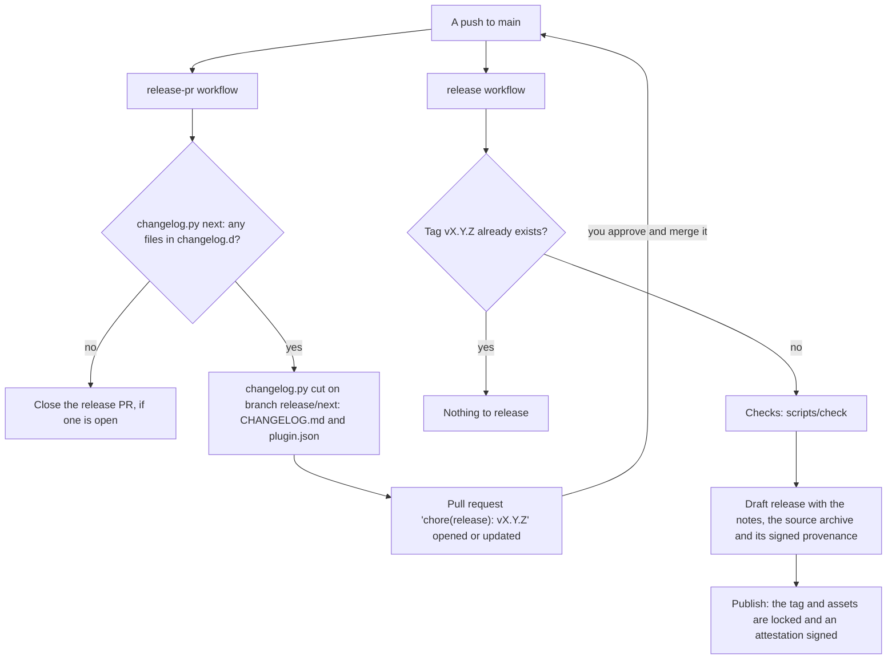

# Releasing

This page is for maintainers and contributors: how a version of this repository is chosen, cut
and published. In short, the changelog decides the version, a bot keeps a release pull request
ready, and merging that pull request is the release.

## The version comes from the changelog

Every change that matters to someone running the stack adds one file to `changelog.d/`, named
`<name>.<heading>.md`, holding its entry. Pull requests never edit `CHANGELOG.md` itself: each
brings its own file, so two of them can't conflict over the changelog, and a release can't
conflict with a pull request still open. The headings decide the next version, following
[semantic versioning](https://semver.org):

| Heading in the file name | Bump | Use it when |
|---|---|---|
| `breaking` or `removed` | Major (`1.4.2` to `2.0.0`) | People must change their setup: a renamed setting, a removed module, a new mount |
| `added`, `changed` or `deprecated` | Minor (`1.4.2` to `1.5.0`) | A new feature, or different behaviour that needs no action |
| `fixed` or `security` | Patch (`1.4.2` to `1.4.3`) | A bug fix or a security fix |

The highest bump present wins: one `.removed.md` among ten `.fixed.md` files makes a major
release. A misnamed file, or one whose entry isn't a `- ` bullet, fails `scripts/check` and so
the pull request. The current version is the `version` field of `ai/homelab-plugin/plugin.json`.

```text
changelog.d/uptime-kuma-recreated.fixed.md

- Uptime Kuma no longer reports a recreated container as down.
```

Write entries for the people running the stack: what changed for them, not how the code changed.

`scripts/changelog.py` does the arithmetic. You can run it locally to see what would happen:

```bash
python3 scripts/changelog.py next ai/homelab-plugin/plugin.json   # the next version, or nothing
python3 scripts/changelog.py notes 1.4.2                          # the notes of a released version
```

Its third command, `cut <version> <version-file>...`, writes the entries into `CHANGELOG.md` under
a new heading with the version and today's date (headings in a fixed order, entries sorted by file
name), deletes the files, and sets the version in each file. The release workflow runs it; you don't need to. The same `changelog.py`
lives in the Needle repository; keep the two copies identical.

## The whole flow



On every push to `main`, two workflows run:

1. **release-pr** (`.github/workflows/release-pr.yml`) asks `changelog.py next` for the next
   version. If `changelog.d/` holds no entries, it closes any open release pull request and stops.
   Otherwise it cuts the release on the branch `release/next` (the new `CHANGELOG.md` section, the
   entry files removed, and the `version` in `ai/homelab-plugin/plugin.json`), force-pushes that branch, and opens or updates
   the pull request **chore(release): vX.Y.Z**, with the notes as its description. GitHub holds CI on a
   pull request the workflow's own token opened until a maintainer approves the run.
2. **release** (`.github/workflows/release.yml`) reads the version from `plugin.json`. If the
   tag `vX.Y.Z` already exists, there is nothing new and it stops; that is the case for every
   ordinary push. Otherwise it runs the full checks (`scripts/check`, the same as CI), creates a
   **draft** release titled "homelab-media-stack X.Y.Z" with the changelog notes, attaches the
   source archive `homelab-media-stack-X.Y.Z.tar.gz` and its signed build provenance
   (`.intoto.jsonl`, the attestation that names this workflow and commit), then publishes it as
   the latest release.

Draft first, then publish, because GitHub's immutable releases act at publication: they lock the
tag to its commit and the assets to the release, and sign a release attestation. Nobody can move
the tag or swap the release's contents afterwards, which is also why the assets go up while the
release is still a draft.

## How to release

1. Merge changes to `main`, each with its entry in `changelog.d/`.
2. Open the pull request **chore(release): vX.Y.Z**. Check the version and read the notes: they are what
   people will see.
3. Start its CI: the pull request says a workflow is awaiting approval; choose **Approve
   workflows to run**, or from a terminal:

   ```bash
   run=$(gh run list -R bugrauluyurt/homelab-media-stack --branch release/next --event pull_request \
     --limit 1 --json databaseId --jq '.[0].databaseId')
   gh api -X POST repos/bugrauluyurt/homelab-media-stack/actions/runs/$run/approve
   ```

4. Once `checks` passes, approve the pull request, then merge it. `main` takes a pull request
   only with a passing `checks` run and an approval from someone other than its author; the bot
   opened this one, so your approval counts. The merge is the release: the release workflow
   checks, drafts and publishes `vX.Y.Z`.
5. Verify it if you like:

```bash
gh release verify vX.Y.Z -R bugrauluyurt/homelab-media-stack
gh release download vX.Y.Z -R bugrauluyurt/homelab-media-stack
gh attestation verify homelab-media-stack-X.Y.Z.tar.gz \
  --bundle homelab-media-stack-X.Y.Z.tar.gz.intoto.jsonl -R bugrauluyurt/homelab-media-stack
```

After the merge, `changelog.d/` is empty again, so release-pr closes nothing and waits for the
next change.

## Changing the bump

The release pull request is regenerated on every push to `main` (its branch is force-pushed), so
edits made inside it are lost. To change the version, rename the files on `main`: turn a
`.changed.md` into `.fixed.md` for a patch, or add a `.breaking.md` entry for a major release.
The pull request follows on that push.

## Hotfixes

A hotfix is the same flow. Merge the fix to `main` with a `.fixed.md` (or `.security.md`) entry;
if nothing else is waiting in `changelog.d/`, the release pull request proposes a patch version.
Merge it.

If other, unreleased changes are already waiting, they go out in the same release, at the highest
bump among them. Release those first, or wait for them to be ready: there is no separate hotfix
branch.

## When something goes wrong

- **The checks fail after merging.** Nothing is published and no tag exists yet. Fix the problem
  on `main` and the next push runs the release again for the same version, or re-run the failed
  workflow once the cause is gone. A draft left behind is reused, not duplicated.
- **A bad release went out.** Releases are immutable: a published tag can't be moved or
  replaced. Fix forward with a patch release (`### Fixed`), and say in its notes what it corrects.
- **The release pull request doesn't appear.** Look at the release-pr run in the Actions tab: an
  unknown heading or notes without a heading stop it with a message naming the problem.

Don't edit `version` in `plugin.json` by hand; the release pull request sets it. Codex reads that
version to notice changed skills, so a change to the skills in `ai/homelab-plugin/skills/` ships
with a changelog entry like any other.
