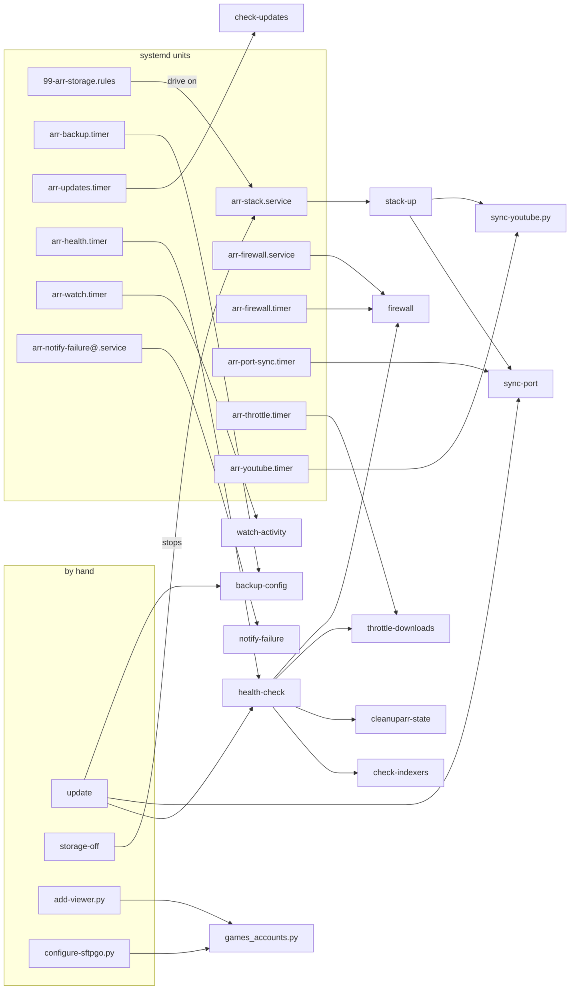

# Scripts reference

Every file in [`scripts/`](https://github.com/bugrauluyurt/homelab-media-stack/tree/main/scripts): what it does, what runs it, whether it needs root, what it changes and whether a second run is safe. It is for anyone operating or changing the stack; the flow pages tell the story around these scripts, and the [systemd reference](systemd.md) covers the units that run them.

**Anchors.** Each entry's heading is the file name, so its anchor is the file name in lower case with the dots removed: `sync-port` is `#sync-port`, `configure-arr.py` is `#configure-arrpy`, `stack_env.py` is `#stack_envpy`.

**Conventions.** Run the scripts as the stack user (`STACK_USER`) from the repository, for example `./scripts/health-check`. That user has passwordless sudo and is in the docker group ([`install-host`](#install-host) checks both). In the tables and entries:

- **Root**: *no* runs as the stack user without sudo; *sudo* runs as the stack user and calls `sudo` itself for some steps; *sudo if needed* calls `sudo grep` only to read an app's API key from its `config.xml` when that key is missing from `.env`; *yes* must run as root.
- **Module**: the compose profile a script belongs to. When that module is off in `COMPOSE_PROFILES`, the script prints `~ <service> is off (COMPOSE_PROFILES in .env); skipped` and exits 0. See [compose profiles](configuration.md#compose-profiles).
- **Idempotent**: a second run changes nothing. The configure scripts print `+` for a change and `=` for something already in place, so a second run prints only `=` lines.

## Summary

| Script | Run by | Root | Changes state |
|---|---|---|---|
| [`install-host`](#install-host) | by hand, first | sudo | systemd units, udev rule, SSH and Docker config, rpcbind |
| [`configure-jellyfin.py`](#configure-jellyfinpy) | by hand | no | Jellyfin API |
| [`configure-sabnzbd.py`](#configure-sabnzbdpy) | by hand | sudo | `.env`, `sabnzbd.ini` (restarts SABnzbd), SABnzbd API |
| [`configure-arr.py`](#configure-arrpy) | by hand | sudo if needed | Radarr, Sonarr, Lidarr and Prowlarr APIs |
| [`configure-bazarr.py`](#configure-bazarrpy) | by hand | sudo if needed | Bazarr API |
| [`configure-lidarr.py`](#configure-lidarrpy) | by hand | sudo if needed | Lidarr API (restarts Lidarr), qBittorrent category, Navidrome admin |
| [`add-indexers.py`](#add-indexerspy) | by hand | sudo if needed | Prowlarr API |
| [`configure-plex.py`](#configure-plexpy) | by hand | sudo | Plex `Preferences.xml` (restarts Plex) |
| [`configure-seerr.py`](#configure-seerrpy) | by hand | sudo if needed | Seerr API |
| [`configure-jellyfin-plugins.py`](#configure-jellyfin-pluginspy) | by hand | no | Jellyfin API (restarts Jellyfin) |
| [`configure-cleanuparr.py`](#configure-cleanuparrpy) | by hand | sudo if needed | Cleanuparr API |
| [`configure-questarr.py`](#configure-questarrpy) | by hand | sudo if needed | Questarr API and database |
| [`configure-sftpgo.py`](#configure-sftpgopy) | by hand | no | folders, starts SFTPGo, SFTPGo API |
| [`configure-jellydash.py`](#configure-jellydashpy) | by hand | no | Jellyfin API key, `.env`, recreates JellyDash, JellyDash database |
| [`configure-dozzle.py`](#configure-dozzlepy) | by hand | no | `users.yml`, starts or restarts Dozzle |
| [`configure-glance.py`](#configure-glancepy) | by hand | no | Jellystat database, `.env`, recreates Glance |
| [`configure-grafana-watch.py`](#configure-grafana-watchpy) | by hand | no | Postgres role in `jellystat-db`, Grafana API |
| [`configure-navidrome.py`](#configure-navidromepy) | by hand | no | `media/singles` folder, Navidrome API |
| [`configure-uptime-kuma.py`](#configure-uptime-kumapy) | by hand | no | Python venv, Uptime Kuma settings and database |
| [`render-scraparr-config`](#render-scraparr-config) | by hand | no | Scraparr's config file |
| [`stack-up`](#stack-up) | `arr-stack.service` | no | starts containers; may recreate qBittorrent and slskd, restart Dozzle |
| [`sync-port`](#sync-port) | `arr-port-sync.timer`, `stack-up`, `update` | no | qBittorrent settings; may restart gluetun |
| [`firewall`](#firewall) | `arr-firewall.service` and `.timer` | yes | iptables and ip6tables rules |
| [`backup-config`](#backup-config) | `arr-backup.timer`, `update` | yes | restic repositories, key file, metrics |
| [`check-updates`](#check-updates) | `arr-updates.timer` | no | state file, metrics, ntfy |
| [`health-check`](#health-check) | `arr-health.timer`, `update`, by hand | sudo | test file on the drive, throwaway containers, ntfy |
| [`watch-activity`](#watch-activity) | `arr-watch.timer` | sudo if needed | state file, ntfy |
| [`throttle-downloads`](#throttle-downloads) | `arr-throttle.timer` | no | qBittorrent speed limits |
| [`sync-youtube.py`](#sync-youtubepy) | `arr-youtube.timer`, `stack-up` | no | Glance channel lists, metric; `.env` with `--login` |
| [`notify-failure`](#notify-failure) | `arr-notify-failure@.service` | yes | ntfy only |
| [`update`](#update) | by hand | sudo | pulls images, recreates containers, restores settings |
| [`storage-off`](#storage-off) | by hand | sudo | stops the stack, unmounts and spins down the drive |
| [`leak-test`](#leak-test) | by hand | no | nothing |
| [`check-indexers`](#check-indexers) | by hand, `health-check` | sudo | nothing |
| [`cleanuparr-state`](#cleanuparr-state) | `health-check` | no | nothing |
| [`add-viewer.py`](#add-viewerpy) | by hand | no | Jellyfin, Seerr, SFTPGo, Navidrome and Needle accounts |
| [`install-agent`](#install-agent) | by hand | no (refuses root) | user unit and agent config |
| [`stack_env.py`](#stack_envpy) | imported | not applicable | `.env` through `set_env` |
| [`stack-env.sh`](#stack-envsh) | sourced | not applicable | nothing itself |
| [`games_accounts.py`](#games_accountspy) | imported | not applicable | SFTPGo accounts |
| [`aliases.zsh`](#aliaseszsh) | `~/.zshrc` or `~/.bashrc` | not applicable | nothing |
| [`changelog.py`](#changelogpy) | release workflows | no | `CHANGELOG.md`, version files |
| [`check`](#check) | CI, by hand | no | nothing |

## Who runs what

Each timer starts the service of the same name, which runs the script. Arrows between scripts mean one calls or imports the other.

The Python scripts import [`stack_env.py`](#stack_envpy) and the bash scripts source [`stack-env.sh`](#stack-envsh) (all but `install-agent`, `changelog.py` and `check`); those links are left out of the diagram.

## Setup

These run by hand while you set the server up, listed in the order [Getting started](../getting-started.md#configure-the-apps) runs them: `install-host`, then `configure-jellyfin.py` after the stack's first start, then the rest. All of them are safe to re-run, for example after changing a key in `.env`.

### install-host

Installs the host side of the stack: renders every template in `systemd/` with values from `.env` (see [placeholders](systemd.md#how-the-templates-are-installed)) into `/etc/systemd/system` and `/etc/udev/rules.d`, installs the SSH hardening from `host/sshd_config.d/` and Docker's log rotation from `host/docker/daemon.json`, and switches rpcbind off. It checks prerequisites first and, for anything missing, prints the `apt-get` (Debian, Ubuntu) or `pacman` (Arch) command that installs it, then stops.

- **File:** [`scripts/install-host`](https://github.com/bugrauluyurt/homelab-media-stack/blob/main/scripts/install-host)
- **Runs:** by hand, first; again after changing `STACK_USER`, `STORAGE_MOUNT`, `STORAGE_UUID` or any file in `systemd/`.
- **Checks:** Docker with the compose and buildx plugins, restic, smartctl, hdparm, lsof, ip6tables, Tailscale, avahi-daemon, mDNS in `/etc/nsswitch.conf`, Python 3.9 or newer, passwordless sudo, the stack user in the docker group, and that `ARR_SUBNET` overlaps no other Docker network and holds `PROWLARR_IP`.
- **Root:** sudo; it needs passwordless sudo (it checks `sudo -n true`).
- **Changes:** writes the units, timers and udev rule, then `systemctl daemon-reload` and `udevadm control --reload`; installs `/etc/ssh/sshd_config.d/10-arr-hardening.conf` (keys only, no root login), checks it with `sshd -t` and reloads ssh, warning when the `Include` line is missing from `sshd_config`; installs `/etc/docker/daemon.json` only when it differs, leaving the Docker restart to you because it restarts every container; disables and masks `rpcbind.socket` and `rpcbind.service`. Without `STORAGE_UUID` it skips the udev rule and removes an installed copy. It never enables or starts a unit.
- **Idempotent:** yes.

### configure-jellyfin.py

Completes Jellyfin's startup wizard: the admin account from `JELLYFIN_USER` (default `admin`) and `JELLYFIN_PASSWORD`, English metadata for the US, and the libraries Movies (`/data/media/movies`) and TV Shows (`/data/media/tv`) with real-time monitoring and chapter image extraction off. The scripts after it need `JELLYFIN_API_KEY`, an API key you create in Jellyfin (Dashboard, API Keys).

- **File:** [`scripts/configure-jellyfin.py`](https://github.com/bugrauluyurt/homelab-media-stack/blob/main/scripts/configure-jellyfin.py)
- **Runs:** by hand, once, after the stack's first start and before the other configure scripts.
- **Root:** no.
- **Changes:** Jellyfin's startup API.
- **Idempotent:** yes; it exits at once when the wizard is already complete.

### configure-sabnzbd.py

Configures SABnzbd: the Usenet server from `USENET_*`, download folders `/data/usenet/incomplete` and `/data/usenet/complete` on the media drive (same filesystem as `media/`, so imports are instant moves), the web login, the host names it answers to, the networks it treats as local, and one category per app (`movies`, `tv`, `music`, `games`). It tests the server connection and exits with an error when the test fails.

- **File:** [`scripts/configure-sabnzbd.py`](https://github.com/bugrauluyurt/homelab-media-stack/blob/main/scripts/configure-sabnzbd.py)
- **Runs:** by hand, before [`configure-arr.py`](#configure-arrpy) when you use Usenet.
- **Needs:** `USENET_HOST`, `USENET_USER`, `USENET_PASS`; `HOMEPAGE_ALLOWED_HOSTS` (its host names become SABnzbd's `host_whitelist`, plus `sabnzbd` for other containers).
- **Root:** sudo, to read SABnzbd's API key from `sabnzbd.ini`.
- **Changes:** writes `SABNZBD_API_KEY` into `.env`; writes `local_ranges` (`LAN_CIDR`, `100.64.0.0/10`, `172.16.0.0/12`, `127.0.0.0/8`) straight into `sabnzbd.ini` with SABnzbd stopped, then starts it again; everything else through SABnzbd's API.
- **Why:** SABnzbd ignores API changes to `local_ranges` (a security setting), and its default private-only list lacks Tailscale's range, so it refused phones on the tailnet.
- **Idempotent:** yes.

### configure-arr.py

Sets up Radarr and Sonarr, Lidarr when the music module is on, and Prowlarr's links to them.

- Radarr and Sonarr: root folder (`/data/media/movies`, `/data/media/tv`); hardlinks, extra files and media info on, recycle bin off; qBittorrent at `gluetun:QBIT_PORT` (category `radarr` or `sonarr`); SABnzbd when `USENET_HOST` is set; a delay profile preferring Usenet, with torrents waiting 60 minutes; a Jellyfin connection that rescans on import; an `Audio Description` custom format scored -10000 in the `HD Bluray + WEB` (Radarr) and `WEB-1080p` (Sonarr) profiles; ntfy alerts for health issues, manual interaction, failed downloads and failed imports when `NTFY_TOPIC` is set.
- Sonarr only: new series folders named `{Series Title} [tvdbid-{TvdbId}]`, and an auto-tag `french` for French-language series, which picks Bazarr's French profile.
- Lidarr: root folder `/data/media/music` with new artists unmonitored, hardlinks, qBittorrent (category `music`), SABnzbd, a delay profile of Soulseek, then Usenet, then torrents after 60 minutes, every import list off, ntfy.
- Prowlarr: Radarr, Sonarr (and Lidarr) linked with full sync and their Newznab categories, NZBgeek when `NZBGEEK_API_KEY` is set, ntfy.

- **File:** [`scripts/configure-arr.py`](https://github.com/bugrauluyurt/homelab-media-stack/blob/main/scripts/configure-arr.py)
- **Runs:** by hand, after [`configure-sabnzbd.py`](#configure-sabnzbdpy).
- **Needs:** `JELLYFIN_API_KEY` for the Jellyfin connection, and Recyclarr's `HD Bluray + WEB` and `WEB-1080p` quality profiles for the audio-description penalty.
- **Root:** sudo if needed; sudo to read SABnzbd's key when `USENET_HOST` is set.
- **Changes:** API writes to Radarr, Sonarr, Lidarr and Prowlarr.
- **Module:** the Lidarr steps need `music`.
- **Why:** Jellyfin's real-time folder watching is off so the drive can sleep; without the connection, new imports wait for the 12-hourly library scan. The audio-description format matches `Audio Description` but not a bare `AD`, which would hit titles like "AD Astra"; `recyclarr/recyclarr.yml` lists the format under `reset_unmatched_scores.except`, or Recyclarr's sync resets its score to 0. The TVDB id in folder names lets Jellyfin match a show it knows only by its original title. Lidarr's import lists grabbed albums nobody asked for and made every artist refresh slow, so music comes only from what you or Needle ask for. qBittorrent is saved with `forceSave` because it is unreachable until the VPN is up.
- **Idempotent:** yes; every step checks for an existing entry first.

### configure-bazarr.py

Connects Bazarr to Radarr and Sonarr, sets its subtitle providers, and creates two language profiles: `English`, and `French audio` (French, then English) selected by Sonarr's `french` tag. Providers `yifysubtitles` and `subtitlecat` are always on; `opensubtitlescom` (with hash matching and AI or machine translations) and `subsource` join when their `.env` keys are set. It prefers external SRT files and upgrades subtitles.

- **File:** [`scripts/configure-bazarr.py`](https://github.com/bugrauluyurt/homelab-media-stack/blob/main/scripts/configure-bazarr.py)
- **Runs:** by hand, after [`configure-arr.py`](#configure-arrpy); again after setting `OPENSUBTITLES_*` or `SUBSOURCE_API_KEY`.
- **Root:** sudo if needed. It reads Bazarr's own key from `$CONFIG_ROOT/bazarr/config/config.yaml`.
- **Changes:** Bazarr settings and language profiles through its API.
- **Why:** image subtitles force a transcode, and embedded ones make Jellyfin read the whole video before web players can use them, hence external SRT only. Don't re-add podnapisi (gone upstream), tvsubtitles (domain dead) or subf2m (HTTP 500 on every search): each cost every search a timeout. Addic7ed is left out because Bazarr can log in to it only through a paid anti-captcha service.
- **Idempotent:** yes.

### configure-lidarr.py

Gives Lidarr its Soulseek source: installs the Tubifarry plugin (Lidarr runs its plugins branch) and restarts Lidarr, adds slskd (`gluetun:5030`) as indexer and download client, and turns Soulseek searching on with a 20-second wait, accent-free search and a looser fallback search. It also turns track renaming on, saves album covers as `folder.jpg` through the Kodi/Emby metadata writer (then refreshes artists so existing albums get theirs), points the qBittorrent category `music` at `/data/torrents/music`, and creates the Navidrome admin from `NAVIDROME_USER` and `NAVIDROME_PASS`.

- **File:** [`scripts/configure-lidarr.py`](https://github.com/bugrauluyurt/homelab-media-stack/blob/main/scripts/configure-lidarr.py)
- **Runs:** by hand, after [`configure-arr.py`](#configure-arrpy), which adds Lidarr's root folder, hardlinks, qBittorrent and Prowlarr link.
- **Root:** sudo if needed.
- **Changes:** Lidarr API; restarts the `lidarr` container once, after installing the plugin; qBittorrent category through `docker exec`; Navidrome admin account.
- **Module:** `music`.
- **Why:** the Soulseek indexer gets priority 1 (default 25) so it wins over public torrents, which rarely have seeders for music. The indexer template leaves searching off because Soulseek has no RSS feed; rare albums answer slowly and often drop accents. Lidarr writes no tags, so Navidrome would show no cover without `folder.jpg`. The category saves under `torrents/` so hardlinks into `media/` work.
- **Idempotent:** yes.

### add-indexers.py

Adds public torrent indexers to Prowlarr (thepiratebay, yts, eztv, limetorrents, torrentproject2, Knaben, and the French torrent9 and world-torrent), plus the semi-private draupnirr and tr4ker once `DRAUPNIRR_API_KEY` or `TR4KER_API_KEY` is set, then runs a real search on every indexer and prints its hit count. Cloudflare-protected sites commonly fail the test; that is expected, not a configuration error. [Indexers](../operations/indexers.md) explains adding and fixing them.

- **File:** [`scripts/add-indexers.py`](https://github.com/bugrauluyurt/homelab-media-stack/blob/main/scripts/add-indexers.py)
- **Runs:** by hand, after [`configure-arr.py`](#configure-arrpy) so Prowlarr syncs the new indexers to the apps.
- **Root:** sudo if needed.
- **Changes:** Prowlarr API (new indexers at priority 25).
- **Why:** 1337x is left out: its Cloudflare often blocks residential IPs (error 1006), which Byparr can't get past, and Knaben indexes its listings.
- **Idempotent:** yes; indexers already present are skipped. The test searches run every time.

### configure-plex.py

Applies Plex preferences that keep playback on Direct Play: the home network and the tailnet (`100.64.0.0/10`) count as local bandwidth, the transcoder uses the `/transcode` RAM disk, library scans run daily instead of watching the folders, trash is not emptied automatically, and preview thumbnails, chapter thumbnails and loudness analysis are off.

- **File:** [`scripts/configure-plex.py`](https://github.com/bugrauluyurt/homelab-media-stack/blob/main/scripts/configure-plex.py)
- **Runs:** by hand, once Plex has created its `Preferences.xml`.
- **Root:** sudo, to read and write `Preferences.xml`.
- **Changes:** stops `plex`, writes `Preferences.xml`, starts `plex`; only when a value differs.
- **Module:** `plex`.
- **Why:** without the tailnet range, Plex applies remote bitrate limits to tailnet clients and force-transcodes. Folder watching would keep waking a spinning drive. Plex rewrites `Preferences.xml` when it exits, so the file is written with Plex stopped.
- **Idempotent:** yes.

### configure-seerr.py

Points Seerr at Jellyfin (signing in as `JELLYFIN_USER`), enables every library, connects Radarr (`HD Bluray + WEB`, `/data/media/movies`, only once a film is released) and Sonarr (`WEB-1080p`, `/data/media/tv`, season folders), and sets ntfy for "media available" and "request failed" when `NTFY_TOPIC` is set. On the first run it initializes Seerr and syncs the existing library so what is already on disk shows as available, not requestable.

- **File:** [`scripts/configure-seerr.py`](https://github.com/bugrauluyurt/homelab-media-stack/blob/main/scripts/configure-seerr.py)
- **Runs:** by hand, after Jellyfin and the arr apps are configured. Then copy Seerr's API key (Settings, General) into `SEERR_API_KEY` for the scripts after it.
- **Root:** sudo if needed.
- **Changes:** Seerr API.
- **Why:** re-sending the Jellyfin host name once it is stored returns HTTP 500, so later runs sign in with credentials only. Reading Seerr's library list resets every library to disabled, so it is read once for the ids and never again after enabling. New requests are left out of ntfy because JellyDash already pushes them.
- **Idempotent:** yes.

### configure-jellyfin-plugins.py

Sets up Jellyfin's plugins and look. It adds the plugin repositories (IAmParadox27, n00bcodr, Neptune, Jellyfin Stable) and installs File Transformation, Plugin Pages, Home Screen Sections, Jellyfin Enhanced, Neptune Indexers, Neptune MDM, TMDb Box Sets, Fanart and Trakt; uninstalls SeerrFin and Intro Skipper and drops their repositories; sets the Abyss theme CSS and the server name (`JELLYFIN_SERVER_NAME`, default `Home Media`); configures the home screen rows and Jellyfin Enhanced (Seerr requests, arr links, quality and rating tags, `TMDB_API_KEY`, `MDBLIST_API_KEY`); starts the TMDb Box Sets scan once on a fresh install. With `HWACCEL` set it also turns on hardware transcoding (see [compose.gpu.yml](configuration.md#composegpuyml-and-compose_file)). Abyss's Spotlight banner comes from `jellyfin/custom-cont-init.d` on every container start, not from this script.

- **File:** [`scripts/configure-jellyfin-plugins.py`](https://github.com/bugrauluyurt/homelab-media-stack/blob/main/scripts/configure-jellyfin-plugins.py)
- **Runs:** by hand, after [`configure-seerr.py`](#configure-seerrpy); again after changing `TMDB_API_KEY`, `MDBLIST_API_KEY` or `HWACCEL`.
- **Needs:** `JELLYFIN_API_KEY`, `SEERR_API_KEY`, `TAILSCALE_IP` (external arr links), `HOMEPAGE_ALLOWED_HOSTS` (one Seerr link per host Jellyfin is opened on, so links point where the browser already is).
- **Root:** no.
- **Changes:** Jellyfin API; `docker restart jellyfin` only when a plugin was added or removed or is not yet active.
- **Why:** the home rows' `OrderIndex` has no gaps because Home Screen Sections 3.0.2 returns an empty home screen when index 0 is followed by anything but 1.
- **Idempotent:** yes.

### configure-cleanuparr.py

Configures Cleanuparr to remove stalled, failed and fake or malicious downloads: the admin account (user `admin`, `CLEANUPARR_PASSWORD`), qBittorrent, Sonarr and Radarr, the malware blocker with the permissive blocklist, the queue cleaner (3 strikes for failed imports and for downloads stuck on metadata), a stall rule (12 strikes, reset by any progress, about an hour without progress), and the `games` category ignored. It stays in dry-run while anything is still being connected and ends live unless you pass `--dry-run`.

- **File:** [`scripts/configure-cleanuparr.py`](https://github.com/bugrauluyurt/homelab-media-stack/blob/main/scripts/configure-cleanuparr.py)
- **Runs:** by hand, after [`configure-arr.py`](#configure-arrpy).
- **Flags:** `--dry-run` leaves (or puts) Cleanuparr in dry-run mode, where destructive actions are only logged.
- **Root:** sudo if needed.
- **Changes:** Cleanuparr API. It refuses to go live while the download cleaner is on.
- **Why:** the stricter `blacklist` matches `*.srt`, `*.sub` and `*.idx` and would strip subtitles. Game releases legitimately ship `.exe` files and archives. There is no "slow" rule, since slow is normal on public trackers. The download cleaner (seeding, orphan and no-hardlink removal) stays off because hardlinks mean seeding costs no disk space. [`health-check`](#health-check) verifies all three through [`cleanuparr-state`](#cleanuparr-state).
- **Idempotent:** yes.

### configure-questarr.py

Configures Questarr: the admin account (user `admin`, `QUESTARR_PASSWORD`), qBittorrent (category `games`, saving to `/data/torrents/games`), SABnzbd when `SABNZBD_API_KEY` is set, indexers synced from Prowlarr, IGDB credentials when `IGDB_CLIENT_ID` and `IGDB_CLIENT_SECRET` are set, and ntfy notifications through apprise when `NTFY_TOPIC` is set. It prints each downloader's connection test.

- **File:** [`scripts/configure-questarr.py`](https://github.com/bugrauluyurt/homelab-media-stack/blob/main/scripts/configure-questarr.py)
- **Runs:** by hand, after [`configure-sabnzbd.py`](#configure-sabnzbdpy) and [`add-indexers.py`](#add-indexerspy); again after setting the IGDB keys.
- **Root:** sudo if needed.
- **Changes:** Questarr API; when the login fails, writes the password's bcrypt hash straight into Questarr's database through `docker exec`.
- **Module:** `games`.
- **Why:** Questarr's password policy (8 or more characters with a letter and a digit) rejects a simple password, but its login only compares the hash. Prowlarr is added by `PROWLARR_IP`, not by name, because Prowlarr writes the host it was called on into its download links and Questarr rejects links whose host differs. The sync adds and updates but never removes, so the script deletes indexers Prowlarr no longer has. Questarr has one shared login and no approval step, so the "download started" push is how you learn a viewer picked a release.
- **Idempotent:** yes.

### configure-sftpgo.py

Sets up SFTPGo, the read-only games download page: creates `$DATA_ROOT/usenet/complete/games` (compose mounts it but won't create it) and `$CONFIG_ROOT/sftpgo`, starts `sftpgo`, limits its admin to logins from the server and Docker, and creates or repairs your account from `GAMES_USER` and `GAMES_PASSWORD`. Viewers' accounts come from [`add-viewer.py`](#add-viewerpy); both go through [`games_accounts.py`](#games_accountspy).

- **File:** [`scripts/configure-sftpgo.py`](https://github.com/bugrauluyurt/homelab-media-stack/blob/main/scripts/configure-sftpgo.py)
- **Runs:** by hand.
- **Root:** no.
- **Changes:** folders, `docker compose up -d sftpgo`, SFTPGo's REST API.
- **Module:** `games`.
- **Idempotent:** yes.

### configure-jellydash.py

Configures JellyDash: creates a Jellyfin API key named `JellyDash` and stores it in `.env` as `JELLYDASH_JELLYFIN_API_KEY`, brings JellyDash up with it, makes sure the admin `JELLYDASH_USER` exists with `JELLYDASH_PASSWORD`, and adds qBittorrent and SABnzbd to its Downloads page through JellyDash's own connection code, so its validation still applies.

- **File:** [`scripts/configure-jellydash.py`](https://github.com/bugrauluyurt/homelab-media-stack/blob/main/scripts/configure-jellydash.py)
- **Runs:** by hand, after [`configure-sabnzbd.py`](#configure-sabnzbdpy).
- **Root:** no.
- **Changes:** Jellyfin API key; `.env`; `docker compose up -d jellydash`, which recreates it when the key changed; JellyDash's database through `docker exec`.
- **Module:** `stats`.
- **Why:** JellyDash refuses passwords under 8 characters, but its login only verifies the stored hash, so the account is created with a random password and yours is written as a hash, fed through stdin. qBittorrent needs no login from the Docker network, so its stored password is a placeholder.
- **Idempotent:** yes.

### configure-dozzle.py

Sets Dozzle's login from `DOZZLE_USER` and `DOZZLE_PASSWORD`. It writes `$CONFIG_ROOT/dozzle/users.yml` (mode 600) with Dozzle's own generator (`docker run amir20/dozzle generate`, password through stdin, never on a command line), starts Dozzle, and when the login doesn't work regenerates the file and restarts it. Dozzle refuses to start without `users.yml`, so the first run writes it before starting.

- **File:** [`scripts/configure-dozzle.py`](https://github.com/bugrauluyurt/homelab-media-stack/blob/main/scripts/configure-dozzle.py)
- **Runs:** by hand.
- **Root:** no.
- **Changes:** `users.yml`; `docker compose up -d dozzle`, and a restart when the login changed.
- **Module:** `monitoring`.
- **Idempotent:** yes.

### configure-glance.py

Gives Glance the two keys it can't get from the apps' settings pages: it creates a Jellystat API key named `glance` (in Jellystat's `app_config` table) and stores it as `JELLYSTAT_API_KEY`, and copies ChangeDetection.io's generated key from its `changedetection.json` into `CHANGEDETECTION_API_KEY`. Glance is recreated only when one of them changed.

- **File:** [`scripts/configure-glance.py`](https://github.com/bugrauluyurt/homelab-media-stack/blob/main/scripts/configure-glance.py)
- **Runs:** by hand, once Jellystat and ChangeDetection.io have started.
- **Root:** no.
- **Changes:** Jellystat's database through `psql` in `jellystat-db`; `.env`; `docker compose up -d glance`.
- **Module:** `dashboards`; the Jellystat key also needs `stats`.
- **Idempotent:** yes.

### configure-grafana-watch.py

Connects Grafana to Jellystat's viewing history, read-only. It creates the Postgres role `grafana_watch_reader` in `jellystat-db` (no superuser, create or replication rights, read-only transactions, 10-second statement timeout), grants it `SELECT` on eight columns of `jf_playback_activity` (`Id`, `UserId`, `UserName`, `NowPlayingItemName`, `SeriesName`, `PlaybackDuration`, `ActivityDateInserted`, `PlayMethod`) and nothing else, verifies those grants, and adds the Grafana datasource "Jellystat (read-only)" (uid `jellystat-readonly`) with a random password. The client IP column stays unreadable. It refuses to go on when the role has unexpected privileges or the existing datasource differs from what it expects.

- **File:** [`scripts/configure-grafana-watch.py`](https://github.com/bugrauluyurt/homelab-media-stack/blob/main/scripts/configure-grafana-watch.py)
- **Runs:** by hand, after Jellystat's first visit, since it needs Jellystat's tables.
- **Root:** no.
- **Changes:** role and grants in `jellystat-db`; Grafana API.
- **Module:** `monitoring` (Grafana) and `stats` (`jellystat-db`); skipped when either is off.
- **Idempotent:** yes; the password is set only when the datasource is created.

### configure-navidrome.py

Gives Navidrome a second library, `Singles`, for the songs Needle fetches one by one: makes sure `$DATA_ROOT/media/singles` exists (owned by `PUID:PGID`), that Navidrome has a library on `/singles`, and that every non-admin user can see it (admins see all libraries). It signs in as `NAVIDROME_USER`.

- **File:** [`scripts/configure-navidrome.py`](https://github.com/bugrauluyurt/homelab-media-stack/blob/main/scripts/configure-navidrome.py)
- **Runs:** by hand, after [`configure-lidarr.py`](#configure-lidarrpy) has created the Navidrome admin.
- **Root:** no.
- **Changes:** the folder; Navidrome API.
- **Module:** `music`.
- **Why:** Needle's single songs live outside Lidarr's music folder so Lidarr never manages them ([music flow](../flows/music.md)).
- **Idempotent:** yes.

### configure-uptime-kuma.py

Configures Uptime Kuma: the admin account, an ntfy notification that is the default for every monitor, Kuma's DNS cache off, the socket proxy as a Docker host, and a status page at `/status/stack` listing every monitor. The monitors: one HTTP monitor per published TCP port of every enabled service (SFTP on 2022 and Kuma itself excluded), HTTP monitors for Plex, Byparr, Scraparr and node-exporter, a keyword monitor "media drive mounted" that looks for the mount in node-exporter's metrics, a JSON monitor that gluetun's forwarded port is above 0, and a Docker health monitor for gluetun. Monitors of services gone from compose are deleted; monitors you added by hand are never touched.

- **File:** [`scripts/configure-uptime-kuma.py`](https://github.com/bugrauluyurt/homelab-media-stack/blob/main/scripts/configure-uptime-kuma.py)
- **Runs:** by hand, last among the configure scripts, and again after adding or removing a service or switching a module off.
- **Root:** no.
- **Changes:** creates a Python venv in `$STATE/venv` with `python-socketio` from PyPI on first run; Kuma settings, monitors and status page; the admin password's hash in Kuma's database through `docker exec`.
- **Module:** `monitoring`.
- **Why:** Kuma 2 has no REST API, so the script speaks socket.io and re-runs itself inside the venv. Kuma refuses weak passwords, so the one from `.env` is written as a bcrypt hash, fed through stdin so it never shows in a process list. Kuma's DNS cache kept a recreated container's old address and reported it down for good. Proton can stop handing out a forwarded port while the tunnel stays up, which quietly costs torrents their incoming peers.
- **Idempotent:** yes.

### render-scraparr-config

Renders `$CONFIG_ROOT/scraparr/config.yaml` (mode 600) from `scraparr/config.yaml.template`, filling in `SONARR_API_KEY`, `RADARR_API_KEY`, `PROWLARR_API_KEY` and `BAZARR_API_KEY`. Scraparr can't read environment variables from its YAML, so the rendered file holds live keys and is written outside the repository, never into it.

- **File:** [`scripts/render-scraparr-config`](https://github.com/bugrauluyurt/homelab-media-stack/blob/main/scripts/render-scraparr-config)
- **Runs:** by hand, once the four keys are in `.env`, and after any of them changes; then `docker compose restart scraparr` so Scraparr reads the new file.
- **Root:** no.
- **Changes:** that one file.
- **Module:** `monitoring` (`scraparr`).
- **Idempotent:** yes.

## Timers and automation

These run unattended. The [systemd reference](systemd.md) has each unit's exact schedule and conditions.

### stack-up

Brings the stack up; it is `arr-stack.service`'s `ExecStart`. In order:

1. Refuses to start (exit 1) unless `STORAGE_MOUNT` is a mount point.
2. Creates every missing bind-mount folder under the app-data root (`CONFIG_ROOT`'s parent, which holds `config/` and `state/`) as the stack user. Docker would create them as root, and the services that run as `PUID` could then not write their own settings on a fresh install.
3. Seeds any missing Glance YouTube list with [`sync-youtube.py --offline`](#sync-youtubepy); Glance won't start without them.
4. Runs `docker compose up -d --remove-orphans`.
5. Fails (exit 1) when a library service is not running: prowlarr, radarr, sonarr, lidarr, bazarr, seerr, plex, jellyfin, navidrome, each only when its module is on.
6. When gluetun runs: waits up to 120 seconds for it to be healthy, recreates qBittorrent and slskd when they don't answer, then runs [`sync-port`](#sync-port).
7. Restarts Dozzle when it started before Docker could list the containers.

A compose error with every library service up is only a warning (the VPN is probably still connecting), and the script exits 0.

- **File:** [`scripts/stack-up`](https://github.com/bugrauluyurt/homelab-media-stack/blob/main/scripts/stack-up)
- **Runs:** [`arr-stack.service`](systemd.md#arr-stackservice), at boot and whenever the media drive mounts. Start it with `sudo systemctl start arr-stack.service` rather than directly.
- **Root:** no; the unit runs it as the stack user.
- **Changes:** creates and starts containers; may recreate qBittorrent and slskd and restart Dozzle; qBittorrent settings through `sync-port`.
- **Why:** a VPN-only failure must not fail the unit, or systemd marks it failed and the `BindsTo=` drive binding stops working; gluetun retries on its own. After a boot, qBittorrent starts on its saved (stale) forwarded port, and syncing here closes the gap before the timer's next run. Dozzle lists containers once at start and never retries.
- **Idempotent:** yes.

### sync-port

Reconciles qBittorrent with the live VPN tunnel. It reads the tunnel address (`tun0` in gluetun) and Proton's forwarded port (gluetun's `/tmp/gluetun/forwarded_port`), then changes in qBittorrent only what differs:

- binds it to `tun0` and the tunnel address;
- sets its listen port to the forwarded port, with random port and UPnP off;
- lets Docker's network (`172.16.0.0/12`) and the tailnet (`100.64.0.0/10`) skip the login, while the home network must always log in;
- turns on CSRF protection and Host header validation, allowing `gluetun`, `127.0.0.1`, `HOST_NAME`, `HOST_NAME.local`, `HOST_NAME.*.ts.net` and the server's own addresses.

It then checks that qBittorrent listens on the tunnel address and port. When Proton has given no valid port (1024 or above) for 15 minutes, it restarts gluetun, waits up to 3 minutes for a healthy tunnel with a port, recreates qBittorrent and slskd, and pushes an ntfy message saying whether that worked. It tries this at most once every 2 hours. [VPN and ports](../flows/vpn-and-ports.md) tells the whole story.

- **File:** [`scripts/sync-port`](https://github.com/bugrauluyurt/homelab-media-stack/blob/main/scripts/sync-port)
- **Runs:** [`arr-port-sync.timer`](systemd.md#arr-port-synctimer) (90 seconds after boot, then every 15 minutes), [`stack-up`](#stack-up), [`update`](#update) after a gluetun update, by hand.
- **Root:** no.
- **Changes:** qBittorrent preferences; the gluetun restart described above (an automatic exception the owner approved). State in `$STATE/port-forward-missing-since` and `$STATE/port-forward-last-heal`.
- **Exit:** 1 when the tunnel is down, there is no valid port, or qBittorrent isn't listening; 0 otherwise.
- **Why:** gluetun routes anything sent from the container's bridge address back out `eth0` (so the WebUI can reply), where its firewall drops tracker traffic and every tracker reports "Operation not permitted"; bound to the tunnel, qBittorrent also can't leak if the tunnel disappears. The tunnel address changes whenever Proton reconnects, hence the timer. The 15 minutes are timed by the clock since boot, not by run count, because two runs come about a minute apart at boot. The CSRF and Host checks stop a web page on a tailnet device from forging requests to the login-free API.
- **Idempotent:** yes.

### firewall

The host firewall, for IPv4 (`iptables`) and IPv6 (`ip6tables`). It builds three chains and hooks them first into `INPUT` (`ARR-IN`), `OUTPUT` (`ARR-OUT`) and `DOCKER-USER` (`ARR-FWD`):

- Traffic on `lo`, `tailscale0`, `docker0` and `br+` is trusted, as are replies to connections the server opened.
- From the home network (`LAN_CIDR`, and on IPv6 link-local plus the LAN's prefixes) only TCP 8096 (Jellyfin), 5055 (Seerr) and 8090 (the games page) answer, plus ICMP, DHCP, mDNS (UDP 5353) and Tailscale (UDP 41641). Everything else, SSH included, is dropped.
- The server and its containers can't open connections to other home devices; the router (default gateway) is the only exception.

The rules are rebuilt only when the wanted rules change (for example a new IPv6 prefix): a hash of them is stored as a comment in `ARR-IN`. It refuses to apply while ufw or firewalld is active, or when Docker uses its nftables firewall backend, which ignores `DOCKER-USER`. [Security](../security.md) explains the policy.

- **File:** [`scripts/firewall`](https://github.com/bugrauluyurt/homelab-media-stack/blob/main/scripts/firewall)
- **Runs:** [`arr-firewall.service`](systemd.md#arr-firewallservice) at boot and [`arr-firewall.timer`](systemd.md#arr-firewalltimer) every 15 minutes; [`health-check`](#health-check) runs `firewall home-ports`; by hand with sudo.
- **Subcommands:** none (apply); `off` removes every rule it added (they return with the next timer run); `status` prints the rules; `home-ports` prints the ports open to the home network.
- **Root:** yes.
- **Changes:** iptables and ip6tables chains.
- **Why:** Docker's published ports never pass through `INPUT`, so the same policy is hooked into `DOCKER-USER`. Home ports accept only home-network sources, so a global IPv6 address or a router port forward never exposes them to the internet. SSH answers only on the tailnet, so a leaked key is useless from the home network. Macvlan containers have their own LAN addresses and never pass through these rules.
- **Idempotent:** yes.

### backup-config

Backs up the stack's settings (never media) with restic. It stages:

- `$CONFIG_ROOT`, skipping what the apps rebuild or fetch again (logs, caches, transcodes, the apps' own backup folders, crash reports, codecs, media metadata and artwork, Python venvs, Grafana plugins, Recyclarr resources, Scrutiny's InfluxDB, gluetun's server list, Jellystat's Postgres folder, Jellyfin's extracted subtitles), sockets, log files and live database side files, and copying every SQLite database through SQLite's online backup API;
- `.env`, the stack user's `~/.config/managarr` and `~/.config/qbt-tui`, and `$STATE`;
- a `pg_dump` of Jellystat's database when the stats module is on;
- the hand-made host files `/etc/fstab`, `/boot/firmware/cmdline.txt`, `/etc/docker/daemon.json`, `/etc/avahi/avahi-daemon.conf` and the stack user's `~/.ssh/authorized_keys`.

It backs this up to `$STORAGE_MOUNT/backups/restic` (tag `arr-stack`, host `HOST_NAME`), prunes it (7 daily, 4 weekly, 6 monthly; the last 5 `pre-update` snapshots kept apart), copies it to a second repository on the system disk (`/var/backups/arr-stack/restic`), on Sundays reads back 5% of the data in both repositories, copies it offsite when `RESTIC_OFFSITE_REPO` is set, and records the time in `/var/lib/arr-backup/last-success` and the Prometheus metric `arr_backup_last_success_timestamp_seconds`. It also keeps `RESTIC_PASSWORD` in `$STORAGE_MOUNT/backups/RESTIC_PASSWORD` (mode 600). It does nothing when the drive isn't mounted. [Backups](../flows/backups.md) covers restoring.

- **File:** [`scripts/backup-config`](https://github.com/bugrauluyurt/homelab-media-stack/blob/main/scripts/backup-config)
- **Runs:** [`arr-backup.timer`](systemd.md#arr-backuptimer) daily at 04:30; [`update`](#update) as `backup-config pre-update`; by hand with `sudo`.
- **Arguments:** any extra restic tags. With a tag (as `update` passes `pre-update`) it skips the Sunday read-back and the offsite copy; it always prints `snapshot <id>`.
- **Root:** yes; the app configs are owned by several container UIDs.
- **Changes:** restic repositories (created on the first run), key file, success stamp, metric.
- **Why:** a WAL-mode database keeps its newest writes in the `-wal` file, so copying the `.db` alone loses them; the online backup API gives a consistent copy without stopping the app, and retries while an app holds its database mid-checkpoint. The second copy on the system disk keeps the history if the media drive dies; the key beside the repository keeps the drive's backups readable if the system disk dies. `pre-update` snapshots skip the daily thinning, which would otherwise drop one taken the same day.
- **Idempotent:** each run adds a snapshot; retention keeps the repositories bounded.

### check-updates

Checks every image the stack's containers run for a newer build upstream for this machine's architecture. It writes the result to `$STATE/updates` (read by [`health-check`](#health-check) and [`update`](#update)) and the metrics `arr_image_updates_available` and `arr_image_updates_checked_timestamp_seconds`, and pushes each update not seen before to ntfy once, flagging a major version change. It never pulls or restarts anything. [Updates](../flows/updates.md) covers the whole cycle.

- **File:** [`scripts/check-updates`](https://github.com/bugrauluyurt/homelab-media-stack/blob/main/scripts/check-updates)
- **Runs:** [`arr-updates.timer`](systemd.md#arr-updatestimer) daily at 06:00; by hand.
- **Root:** no.
- **Changes:** `$STATE/updates`, `$STATE/updates.notified`, the metrics file, ntfy.
- **Why:** it compares this architecture's manifest, not the multi-arch index, because the index changes whenever any architecture is rebuilt. Images labelled only `latest` (or not at all) show their build date, so an update never reads "latest -> latest". Dozens of registry lookups are too slow for every health check, hence a daily timer and a state file.
- **Idempotent:** yes; each update notifies once.

### health-check

One-shot status of the whole stack, grouped as STORAGE, HARDWARE (only where `vcgencmd` exists, as on a Raspberry Pi), SYSTEMD, SECURITY, BACKUPS, SERVICES, MONITORING, CLEANUP & INTROS, INDEXERS and VPN. It ends by listing available image updates from `$STATE/updates` (informational, never a failure) and exits 0 only when every check passes. Some of the thresholds:

| Check | Fails when |
|---|---|
| Disks | the media drive or the system disk is 90% full or more |
| Media drive SMART | health not passed, any reallocated, pending or uncorrectable sector (NVMe: media errors), or 55 C or hotter |
| Raspberry Pi | under-voltage, frequency cap, throttling or soft temperature limit right now, or the SoC at 80 C or hotter |
| Backups | the last backup is 48 hours old or more, or a restic copy or the key file is missing (drive checks pass while the drive is off) |
| Units | a timer or `arr-stack.service` isn't enabled, or any systemd unit has failed |
| Firewall | a chain isn't hooked, a port other than the firewall's `home-ports` is open to the home network, or SSH is |
| VPN | the exit country isn't in `VPN_COUNTRIES` or is the United States, or qBittorrent isn't bound to the tunnel on the forwarded port |
| qBittorrent | the alternative download limit is under 1,000,000 bytes/s, or the upload cap differs from `throttle-downloads --upload-cap` |

- **File:** [`scripts/health-check`](https://github.com/bugrauluyurt/homelab-media-stack/blob/main/scripts/health-check)
- **Runs:** [`arr-health.timer`](systemd.md#arr-healthtimer) every 6 hours with `--notify`; [`update`](#update) after recreating containers; by hand (the `health` alias); the operational skills in `ai/homelab-plugin/skills/`.
- **Flags:** `--notify` also pushes the names of the failing checks to ntfy.
- **Calls:** [`firewall`](#firewall) `home-ports`, [`throttle-downloads`](#throttle-downloads) `--upload-cap`, [`cleanuparr-state`](#cleanuparr-state), [`check-indexers`](#check-indexers).
- **Root:** sudo (smartctl, iptables, `sshd -T`, the backup files).
- **Changes:** not read-only: it creates and removes a hardlink test file in `$DATA_ROOT/torrents/movies` and `$DATA_ROOT/media/movies`, and starts throwaway `curlimages/curl` containers on the `arr` network. Don't run it during a look-only investigation.
- **Module:** checks of a switched-off module's services are skipped.
- **Why:** a container created while the memory cgroup was unavailable silently loses its `mem_limit`, and compose won't recreate it because its config is unchanged, hence the memory-limit check. A Jellyfin update can disable plugins built for the older version without anything else failing. Byparr's `/health` launches a real browser, so its container health status is read instead.
- **Idempotent:** yes.

### watch-activity

Pushes alerts that need someone watching all the time: a stream Jellyfin transcodes in software (hardware transcodes are expected and skipped), a Jellyfin device never seen before, a failed Jellyfin login, and a Seerr request approved more than 48 hours ago that is out (Radarr: released; Sonarr: episodes aired) but still has nothing downloaded. Films not yet released are skipped, since Radarr waits for them on purpose. Each alert fires once; what was reported lives in `$STATE/watch-activity.json`, and the first run only records what already exists. When Jellyfin or Seerr answers with an HTTP error it exits quietly.

- **File:** [`scripts/watch-activity`](https://github.com/bugrauluyurt/homelab-media-stack/blob/main/scripts/watch-activity)
- **Runs:** [`arr-watch.timer`](systemd.md#arr-watchtimer) every minute, from 3 minutes after boot.
- **Root:** sudo if needed.
- **Changes:** its state file; ntfy.
- **Idempotent:** yes; an alert is not repeated.

### throttle-downloads

Keeps qBittorrent's speed limits: an alternative download limit of 20 MB/s and an upload limit of 10 Mbps in both normal and alternative mode. It switches the alternative (capped) mode on while anyone plays something in Jellyfin or Plex or the 5-minute load average is at least twice the CPU count, and off once nobody watches and the load is under the CPU count. It switches off only a cap it switched on itself (marked by `$STATE/throttle-by-script`), so a cap you set by hand stays. Downloads are otherwise unlimited.

- **File:** [`scripts/throttle-downloads`](https://github.com/bugrauluyurt/homelab-media-stack/blob/main/scripts/throttle-downloads)
- **Runs:** [`arr-throttle.timer`](systemd.md#arr-throttletimer) every minute, from 3 minutes after boot; `health-check` runs `--upload-cap`.
- **Flags:** `--upload-cap` prints the upload cap as `<Mbps> <bytes per second>` and changes nothing.
- **Root:** no.
- **Changes:** qBittorrent preferences and speed limit mode (an automatic exception the owner approved).
- **Why:** at full speed, decrypting the WireGuard tunnel takes most of the CPU, playback stutters and qBittorrent drops the arr apps' requests; at 40 MB/s the VPN alone kept a Raspberry Pi 5's CPU about 90% busy.
- **Idempotent:** yes.

### sync-youtube.py

Keeps Glance's YouTube channel lists in step with your subscriptions, read through the YouTube Data API (read-only). For each tab in `glance/youtube-channels.json`, pinned channels you still follow come first and the remaining slots go to channels whose YouTube topics match the tab (Gaming, Tech, Markets). Each list is written to `$CONFIG_ROOT/glance/youtube-<tab>.yml`, which `glance.yml` includes, only when it changed; a tab with no channels keeps its previous list. A sync also writes the metric `arr_youtube_sync_timestamp_seconds`.

- **File:** [`scripts/sync-youtube.py`](https://github.com/bugrauluyurt/homelab-media-stack/blob/main/scripts/sync-youtube.py)
- **Runs:** [`arr-youtube.timer`](systemd.md#arr-youtubetimer) on Sundays at 05:00; [`stack-up`](#stack-up) with `--offline`; by hand once with `--login`.
- **Flags:** none syncs (without `YOUTUBE_REFRESH_TOKEN` it keeps the pinned lists and says so); `--login` signs in once with Google's device flow and stores `YOUTUBE_REFRESH_TOKEN` in `.env`; `--offline` writes only missing lists, from the pinned channels.
- **Root:** no.
- **Changes:** the list files, the metric; `.env` with `--login`.
- **Module:** `dashboards` (`glance`). Once you are signed in, `health-check` expects a sync within the last 14 days.
- **Idempotent:** yes.

### notify-failure

The `OnFailure=` handler: pushes "media stack: `<unit>` failed" with the unit's last 8 log lines (at most 1500 characters) to ntfy. Without `NTFY_TOPIC` it does nothing.

- **File:** [`scripts/notify-failure`](https://github.com/bugrauluyurt/homelab-media-stack/blob/main/scripts/notify-failure)
- **Runs:** [`arr-notify-failure@.service`](systemd.md#arr-notify-failureservice), started with the failed unit's name when `arr-stack`, `arr-firewall`, `arr-backup`, `arr-updates` or `arr-youtube` fails.
- **Arguments:** the unit name.
- **Root:** yes (the unit runs as root).
- **Changes:** one ntfy push per run.

## Day-to-day tools

### update

Updates services safely, in four steps:

1. Takes a settings snapshot with `sudo backup-config pre-update`, and stops if that fails or the drive is off.
2. Notes each service's current image.
3. Pulls and recreates the services. For each image that changed, the previous one is kept as `<repository>:rollback-<date>-<time>` (one per app; older rollback tags are removed) and recorded in `$STATE/rollback/<service>`. qBittorrent and slskd are recreated with gluetun, and after a gluetun update they are re-attached, gluetun is waited for and [`sync-port`](#sync-port) runs. The updated images are marked current in `$STATE/updates`.
4. Runs [`health-check`](#health-check); on a failure it waits for the containers to finish starting, 30 seconds more, and checks again.

It pushes ntfy when recreating or the final health check fails. [Updates](../flows/updates.md) covers the flow.

- **File:** [`scripts/update`](https://github.com/bugrauluyurt/homelab-media-stack/blob/main/scripts/update)
- **Usage:** `update` (every service `check-updates` found an update for); `update jellyfin sonarr` (just these); `update --rollback <service>` (the previous image and its settings from the pre-update snapshot); `update --rollback <service> --image-only` (the previous image, keeping current settings).
- **Runs:** by hand (the `update` alias); the stack-update skill, which asks first.
- **Root:** sudo (backup, restic restore, copying settings back).
- **Changes:** pulls images, recreates containers, tags rollback images; a rollback stops the service, copies its settings folders under `$CONFIG_ROOT` back from the snapshot, fixes their ownership and recreates it.
- **Why:** rollback restores settings by default because updates often migrate an app's database, and the older version can't open a migrated one. Stale `-wal` and `-shm` files beside a restored database are deleted, since they would be replayed on top of the complete copy and corrupt it. Settings are copied over the live folder, not swapped in, because backups leave out caches and artwork.
- **Idempotent:** a second run finds nothing to update. Only an image that actually changed replaces the rollback record, so running it twice never makes the new image the one to roll back to.

### storage-off

Stops the stack and unmounts the media drive so you can switch it off: `sudo systemctl stop arr-stack.service`, `sync`, unmount (three tries, 3 seconds apart; when it stays busy it shows what holds it with `lsof` or `fuser` and exits 1), then spins the disk down with `hdparm -Y`, unless the mount lives on the system disk. [Storage and boot](../flows/storage-and-boot.md) covers switching the drive back on.

- **File:** [`scripts/storage-off`](https://github.com/bugrauluyurt/homelab-media-stack/blob/main/scripts/storage-off)
- **Runs:** by hand (the `storage-off` alias); the stack-power skill, which asks first.
- **Root:** sudo.
- **Changes:** stops every container of the stack, unmounts and spins down the drive.
- **Idempotent:** yes; it exits 0 when the drive is already unmounted.

### leak-test

Checks that qBittorrent's traffic leaves through the VPN: it compares the public IPv4 address seen by the host, by gluetun and by qBittorrent (from `api.ipify.org`), then compares Proton's forwarded port with qBittorrent's listen port.

- **File:** [`scripts/leak-test`](https://github.com/bugrauluyurt/homelab-media-stack/blob/main/scripts/leak-test)
- **Runs:** by hand (the `leaktest` alias); the vpn-check skill.
- **Exit:** 0 pass; 1 leak (gluetun's address equals the host's, or qBittorrent's differs from gluetun's); 2 inconclusive (an address couldn't be read). A port mismatch is printed but doesn't change the exit code.
- **Root:** no.
- **Changes:** nothing.
- **Why:** ipify answers in plain text to every client, while ifconfig.me serves HTML to wget, which silently breaks the comparison. The port comes from gluetun's port file because its control API needs authentication.

### check-indexers

Tests every indexer in Prowlarr and prints a table (enabled, test result, queries, failures, average response time, error) and Prowlarr's health warnings. Prowlarr already tracks failures and disables a failing indexer with backoff on its own; this surfaces that on demand.

- **File:** [`scripts/check-indexers`](https://github.com/bugrauluyurt/homelab-media-stack/blob/main/scripts/check-indexers)
- **Runs:** by hand (the `indexers` alias); [`health-check`](#health-check), which needs at least one `PASS`.
- **Root:** sudo; it always reads Prowlarr's key from its `config.xml`.
- **Changes:** nothing in the stack (Prowlarr records the test results as usual).

### cleanuparr-state

Prints Cleanuparr's safety-relevant state on one line: `live|dryrun downloadcleaner=on|off ignored=<categories>`. It signs in as `admin` with `CLEANUPARR_PASSWORD`.

- **File:** [`scripts/cleanuparr-state`](https://github.com/bugrauluyurt/homelab-media-stack/blob/main/scripts/cleanuparr-state)
- **Runs:** [`health-check`](#health-check) (live, download cleaner off, games ignored); by hand.
- **Root:** no.
- **Changes:** nothing.

### add-viewer.py

Gives someone their own accounts, all with one password: a Jellyfin user (watches everything, can't administer or delete), a Seerr user imported from Jellyfin that can request (requests wait for your approval unless `--auto-approve`), a read-only login to the games download page, and a Navidrome user for Needle, named after `NAME` up to any `@`. [Viewers](../flows/viewers.md) covers the Tailscale side, which is a separate step.

- **File:** [`scripts/add-viewer.py`](https://github.com/bugrauluyurt/homelab-media-stack/blob/main/scripts/add-viewer.py)
- **Usage:** `add-viewer.py NAME [--auto-approve] [--music-requests] [--spotify]`. It asks for the password, or reads it from stdin when that isn't a terminal. `--music-requests` lets the account get albums and songs in Needle and `--spotify` lets it connect Spotify (both shown and changeable in Needle, Settings, People).
- **Runs:** by hand.
- **Root:** no.
- **Changes:** Jellyfin, Seerr, SFTPGo, Navidrome and Needle accounts through their APIs.
- **Module:** the games login needs `games`; the Navidrome and Needle steps need `music`.
- **Idempotent:** yes; existing accounts keep their password, and the flags only switch permissions on.

### install-agent

Installs the always-on Telegram agent as a user service. It validates the agent's config and Telegram pairing through `ai/agent/gateway.py`, writes `~/.config/arr-agent/config.json` (keeping the old one as `config.previous.json`), renders `ai/agent/arr-agent.service` into `~/.config/systemd/user/` (keeping the old one as `arr-agent.service.previous`) and runs `systemctl --user daemon-reload`. It never starts the service and never replaces the agent's or Telegram's credentials; it prints the commands to check, start and inspect it, and the `loginctl enable-linger` command that lets it run without a login. [AI agent](../flows/ai-agent.md) covers the agent.

- **File:** [`scripts/install-agent`](https://github.com/bugrauluyurt/homelab-media-stack/blob/main/scripts/install-agent)
- **Flags:** `--enable` enables the service for later boots of the user manager (without starting it); `--profile NAME` picks an existing paired pi-telegram profile (default `default`).
- **Needs:** `node` and the `pi` agent CLI on `PATH`; repository, home and node paths without whitespace, quotes, backslashes or `%`.
- **Runs:** by hand.
- **Root:** no; it refuses to run as root.
- **Changes:** the agent's config file and user unit.
- **Idempotent:** yes.

## Shared helpers

### stack_env.py

Imported by the stack's Python scripts. It reads `.env` (a value wrapped in single or double quotes is unwrapped, because `.env` single-quotes any value containing `$`, which Compose and bash would expand) and provides:

- `REPO`, `ENV` (every `.env` value), `CONFIG` (`CONFIG_ROOT`), `STATE` (the `state` folder next to `CONFIG_ROOT`), `STORAGE` (`STORAGE_MOUNT`, default `/mnt/storage`);
- `COMPOSE_PROFILES=*` in the environment of child processes when `.env` doesn't set it;
- `set_env(key, value)`: replaces the key's line in `.env`, or appends one;
- `http()`: a JSON request that exits with the response on an HTTP error, or returns `None` when `fatal=False`;
- `arr_key(app)`: an arr app's API key from `.env`, else from its `config.xml` through `sudo grep`;
- `wait_ready()`, `notify()` (ntfy, a no-op without `NTFY_TOPIC`);
- `enabled_services()` (`docker compose config --services`) and `require_service(name)`, which prints the "is off" line and exits 0 when the service's module is off.

- **File:** [`scripts/stack_env.py`](https://github.com/bugrauluyurt/homelab-media-stack/blob/main/scripts/stack_env.py)
- **Changes:** `.env`, only through `set_env`.

### stack-env.sh

Sourced by the stack's bash scripts. It sets `REPO`, exports every `.env` value, defaults `STORAGE_MOUNT` to `/mnt/storage` and `COMPOSE_PROFILES` to `*`, sets `STATE_ROOT` (the `state` folder next to `CONFIG_ROOT`) and defines:

- `notify TITLE TAGS BODY` (ntfy, a no-op without `NTFY_TOPIC`);
- `write_update_metrics`: pending image updates for node-exporter's textfile collector, written whole and renamed into place so a scrape never sees half a file;
- `disk_of_mount PATH`: the whole disk a mount lives on, bind mounts included;
- `service_enabled NAME`: whether a service is in an active profile;
- `json_get`, `tunnel_ip`, `forwarded_port`, `qbit_prefs`, `wait_gluetun_healthy`;
- `vpn_apps_attached` and `reattach_vpn_apps`: qBittorrent and slskd share gluetun's network namespace, and when gluetun is restarted or recreated under them they keep "running" with a dead network until they are recreated too. slskd is named only when its module is on, because naming a service starts it even when its profile is off.

- **File:** [`scripts/stack-env.sh`](https://github.com/bugrauluyurt/homelab-media-stack/blob/main/scripts/stack-env.sh)
- **Changes:** nothing itself.

### games_accounts.py

Accounts for SFTPGo, the read-only games download page, through its REST API as `SFTPGO_ADMIN_USER`. It is the only supported way to manage those accounts.

- `ensure(name, password)`: creates the account, or re-applies the read-only settings: home `/srv/games`, `list` and `download` only, FTP and WebDAV denied, no uploads, no share links, no two-factor login (a lost phone would lock a viewer out). A password given for an existing account replaces its password.
- `lock_admin()`: lets the admin log in only from `127.0.0.0/8` and `172.16.0.0/12` (the server and Docker).
- `exists(name)`, `login_works(name, password)`, `wait_ready()`.

- **File:** [`scripts/games_accounts.py`](https://github.com/bugrauluyurt/homelab-media-stack/blob/main/scripts/games_accounts.py)
- **Used by:** [`configure-sftpgo.py`](#configure-sftpgopy) (your account) and [`add-viewer.py`](#add-viewerpy) (everyone else's).

### aliases.zsh

Terminal shortcuts, sourced from `~/.zshrc` or `~/.bashrc`: `arr` (managarr), `qbt` (qbt-tui), `dock` (lazydocker), `stack` (go to the repository), `health`, `update`, `indexers`, `leaktest` and `storage-off`. The paths use `MEDIA_STACK_DIR`, default `~/homelab-media-stack`. [Terminal](../operations/terminal.md) covers the tools.

- **File:** [`scripts/aliases.zsh`](https://github.com/bugrauluyurt/homelab-media-stack/blob/main/scripts/aliases.zsh)

## Repository tooling

### changelog.py

Release tooling for this repository, not part of the server. The headings under `## Unreleased` in `CHANGELOG.md` decide the next version: `Breaking` or `Removed` bump the major version, `Added`, `Changed` or `Deprecated` the minor, `Fixed` or `Security` the patch; the highest bump present wins. [Releasing](../operations/releasing.md) is the procedure.

- **File:** [`scripts/changelog.py`](https://github.com/bugrauluyurt/homelab-media-stack/blob/main/scripts/changelog.py)
- **Subcommands:** `next <version-file>` prints the next version (nothing when Unreleased is empty); `cut <version> <version-file>...` moves the Unreleased notes under the version and writes it into each JSON version file; `notes <version>` prints a released version's notes.
- **Runs:** the release-pr and release GitHub workflows; by hand.
- **Changes:** `CHANGELOG.md` and the version files, with `cut` only.

### check

Every check CI and releases run, each tool from a pinned container, so it needs only Docker and Python 3: Python syntax, shell syntax, shellcheck (warnings and up), ruff, the unit tests (`tests/` and the agent's), `docker compose config` against `.env.example` with every module, with none and with the GPU override, a gitleaks secret scan, a heading in these reference pages for every file in `scripts/` and `systemd/`, no em or en dashes in tracked files (the vendored Grafana dashboard excepted), every Mermaid diagram rendering, and a strict build of the documentation site. It prints the failed steps and exits 1 when any fails.

- **File:** [`scripts/check`](https://github.com/bugrauluyurt/homelab-media-stack/blob/main/scripts/check)
- **Flags:** `--fast` skips rendering the diagrams and building the documentation site.
- **Runs:** the CI workflow on pull requests and pushes to `main`, and before releases; by hand before you push.
- **Root:** no.
- **Changes:** nothing in the repository.

## State files

What the scripts keep between runs. `$STATE` is the `state` folder next to `CONFIG_ROOT`.

| Path | Written by | Read by |
|---|---|---|
| `$STATE/updates`, `$STATE/updates.notified` | `check-updates`, `update` | `health-check`, `update` |
| `$STATE/metrics/*.prom` | `check-updates`, `update`, `backup-config`, `sync-youtube.py` | node-exporter, `health-check` |
| `$STATE/rollback/<service>` | `update` | `update --rollback` |
| `$STATE/port-forward-missing-since`, `$STATE/port-forward-last-heal` | `sync-port` | `sync-port` |
| `$STATE/throttle-by-script` | `throttle-downloads` | `throttle-downloads` |
| `$STATE/watch-activity.json` | `watch-activity` | `watch-activity` |
| `$STATE/venv` | `configure-uptime-kuma.py` | `configure-uptime-kuma.py` |
| `$STORAGE_MOUNT/backups/restic` | `backup-config` | `update --rollback` |
| `$STORAGE_MOUNT/backups/RESTIC_PASSWORD` | `backup-config` | `update --rollback`, `health-check` |
| `/var/backups/arr-stack/restic` | `backup-config` | `health-check` |
| `/var/lib/arr-backup/last-success` | `backup-config` | `health-check` |
