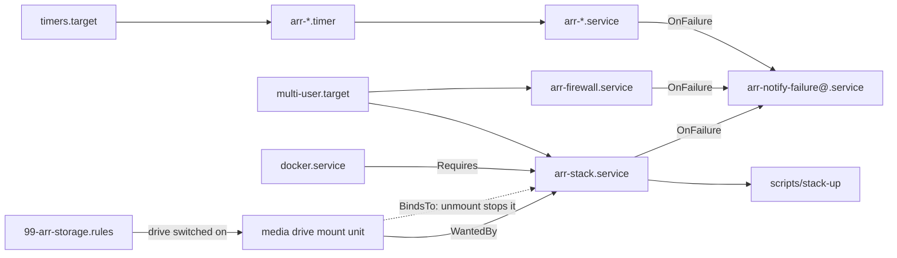
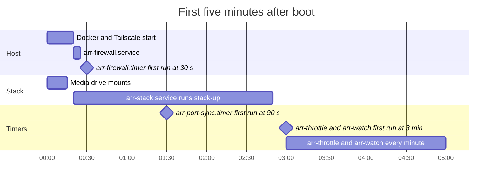

# systemd reference

Every file in [`host/systemd/`](https://github.com/bugrauluyurt/homelab-media-stack/tree/main/host/systemd): the units, timers and udev rule that start the stack with the media drive and run its scheduled jobs. It is for anyone checking when something runs, as which user, and why it did or didn't. [Storage and boot](../flows/storage-and-boot.md) tells the story; the scripts they run are in the [scripts reference](scripts.md).

**Anchors.** Each entry's heading is the file name, so its anchor is the file name in lower case with dots and `@` removed: `arr-stack.service` is `#arr-stackservice`, `arr-notify-failure@.service` is `#arr-notify-failureservice`, `99-arr-storage.rules` is `#99-arr-storagerules`.

## How the templates are installed

The files in `host/systemd/` are templates. [`host-install`](scripts.md#host-install) fills in their placeholders from `.env` with `sed` and installs them: the udev rule into `/etc/udev/rules.d`, everything else into `/etc/systemd/system`. It then runs `systemctl daemon-reload` and `udevadm control --reload`.

| Placeholder | Filled with | Example |
|---|---|---|
| `@REPO@` | the repository's absolute path (the folder above `scripts/`) | `/home/<user>/homelab-media-stack` |
| `@STACK_USER@` | `STACK_USER` | `<user>` |
| `@STACK_GROUP@` | the stack user's primary group, `id -gn "$STACK_USER"` | `<user>` |
| `@STORAGE_UUID@` | `STORAGE_UUID` | the drive's filesystem UUID |
| `@STORAGE_MOUNT@` | `STORAGE_MOUNT`, default `/mnt/storage` | `/mnt/storage` |
| `@STORAGE_UNIT@` | the mount unit of `STORAGE_MOUNT`: `systemd-escape --path --suffix=mount "$STORAGE_MOUNT"` | `mnt-storage.mount` |

Without `STORAGE_UUID`, `host-install` skips the udev rule and removes an installed copy: the media disk is then always mounted (through fstab or a bind mount), so there is nothing to hot-plug.

`host-install` never enables anything. The units meant to be enabled are `arr-stack.service`, `arr-firewall.service`, `arr-firewall.timer`, `arr-port-sync.timer`, `arr-backup.timer`, `arr-updates.timer`, `arr-health.timer`, `arr-watch.timer`, `arr-throttle.timer` and, with the dashboards module, `arr-youtube.timer`. [Getting started](../getting-started.md#start-the-stack) enables them in stages: the firewall first, the timers that read the apps' API keys last.

The other services have no `[Install]` section: their timer, or `OnFailure=`, starts them. [`stack-health`](scripts.md#stack-health) fails when one of the units above is not enabled (`arr-youtube.timer` only while the dashboards module is on). Re-run `host-install` after changing a file in `host/systemd/` or `STACK_USER`, `STORAGE_MOUNT` or `STORAGE_UUID`.

## How the units fit together



`OnFailure=` is set on `arr-stack`, `arr-firewall`, `arr-backup`, `arr-updates` and `arr-youtube`; the other services have none.

## The first minutes after boot

With the media drive on at boot. The bars for Docker, the mount and `stack-up` are illustrative (their length varies from machine to machine); the timer marks are the exact `OnBootSec=` values.



1. Docker and Tailscale start (both enabled on the host).
2. `arr-firewall.service` loads the firewall once Docker, Tailscale and the network are up. It is a one-shot job, so `systemctl` shows it inactive afterwards; the rules stay. `arr-firewall.timer` applies it again 30 seconds after boot, then every 15 minutes.
3. When the drive is mounted, `arr-stack.service` runs `stack-up`: every container starts, qBittorrent and slskd are re-attached to the VPN if needed, and the forwarded port is synced once gluetun is healthy. The unit allows up to 600 seconds for this.
4. `arr-port-sync.timer` runs `vpn-port-sync` 90 seconds after boot, then every 15 minutes.
5. `arr-throttle.timer` and `arr-watch.timer` start 3 minutes after boot and then run every minute.
6. `arr-backup.timer`, `arr-updates.timer` and `arr-youtube.timer` have `Persistent=true`: a run missed while the machine was off happens soon after boot. `arr-health.timer` has no catch-up; it waits for its next slot.

With the drive off, steps 3 and 5 do nothing: `arr-stack.service` waits for the mount, and the drive-dependent services are skipped by `ConditionPathIsMountPoint=`.

## Steady-state schedule

| Timer | When | Randomized delay | Catches up after downtime | Runs |
|---|---|---|---|---|
| [`arr-throttle.timer`](#arr-throttletimer) | every minute, first 3 min after boot | none (accuracy 10 s) | no | `downloads-throttle` |
| [`arr-watch.timer`](#arr-watchtimer) | every minute, first 3 min after boot | none (accuracy 10 s) | no | `activity-watch` |
| [`arr-firewall.timer`](#arr-firewalltimer) | every 15 minutes, first 30 s after boot | none | no | `host-firewall` |
| [`arr-port-sync.timer`](#arr-port-synctimer) | every 15 minutes, first 90 s after boot | none | no | `vpn-port-sync` |
| [`arr-health.timer`](#arr-healthtimer) | 00:20, 06:20, 12:20, 18:20 | up to 10 min | no | `stack-health --notify` |
| [`arr-backup.timer`](#arr-backuptimer) | daily 04:30 | up to 15 min | yes | `stack-backup` |
| [`arr-youtube.timer`](#arr-youtubetimer) | hourly | up to 10 min | yes | `youtube-sync.py` |
| [`arr-updates.timer`](#arr-updatestimer) | daily 06:00 | up to 30 min | yes | `stack-update-check` |

`systemctl list-timers 'arr-*'` shows the next and last run of each.

## Stack and drive

### 99-arr-storage.rules

The udev rule that mounts a hand-powered media drive when you switch it on:

```
ACTION=="add", SUBSYSTEM=="block", ENV{ID_FS_UUID}=="@STORAGE_UUID@", ENV{SYSTEMD_WANTS}+="@STORAGE_UNIT@"
```

When a block device with the filesystem UUID `STORAGE_UUID` appears, systemd starts the drive's mount unit (from its fstab line, a hand edit described in [Host](../operations/host.md)). Because `arr-stack.service` is wanted by that mount unit, the stack starts with it.

- **File:** [`host/systemd/99-arr-storage.rules`](https://github.com/bugrauluyurt/homelab-media-stack/blob/main/host/systemd/99-arr-storage.rules)
- **Installed to:** `/etc/udev/rules.d/`, only when `STORAGE_UUID` is set.

### arr-stack.service

Starts and stops the whole stack with the media drive.

- **File:** [`host/systemd/arr-stack.service`](https://github.com/bugrauluyurt/homelab-media-stack/blob/main/host/systemd/arr-stack.service)
- **Runs:** `ExecStartPre=/usr/bin/mountpoint -q @STORAGE_MOUNT@`, then `ExecStart=@REPO@/scripts/stack-up` ([`stack-up`](scripts.md#stack-up)); on stop, `ExecStop=/usr/bin/docker compose stop`. `WorkingDirectory=@REPO@`.
- **Type:** `oneshot` with `RemainAfterExit=yes`, so it stays active while the stack runs.
- **User and group:** `@STACK_USER@`, `@STACK_GROUP@`.
- **Timeouts:** `TimeoutStartSec=600`; `TimeoutStopSec=180`, because qBittorrent, Jellyfin and Jellystat's Postgres each get 30 seconds to shut down cleanly (their `stop_grace_period`).
- **Dependencies:** `After=docker.service @STORAGE_UNIT@`, `Requires=docker.service`, `BindsTo=@STORAGE_UNIT@` (the stack stops when the drive is unmounted).
- **Started by:** `WantedBy=multi-user.target @STORAGE_UNIT@`: at boot, and whenever the drive mounts.
- **On failure:** `arr-notify-failure@arr-stack.service`.

## Firewall

### arr-firewall.service

Applies the host firewall ([`host-firewall`](scripts.md#host-firewall)) at boot.

- **File:** [`host/systemd/arr-firewall.service`](https://github.com/bugrauluyurt/homelab-media-stack/blob/main/host/systemd/arr-firewall.service)
- **Runs:** `@REPO@/scripts/host-firewall`, `Type=oneshot`.
- **User:** root (no `User=`).
- **Dependencies:** `After=docker.service tailscaled.service network-online.target`, `Wants=network-online.target`.
- **Started by:** `WantedBy=multi-user.target`, and by `arr-firewall.timer`.
- **On failure:** `arr-notify-failure@arr-firewall.service`.

### arr-firewall.timer

Re-applies the firewall after Docker restarts and IPv6 prefix changes. The script rebuilds the rules only when they differ from what is loaded.

- **File:** [`host/systemd/arr-firewall.timer`](https://github.com/bugrauluyurt/homelab-media-stack/blob/main/host/systemd/arr-firewall.timer)
- **When:** `OnBootSec=30sec`, `OnUnitActiveSec=15min`.
- **Started by:** `WantedBy=timers.target`.

## VPN port

### arr-port-sync.service

Runs [`vpn-port-sync`](scripts.md#vpn-port-sync), which keeps qBittorrent on the tunnel and on Proton's forwarded port.

- **File:** [`host/systemd/arr-port-sync.service`](https://github.com/bugrauluyurt/homelab-media-stack/blob/main/host/systemd/arr-port-sync.service)
- **Runs:** `@REPO@/scripts/vpn-port-sync`, `Type=oneshot`.
- **User and group:** `@STACK_USER@`, `@STACK_GROUP@`.
- **Dependencies:** `After=arr-stack.service`, `Requires=docker.service`, `ConditionPathIsMountPoint=@STORAGE_MOUNT@` (while the drive is off the VPN isn't running, so the run is skipped). No `OnFailure=`.
- **Started by:** `arr-port-sync.timer`.

### arr-port-sync.timer

- **File:** [`host/systemd/arr-port-sync.timer`](https://github.com/bugrauluyurt/homelab-media-stack/blob/main/host/systemd/arr-port-sync.timer)
- **When:** `OnBootSec=90sec`, `OnUnitActiveSec=15min`.
- **Started by:** `WantedBy=timers.target`.

## Monitoring

### arr-health.service

Runs [`stack-health --notify`](scripts.md#stack-health), which pushes the names of failing checks to ntfy.

- **File:** [`host/systemd/arr-health.service`](https://github.com/bugrauluyurt/homelab-media-stack/blob/main/host/systemd/arr-health.service)
- **Runs:** `@REPO@/scripts/stack-health --notify`, `Type=oneshot`.
- **User and group:** `@STACK_USER@`, `@STACK_GROUP@` (the script calls sudo where it needs root).
- **Condition:** `ConditionPathIsMountPoint=@STORAGE_MOUNT@`: the whole stack is down while the drive is off, so there is nothing to check.
- **Dependencies:** `After=arr-stack.service`.
- **Started by:** `arr-health.timer`.

### arr-health.timer

- **File:** [`host/systemd/arr-health.timer`](https://github.com/bugrauluyurt/homelab-media-stack/blob/main/host/systemd/arr-health.timer)
- **When:** `OnCalendar=00/6:20` (00:20, 06:20, 12:20 and 18:20), `RandomizedDelaySec=10min`. Not persistent.
- **Started by:** `WantedBy=timers.target`.

### arr-watch.service

Runs [`activity-watch`](scripts.md#activity-watch): alerts on software transcodes, new Jellyfin devices, failed logins and stuck requests.

- **File:** [`host/systemd/arr-watch.service`](https://github.com/bugrauluyurt/homelab-media-stack/blob/main/host/systemd/arr-watch.service)
- **Runs:** `@REPO@/scripts/activity-watch`, `Type=oneshot`.
- **User and group:** `@STACK_USER@`, `@STACK_GROUP@`.
- **Condition:** `ConditionPathIsMountPoint=@STORAGE_MOUNT@`.
- **Dependencies:** `After=arr-stack.service`.
- **Started by:** `arr-watch.timer`.

### arr-watch.timer

- **File:** [`host/systemd/arr-watch.timer`](https://github.com/bugrauluyurt/homelab-media-stack/blob/main/host/systemd/arr-watch.timer)
- **When:** `OnBootSec=3min`, `OnUnitActiveSec=1min`, `AccuracySec=10s`.
- **Started by:** `WantedBy=timers.target`.

### arr-throttle.service

Runs [`downloads-throttle`](scripts.md#downloads-throttle), which caps qBittorrent while someone watches or the machine is overloaded.

- **File:** [`host/systemd/arr-throttle.service`](https://github.com/bugrauluyurt/homelab-media-stack/blob/main/host/systemd/arr-throttle.service)
- **Runs:** `@REPO@/scripts/downloads-throttle`, `Type=oneshot`.
- **User and group:** `@STACK_USER@`, `@STACK_GROUP@`.
- **Condition:** `ConditionPathIsMountPoint=@STORAGE_MOUNT@`.
- **Dependencies:** `After=arr-stack.service`.
- **Started by:** `arr-throttle.timer`.

### arr-throttle.timer

- **File:** [`host/systemd/arr-throttle.timer`](https://github.com/bugrauluyurt/homelab-media-stack/blob/main/host/systemd/arr-throttle.timer)
- **When:** `OnBootSec=3min`, `OnUnitActiveSec=1min`, `AccuracySec=10s`.
- **Started by:** `WantedBy=timers.target`.

## Maintenance

### arr-backup.service

Runs [`stack-backup`](scripts.md#stack-backup), the restic backup of the stack's settings.

- **File:** [`host/systemd/arr-backup.service`](https://github.com/bugrauluyurt/homelab-media-stack/blob/main/host/systemd/arr-backup.service)
- **Runs:** `@REPO@/scripts/stack-backup`, `Type=oneshot`, with `Nice=10` and `IOSchedulingClass=idle` so it yields to everything else.
- **User:** root (no `User=`); the app configs are owned by several container UIDs.
- **Condition:** `ConditionPathIsMountPoint=@STORAGE_MOUNT@`: the drive is powered by hand, so the backup is skipped rather than failed while it is off. A skipped run is not repeated when the drive comes back; the next one is the following day's.
- **Dependencies:** `After=@STORAGE_UNIT@ docker.service`.
- **Started by:** `arr-backup.timer`.
- **On failure:** `arr-notify-failure@arr-backup.service`.

### arr-backup.timer

- **File:** [`host/systemd/arr-backup.timer`](https://github.com/bugrauluyurt/homelab-media-stack/blob/main/host/systemd/arr-backup.timer)
- **When:** `OnCalendar=*-*-* 04:30:00`, `RandomizedDelaySec=15min`, `Persistent=true` (if the machine was off at 04:30, it runs at the next opportunity).
- **Started by:** `WantedBy=timers.target`.

### arr-updates.service

Runs [`stack-update-check`](scripts.md#stack-update-check), which reports new image builds and never pulls or restarts anything.

- **File:** [`host/systemd/arr-updates.service`](https://github.com/bugrauluyurt/homelab-media-stack/blob/main/host/systemd/arr-updates.service)
- **Runs:** `@REPO@/scripts/stack-update-check`, `Type=oneshot`.
- **User and group:** `@STACK_USER@`, `@STACK_GROUP@`.
- **Dependencies:** `After=network-online.target docker.service`, `Wants=network-online.target`.
- **Started by:** `arr-updates.timer`.
- **On failure:** `arr-notify-failure@arr-updates.service`.

### arr-updates.timer

- **File:** [`host/systemd/arr-updates.timer`](https://github.com/bugrauluyurt/homelab-media-stack/blob/main/host/systemd/arr-updates.timer)
- **When:** `OnCalendar=*-*-* 06:00:00`, `RandomizedDelaySec=30min`, `Persistent=true`.
- **Started by:** `WantedBy=timers.target`.

### arr-youtube.service

Runs [`youtube-sync.py`](scripts.md#youtube-syncpy), which syncs Glance's YouTube channel lists with your subscriptions and writes their latest uploads. With the dashboards module off, the script exits at once.

- **File:** [`host/systemd/arr-youtube.service`](https://github.com/bugrauluyurt/homelab-media-stack/blob/main/host/systemd/arr-youtube.service)
- **Runs:** `@REPO@/scripts/youtube-sync.py`, `Type=oneshot`.
- **User and group:** `@STACK_USER@`, `@STACK_GROUP@`.
- **Dependencies:** `After=network-online.target`, `Wants=network-online.target`.
- **Started by:** `arr-youtube.timer`.
- **On failure:** `arr-notify-failure@arr-youtube.service`.

### arr-youtube.timer

- **File:** [`host/systemd/arr-youtube.timer`](https://github.com/bugrauluyurt/homelab-media-stack/blob/main/host/systemd/arr-youtube.timer)
- **When:** `OnCalendar=hourly`, `RandomizedDelaySec=10min`, `Persistent=true`.
- **Started by:** `WantedBy=timers.target`.

## Failure alerts

### arr-notify-failure@.service

A template unit that pushes a failed unit's last log lines to ntfy through [`stack-failure-notify`](scripts.md#stack-failure-notify). A unit with `OnFailure=arr-notify-failure@%n.service` starts one instance named after itself (`%n` is the failing unit's full name), and the instance passes that name on as `%i`.

- **File:** [`host/systemd/arr-notify-failure@.service`](https://github.com/bugrauluyurt/homelab-media-stack/blob/main/host/systemd/arr-notify-failure@.service)
- **Runs:** `@REPO@/scripts/stack-failure-notify %i`, `Type=oneshot`.
- **User:** root (no `User=`).
- **Used by:** `arr-stack.service`, `arr-firewall.service`, `arr-backup.service`, `arr-updates.service`, `arr-youtube.service`.

## Not in host/systemd/

The Telegram agent's user unit, `arr-agent.service`, is a template in `ai/agent/` and is installed into `~/.config/systemd/user/` by [`agent-install`](scripts.md#agent-install), not by `host-install`. [AI agent](../flows/ai-agent.md) covers it.
