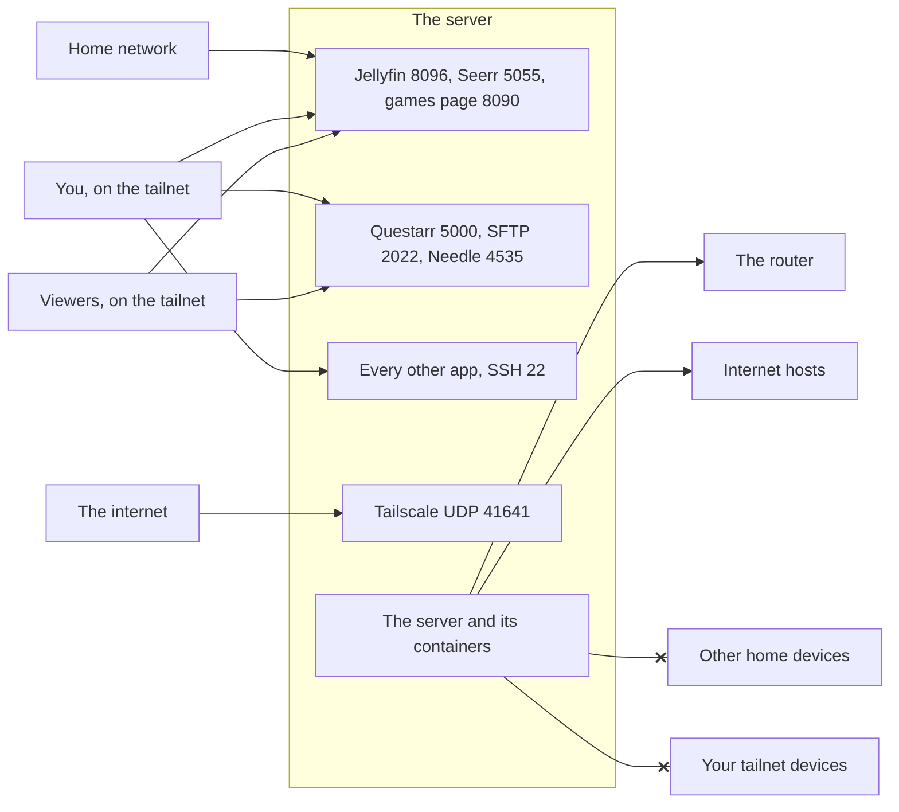
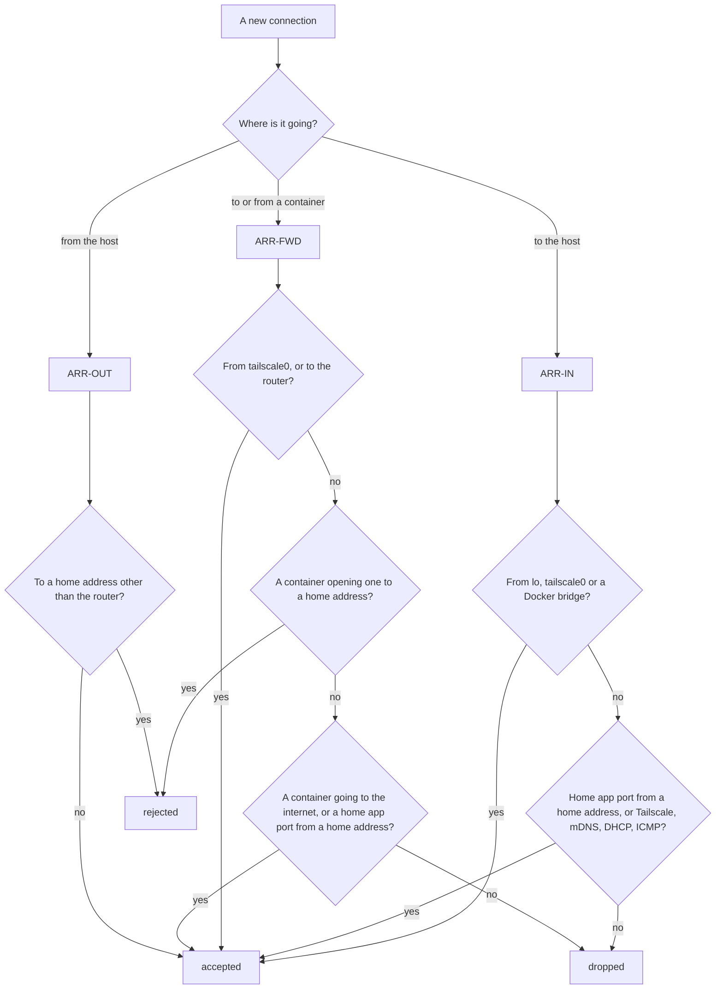
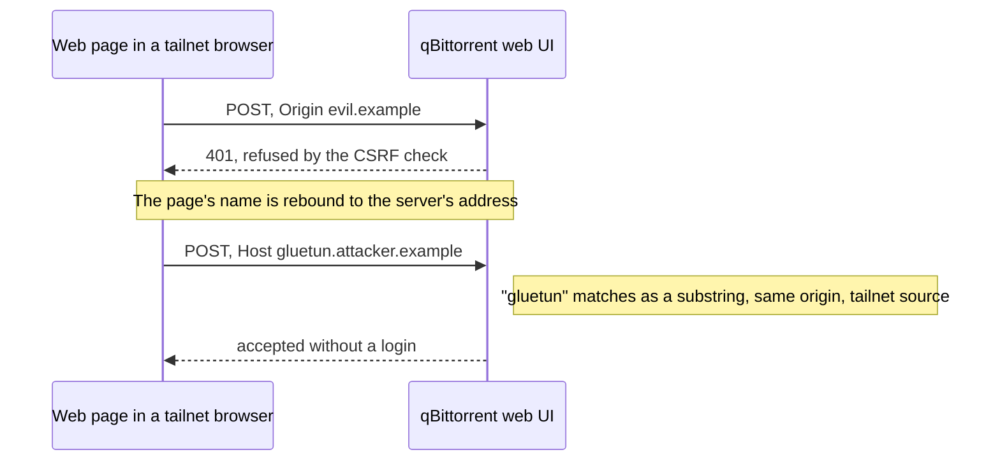

# Security

This page describes what the stack protects against, who can reach what, and every control
that enforces it: the host firewall, SSH, the login-free apps, SFTPGo, secrets and the supply
chain. It is for anyone deciding whether to trust the stack on their network, and for anyone
about to change one of these controls.

## Threat model

The design assumes the home network is shared with people and devices you don't control,
and that any single piece (a container, a key, a browser tab) can go wrong.

| Threat | What it could do | What stops it |
|---|---|---|
| Guests and devices on the home network | Open admin apps, change settings, delete media | The firewall gives the home network only Jellyfin, Seerr and the games page, each with its own login. SSH and everything else answer only on the tailnet. |
| Devices on your tailnet | A viewer's device reaching admin apps; your own lost device reaching everything | Tailscale's policy limits each viewer to six ports. Your own devices reach everything, so keep them safe. |
| A compromised container | Pivot to your laptops, phones or other home devices; take over Docker | Containers cannot open connections to home devices or to tailnet devices. No container holds the Docker socket except a read-only proxy. |
| A leaked SSH key | Log in as an account that is effectively root | Keys work only from the tailnet, and each key only from the sources pinned in its `from=` option. Passwords are off. |
| A malicious web page open in a browser on a tailnet device | Send requests to login-free apps from inside your tailnet | CSRF and Host checks on qBittorrent, Host allow-lists on Homepage and SABnzbd. One gap remains: see [qBittorrent's web UI](#qbittorrents-web-ui). |
| The internet over IPv6, or a router port forward | Reach the home apps directly, since the server has global IPv6 addresses | Home apps accept only home-network source addresses. From any other source, only Tailscale's port, mDNS, the DHCP client and ICMP answer. |
| A leaked secret in the repository | API keys or the VPN key in a public commit | Secrets live only in `.env` and outside the repository; a pre-commit hook blocks common key formats. |
| Your IP in a torrent swarm | Your home address exposed to peers | P2P runs only inside the VPN namespace and fails closed ([Architecture](architecture.md#the-vpn-boundary)). |

## Access matrix



| From | Can reach | Enforced by |
|---|---|---|
| The home network (`LAN_CIDR`, `fe80::/10` and the network's IPv6 prefixes) | Jellyfin 8096, Seerr 5055 and the games page 8090 (IPv4 only), plus DHCP, mDNS, ICMP and Tailscale's own port. Everything else is dropped. | `scripts/firewall` |
| You, on the tailnet | Every port, including SSH | Tailscale policy: your login may reach everything |
| Viewers, on the tailnet | Jellyfin 8096, Seerr 5055, Questarr 5000, the games page 8090, SFTP 2022 and Needle 4535; not Navidrome (Needle passes music through), not SSH | Tailscale policy: `group:viewers` |
| The internet (a global IPv6 address, or a port forward on the router) | Tailscale's UDP 41641, mDNS, the DHCP client and ICMP only | `scripts/firewall` |
| The server and its containers | The internet and the router; not other home devices, and not your tailnet devices | `scripts/firewall` (home devices), the `tag:media` tag (tailnet devices) |

The reference policy is
[`host/tailscale-policy.hujson`](https://github.com/bugrauluyurt/homelab-media-stack/blob/main/host/tailscale-policy.hujson);
its tests assert that a viewer is refused ports such as Sonarr, qBittorrent, the dashboards,
Navidrome and SSH. The server carries `tag:media`, so it belongs to the tag rather than to a
person, and no grant lets the tag start a connection. If the server were compromised, it could
not reach your laptops or phones. Never add back Tailscale's default allow-everything grant:
grants only add access, so it would cancel all of this. Access follows the person, so don't
tag a viewer's devices, or they stop counting as that viewer. Adding a viewer is covered in
[Viewers](flows/viewers.md).

### Apps without a login

Bazarr, Homepage, Glance, Prometheus, Scrutiny and ChangeDetection.io have no login, and
qBittorrent needs none from the tailnet. Several others use simple logins. That is acceptable
only because the home network cannot reach them and viewers are held to their six ports. It
also means anyone signed in to Tailscale as you can open everything. Use real passwords
before loosening either rule.

## The firewall

`scripts/firewall` owns the host's packet filter for IPv4 (`iptables`) and IPv6
(`ip6tables`). It installs three chains and hooks each into a built-in chain:

| Chain | Hooked into | Covers |
|---|---|---|
| `ARR-IN` | `INPUT` | Connections to the host itself, such as SSH |
| `ARR-OUT` | `OUTPUT` | Connections the host opens |
| `ARR-FWD` | `DOCKER-USER` | Connections to and from containers, including published ports |

The `DOCKER-USER` hook is the important one. Docker publishes a container port by rewriting
the packet before it reaches `INPUT`, so rules in `INPUT` never see it; `DOCKER-USER` is the
chain Docker keeps for your rules.



Replies to established connections always pass. The host's own Tailscale traffic (source
port 41641) may reach home addresses, so Tailscale can connect directly to devices on the
same network.

**How it runs.** `arr-firewall.service` applies the rules at boot once Docker is up, and
`arr-firewall.timer` re-applies them every 15 minutes, which follows Docker restarts and
changes to the home network's IPv6 prefixes. Each run
computes the wanted rules, compares a hash stamped into `ARR-IN`, and rebuilds only when they
differ (`+ iptables: rules rebuilt`, otherwise `= iptables: rules current`).

```bash
sudo ~/homelab-media-stack/scripts/firewall status       # show the rules
sudo ~/homelab-media-stack/scripts/firewall off          # remove them (the timer restores them within 15 minutes)
~/homelab-media-stack/scripts/firewall home-ports        # the ports open to the home network
```

**Guards.** The script refuses to apply, and says why, when:

- **ufw or firewalld is active.** Either would drop what these rules allow. Disable it
  (`sudo ufw disable`, or `sudo systemctl disable --now firewalld`).
- **Docker uses its nftables firewall backend.** That backend ignores `DOCKER-USER`, so
  published ports would stay open to everyone. The default iptables backend is what the
  rules need. (Arch's `iptables-nft` package is fine: it is the `iptables` command on the
  kernel's nftables, and Docker still honours `DOCKER-USER` through it.)

**What the health check verifies.** All three hooks exist for IPv4 and IPv6; exactly the home
ports are open to the home network, only from home addresses; `ARR-FWD` ends in a drop; SSH is
not open to the home network; and the firewall service and timer are enabled.

Containers on a macvlan network (another project on the same host, for example) have their
own home-network addresses and never pass through these rules.

## SSH

Every account with the docker group and passwordless sudo is effectively root, so SSH is
locked down three ways:

- **Keys only.** `host/sshd_config.d/10-arr-hardening.conf` turns off passwords, keyboard
  interactive login and root login. It is named to sort before Raspberry Pi OS's
  `50-cloud-init.conf`, which turns passwords back on, because `sshd` keeps the first value it
  reads. `install-host` installs it and confirms it is active.
- **Tailnet only.** Port 22 is not a home app, so the firewall drops it from the home network.
- **Every key pinned.** Each line in `~/.ssh/authorized_keys` starts with a `from=` option
  naming where that key may be used from, so a leaked key is useless anywhere else. The
  health check fails if any key lacks one.

```text
from="100.64.0.0/10,fd7a:115c:a1e0::/48" ssh-ed25519 AAAA... you@laptop
from="<agent's tailnet IPv4>,<its IPv6>",no-agent-forwarding,no-X11-forwarding ssh-ed25519 AAAA... agent
```

The first form allows your key from any tailnet device (the Tailscale policy already limits
port 22 to your own devices). The second limits an automated agent's key to its one device.
`rpcbind` is disabled and masked, since nothing here uses NFS. If Tailscale is ever down, use
a keyboard and screen on the server.

## qBittorrent's web UI

qBittorrent is login-free for the tailnet (`100.64.0.0/10`) and Docker (`172.16.0.0/12`), so
Radarr and Sonarr reach it at `gluetun:8080` without storing a password. `scripts/sync-port`
sets exactly those two ranges on every run. Anyone else must log in, and the health check
fails if a login-free range overlaps `LAN_CIDR`.

Login-free access from the tailnet would let any web page open in a browser on a tailnet
device send requests to it, so two checks stay on. CSRF protection refuses a request whose
`Origin` or `Referer` is another site, and Host header validation refuses a request for a
host name it does not know. `sync-port` keeps the accepted names current (`gluetun`,
`127.0.0.1`, and the server's own names and IPv4 addresses). The health check sends a
request with a foreign `Origin` and expects `401`. Dashboard links still work because
Homepage and Glance send no `Referer`; browser extensions that send torrents are refused,
because their `Origin` is the extension.

One gap remains, and it is stated here plainly: qBittorrent matches accepted host names as
substrings. A targeted DNS rebinding attack, a page on a name such as
`gluetun.attacker.example` that resolves to the server, passes both checks:



Only a login on the tailnet would close that gap. The home network is not exposed to it:
port 8080 is not a home app, so the firewall drops it there.

## SFTPGo, read-only

The games download page must never become a way to write to the server:

- Every account may only `list` and `download`. FTP and WebDAV are refused per account, and
  the web client has uploads and shares switched off. Accounts are managed only through
  `scripts/games_accounts.py`, which `configure-sftpgo.py` (yours) and `add-viewer.py`
  (viewers') call. Because every account is read-only, yours grants nothing a viewer's does not.
- The game folders are mounted `read_only`, so even a flaw in SFTPGo cannot write to them.
- The web admin is off, and so is the OpenAPI page. The admin account exists for the scripts
  only, over the REST API, and its allow-list admits only the server (`127.0.0.0/8`) and
  Docker (`172.16.0.0/12`).
- Its ports are published on IPv4 only. Over IPv6, Docker's proxy would present every client
  as the Docker gateway, an address inside that allow-list.
- The home network reaches the web page (8090) only; SFTP (2022) is tailnet only.

The health check confirms that a listing without a login gets `401`, that SFTP answers, and
that the admin login is refused when tried from the server's tailnet address.

## Secrets

- **`.env`** holds every secret and this machine's values. It is gitignored and should be
  `chmod 600`. Scripts read values into variables and keep them out of their output.
- **App settings live outside the repository** in `CONFIG_ROOT`, so `git add -A` cannot
  capture an API key that was never inside the repository. Files rendered with live keys
  (Scraparr's config) are written there, `chmod 600`.
- **The VPN key** is only in `.env`. `wg0.conf` holds the rest of the WireGuard
  configuration, mode `600`, and deliberately no `PrivateKey`.
- **The pre-commit hook** (`git config core.hooksPath .githooks`) blocks `.env` and its copies
  (`.env.bak`, `.env.local`; `.env.example` is allowed), `*.local.*`, `*.key` and `*.pem` files,
  and contents that look like a WireGuard private key, a Plex claim token, an API key, a PEM
  private key, a GitHub token, a Telegram bot token or a Google refresh token.
  It also refuses scripts that do not parse. The repository's own checks run gitleaks as well.
- **Backups include `.env`**, encrypted by restic with `RESTIC_PASSWORD`. The backup
  repository is on the media disk with a mirror on the system disk, and a root-only copy of
  the password sits on the media disk, so either disk can fail without losing the backups
  ([Backups](flows/backups.md)).
- **The ntfy topic** works like a password: anyone who knows its name can read your alerts.
- **Keys stay server-side** where possible: Needle holds the Lidarr and slskd keys so the
  browser never sees them, and Grafana reads Jellystat through a read-only database role
  limited to the viewing columns it needs.

## Supply chain

- **Images come from their upstream publishers** (linuxserver.io and each project's own
  registry). Most follow `:latest` or a major-version tag (`recyclarr:8`, `uptime-kuma:2`,
  `postgres:16-alpine`, `sftpgo:v2-alpine`, `needle:1`), not digests. Nothing is built
  locally unless you set `NEEDLE_IMAGE=needle:local`.
- **Updates are reviewed, not automatic.** `check-updates` runs daily and notifies you;
  `update` snapshots the settings, keeps the running images as rollback tags, pulls, recreates
  and runs the health check, and `update --rollback` restores image and settings together
  ([Updates](flows/updates.md)).
- **Needle's image** is published from its own repository with build provenance. Verify the
  image you run:

  ```bash
  gh attestation verify oci://ghcr.io/bugrauluyurt/needle:<version> --owner bugrauluyurt
  ```

- **This repository's releases** are immutable and signed by GitHub, and from v2.3.0 each
  carries its source archive with signed build provenance:

  ```bash
  gh release verify <tag> -R bugrauluyurt/homelab-media-stack
  gh attestation verify homelab-media-stack-<version>.tar.gz \
    --bundle homelab-media-stack-<version>.tar.gz.intoto.jsonl -R bugrauluyurt/homelab-media-stack
  ```

## Reporting a vulnerability

Please report security problems privately, through the repository's **Security** tab
(**Report a vulnerability**), not in a public issue. What is in scope and what to include is
in [SECURITY.md](https://github.com/bugrauluyurt/homelab-media-stack/blob/main/.github/SECURITY.md).
