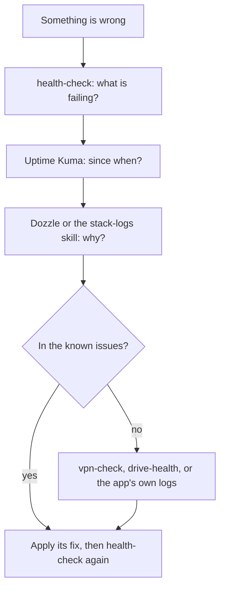

# Troubleshooting

This page is for the owner, and anyone helping: how to find out what is wrong, in which order to
look, and an index of every problem already solved once, grouped by area. The fixes themselves
live in
[`known-issues.md`](https://github.com/bugrauluyurt/homelab-media-stack/blob/main/ai/homelab-plugin/skills/stack-logs/references/known-issues.md),
which ships with the `stack-logs` skill so an AI agent reads the same list.

## How to diagnose



1. **Run `health-check` first** (`health` in the [terminal](operations/terminal.md)). It checks
   storage, systemd units, security, backups, every service, monitoring, Cleanuparr, the indexers
   and the VPN, and prints `OK` or `FAIL` per line with a summary `N passed, M failed`. A yellow
   `UPDATES` line is information, not a failure. It exits non-zero when anything failed.
   It isn't strictly read-only: it writes a hardlink test file on the media drive and starts
   short-lived `curl` containers. `arr-health.timer` runs it every 6 hours with `--notify` and
   pushes failures to your phone.
2. **Uptime Kuma tells you *when*.** The status page, `http://<tailscale-ip>:3003/status/stack`,
   has every service's recent checks, so you can see whether something is down now, went down at
   a certain time, or has been flaky ([Dashboards](using/dashboards.md#uptime-kuma)).
3. **The logs tell you *why*.** Dozzle, `http://<tailscale-ip>:8888`, streams every container's
   log with search ([Dashboards](using/dashboards.md#dozzle)). In a terminal:

    ```bash
    docker compose ps --format '{{.Name}} {{.Status}}'
    docker logs --since 30m <service> 2>&1 | grep -iE 'error|warn|fatal|exception' | tail -30
    ```

    Every container is named after its compose service. Or ask an AI agent with the `stack-logs`
    skill: it reads the logs and matches them against the known issues ([AI agent](flows/ai-agent.md)).
4. **For the VPN**, run `leak-test` (`leaktest`) or the `vpn-check` skill, which also proves
   qBittorrent and slskd sit inside gluetun's network and that traffic can't bypass the tunnel
   ([VPN and ports](flows/vpn-and-ports.md)).
5. **For the media drive**, the `drive-health` skill reads its SMART data, temperature and USB
   link, and Scrutiny shows the history ([Maintenance](operations/maintenance.md#drive-health)).

Diagnosis is safe. Fixing often isn't: restarting services, touching the VPN, editing `.env` or
restoring data interrupts people, so check that nothing is playing in Jellyfin first. The
[things never to do](https://github.com/bugrauluyurt/homelab-media-stack/blob/main/ai/homelab-plugin/skills/stack-logs/references/known-issues.md#things-never-to-do)
are listed at the end of the known issues.

## Where a failing check points

| `health-check` section | Look at |
|---|---|
| STORAGE | [Storage and boot](flows/storage-and-boot.md), [disk space](operations/maintenance.md#disk-space), [drive health](operations/maintenance.md#drive-health) |
| SYSTEMD | [systemd reference](reference/systemd.md), [Host setup](operations/host.md) |
| SECURITY | [Security](security.md), [Host setup](operations/host.md) |
| BACKUPS | [Backups](flows/backups.md) |
| SERVICES, MONITORING | The app's logs; [Monitoring](flows/monitoring.md) |
| CLEANUP & INTROS | [Cleanuparr](operations/maintenance.md#cleanuparr) |
| INDEXERS | [Indexers](operations/indexers.md) |
| VPN | [VPN and ports](flows/vpn-and-ports.md) |

## Known issues by area

Each link opens the entry with its symptom, cause and fix.

### VPN and torrents

- [qBittorrent stops answering after gluetun restarts](https://github.com/bugrauluyurt/homelab-media-stack/blob/main/ai/homelab-plugin/skills/stack-logs/references/known-issues.md#qbittorrent-stops-answering-after-gluetun-restarts)
- [Forwarded port out of sync](https://github.com/bugrauluyurt/homelab-media-stack/blob/main/ai/homelab-plugin/skills/stack-logs/references/known-issues.md#forwarded-port-out-of-sync), including right after a reboot
- [No forwarded port at all ("vpn forwarded port" DOWN in Kuma)](https://github.com/bugrauluyurt/homelab-media-stack/blob/main/ai/homelab-plugin/skills/stack-logs/references/known-issues.md#no-forwarded-port-at-all-vpn-forwarded-port-down-in-kuma)
- [Torrents stuck at 0 peers, trackers say "Operation not permitted"](https://github.com/bugrauluyurt/homelab-media-stack/blob/main/ai/homelab-plugin/skills/stack-logs/references/known-issues.md#torrents-stuck-at-0-peers-trackers-say-operation-not-permitted)
- [Trackers say "Host not found"](https://github.com/bugrauluyurt/homelab-media-stack/blob/main/ai/homelab-plugin/skills/stack-logs/references/known-issues.md#trackers-say-host-not-found)

### Searching and downloading

- [Searches find nothing, or an indexer keeps failing](https://github.com/bugrauluyurt/homelab-media-stack/blob/main/ai/homelab-plugin/skills/stack-logs/references/known-issues.md#searches-find-nothing-or-an-indexer-keeps-failing)
- [Releases shown as rejected](https://github.com/bugrauluyurt/homelab-media-stack/blob/main/ai/homelab-plugin/skills/stack-logs/references/known-issues.md#releases-shown-as-rejected)
- [Byparr healthcheck fails](https://github.com/bugrauluyurt/homelab-media-stack/blob/main/ai/homelab-plugin/skills/stack-logs/references/known-issues.md#byparr-healthcheck-fails)
- [Radarr downloaded a fake of a movie still in cinemas](https://github.com/bugrauluyurt/homelab-media-stack/blob/main/ai/homelab-plugin/skills/stack-logs/references/known-issues.md#radarr-downloaded-a-fake-of-a-movie-still-in-cinemas)
- [SABnzbd "Refused connection from ::ffff:100.x"](https://github.com/bugrauluyurt/homelab-media-stack/blob/main/ai/homelab-plugin/skills/stack-logs/references/known-issues.md#sabnzbd-refused-connection-from-ffff100x)

### Watching and subtitles

- [Jellyfin home screen shows "Nothing here"](https://github.com/bugrauluyurt/homelab-media-stack/blob/main/ai/homelab-plugin/skills/stack-logs/references/known-issues.md#jellyfin-home-screen-shows-nothing-here)
- [A show is in Jellyfin but has no poster or description](https://github.com/bugrauluyurt/homelab-media-stack/blob/main/ai/homelab-plugin/skills/stack-logs/references/known-issues.md#a-show-is-in-jellyfin-but-has-no-poster-or-description)
- [Slow playback or disk while downloading](https://github.com/bugrauluyurt/homelab-media-stack/blob/main/ai/homelab-plugin/skills/stack-logs/references/known-issues.md#slow-playback-or-disk-while-downloading)
- [Subtitles stuck on "Fetching additional data" in a browser](https://github.com/bugrauluyurt/homelab-media-stack/blob/main/ai/homelab-plugin/skills/stack-logs/references/known-issues.md#subtitles-stuck-on-fetching-additional-data-in-a-browser)
- [Bazarr "throttling" messages](https://github.com/bugrauluyurt/homelab-media-stack/blob/main/ai/homelab-plugin/skills/stack-logs/references/known-issues.md#bazarr-throttling-messages)
- [Bazarr uses a full CPU core for minutes at a time](https://github.com/bugrauluyurt/homelab-media-stack/blob/main/ai/homelab-plugin/skills/stack-logs/references/known-issues.md#bazarr-uses-a-full-cpu-core-for-minutes-at-a-time)

Quick answers for viewers (buffering, nothing new showing, works only at home) are in
[Watching](using/watching.md#quick-answers).

### Music

- [Lidarr ignores Soulseek](https://github.com/bugrauluyurt/homelab-media-stack/blob/main/ai/homelab-plugin/skills/stack-logs/references/known-issues.md#lidarr-ignores-soulseek)
- [Lidarr finds copies but takes none ("X is not wanted in profile")](https://github.com/bugrauluyurt/homelab-media-stack/blob/main/ai/homelab-plugin/skills/stack-logs/references/known-issues.md#lidarr-finds-copies-but-takes-none-x-is-not-wanted-in-profile)
- ["Album match is not close enough" in Needle's Downloading now](https://github.com/bugrauluyurt/homelab-media-stack/blob/main/ai/homelab-plugin/skills/stack-logs/references/known-issues.md#album-match-is-not-close-enough-491-vs-80-in-needles-downloading-now)
- [An album has no cover in Navidrome or Needle](https://github.com/bugrauluyurt/homelab-media-stack/blob/main/ai/homelab-plugin/skills/stack-logs/references/known-issues.md#an-album-has-no-cover-in-navidrome-or-needle)
- [Needle hides Spotify, or says Spotify refused (429)](https://github.com/bugrauluyurt/homelab-media-stack/blob/main/ai/homelab-plugin/skills/stack-logs/references/known-issues.md#needle-hides-spotify-or-says-spotify-refused-429)
- [Lidarr: "Connection refused (gluetun:5030)" from SlskdDownloadManager](https://github.com/bugrauluyurt/homelab-media-stack/blob/main/ai/homelab-plugin/skills/stack-logs/references/known-issues.md#lidarr-connection-refused-gluetun5030-from-slskddownloadmanager)

### Games

- [Questarr says "added to qBittorrent" but nothing downloads](https://github.com/bugrauluyurt/homelab-media-stack/blob/main/ai/homelab-plugin/skills/stack-logs/references/known-issues.md#questarr-says-added-to-qbittorrent-but-nothing-downloads)
- [Games page (SFTPGo): a big download started over](https://github.com/bugrauluyurt/homelab-media-stack/blob/main/ai/homelab-plugin/skills/stack-logs/references/known-issues.md#games-page-sftpgo-a-big-download-started-over)

### Access

- [An app won't open from home Wi-Fi, only Jellyfin, Seerr and the games page do](https://github.com/bugrauluyurt/homelab-media-stack/blob/main/ai/homelab-plugin/skills/stack-logs/references/known-issues.md#an-app-wont-open-from-home-wi-fi-only-jellyfin-seerr-and-the-games-page-do)
- [A viewer (family, friend) can't connect](https://github.com/bugrauluyurt/homelab-media-stack/blob/main/ai/homelab-plugin/skills/stack-logs/references/known-issues.md#a-viewer-family-friend-cant-connect)
- [SSH refused ("Permission denied (publickey)") from a device of yours](https://github.com/bugrauluyurt/homelab-media-stack/blob/main/ai/homelab-plugin/skills/stack-logs/references/known-issues.md#ssh-refused-permission-denied-publickey-from-a-device-of-yours)

### Monitoring and dashboards

- [Uptime Kuma says a service is down, but it's running](https://github.com/bugrauluyurt/homelab-media-stack/blob/main/ai/homelab-plugin/skills/stack-logs/references/known-issues.md#uptime-kuma-says-a-service-is-down-but-its-running)
- [Dozzle lists containers but can't open their logs](https://github.com/bugrauluyurt/homelab-media-stack/blob/main/ai/homelab-plugin/skills/stack-logs/references/known-issues.md#dozzle-lists-containers-but-cant-open-their-logs)
- [Dozzle shows no CPU or memory](https://github.com/bugrauluyurt/homelab-media-stack/blob/main/ai/homelab-plugin/skills/stack-logs/references/known-issues.md#dozzle-shows-no-cpu-or-memory-avg-cpumemory-empty)

### Storage and configuration

- [The media drive won't mount](https://github.com/bugrauluyurt/homelab-media-stack/blob/main/ai/homelab-plugin/skills/stack-logs/references/known-issues.md#the-media-drive-wont-mount)
- [A value in .env contains `$`](https://github.com/bugrauluyurt/homelab-media-stack/blob/main/ai/homelab-plugin/skills/stack-logs/references/known-issues.md#a-value-in-env-contains-)

Solved a new problem? Add it to `known-issues.md` in the same shape (symptom, cause, fix) and link
it from the matching group here.
