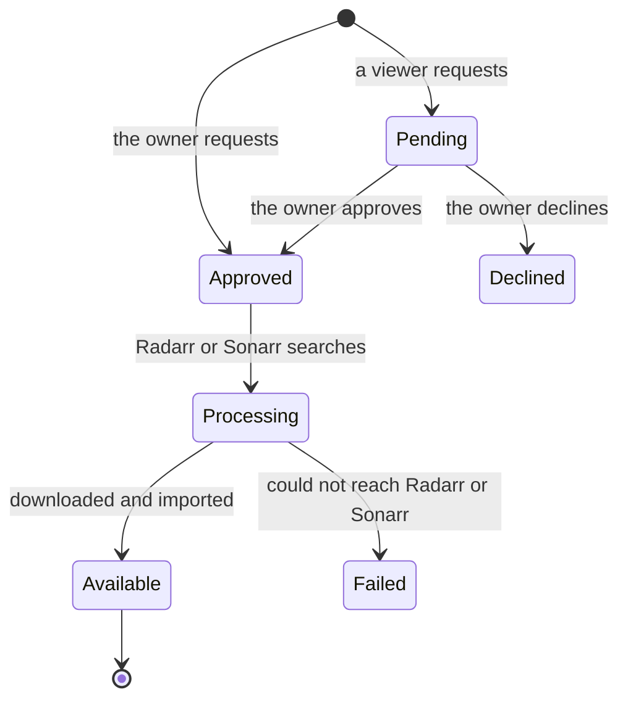

# Requesting movies and shows

This page is for everyone who asks the server for something to watch: how to request a movie or
a show in Seerr, what happens after you press **Request**, how long it takes, and why everything
arrives in 1080p. Music and games have their own pages: [Music](music.md) and [Games](games.md).

## Where to request

Open **Seerr**:

| From | Address |
|---|---|
| Anywhere, over Tailscale | `http://<tailscale-ip>:5055` |
| At home, on the home network | `http://<lan-ip>:5055` |

Sign in with your Jellyfin account. The owner uses `JELLYFIN_USER` / `JELLYFIN_PASSWORD` from
`.env`; everyone else gets an account from `add-viewer.py` (see [Giving someone access](../flows/viewers.md)).
Seerr works the same in a phone's browser, which is handy for requesting from the sofa.

You can also request without leaving Jellyfin: its search shows Seerr results with a request
button, and the Discover rows on the home screen and the Recommended and Similar rows on every
detail page are requestable. See [Watching](watching.md#the-jellyfin-look-and-plugins).

## Browsing and requesting

Seerr's **Discover** page is a catalogue of everything that exists, not only what you have. It
pulls from TMDB, so it knows about films and series no indexer carries yet.

| Row | What it is |
|---|---|
| **Trending** | What people are watching this week, movies and TV mixed |
| **Popular Movies** / **Popular Series** | All-time popular titles |
| **Upcoming Movies** / **Upcoming Series** | Not out yet: request early and it downloads once a release appears |
| **Genres, Studios, Networks** | Browse by genre, studio or streaming network |

Every poster carries a badge:

| Badge | Meaning |
|---|---|
| **Available** | Already in the library: go and watch it |
| **Partially available** | Some seasons are in, others aren't |
| **Requested** / **Processing** | On its way |
| No badge | You don't have it |

To request something:

1. Search for the title, or find it on Discover.
2. Open its poster and press **Request**.
3. For a series, tick the seasons you want, then press **Request** again.

That's all. Nothing needs watching over.

## What happens after you request

- **Approval.** The owner's requests go straight through. A viewer's request waits for the
  owner's approval, unless the viewer was added with `add-viewer.py --auto-approve` or given
  Auto-Approve in Seerr → Users.
- **Search and download.** Seerr hands the request to Radarr (movies) or Sonarr (series). They ask
  Prowlarr to search every indexer, pick the best release that fits the quality rules, and send
  it to SABnzbd (Usenet) or, as a fallback, to qBittorrent inside the VPN.
- **Import.** The finished file is renamed and filed into the library, and Jellyfin is told to
  rescan at once, so it appears without waiting for the scheduled scan.
- **Subtitles.** Bazarr fetches English subtitles a few minutes later.

The whole pipeline, step by step, is in [Media requests](../flows/media-requests.md).

## How long it takes

| Situation | Typical wait |
|---|---|
| A movie that is on Usenet | Minutes, rarely more than half an hour |
| A full season | Longer: it is several files |
| Only a torrent exists | At least 60 minutes, then as fast as the seeders allow |
| Not released yet | It stays **Requested** until a release appears, then downloads by itself |
| No indexer has it | It stays **Requested**; see [When nothing arrives](#when-nothing-arrives) |

Why a torrent waits: Radarr, Sonarr and Lidarr search Usenet and torrents on every request, and
their delay profile makes a torrent release wait 60 minutes before it can be grabbed. If a Usenet
release turns up in that hour, it wins. Usenet downloads at the full speed of your line and
shares nothing, so it is the preferred source; torrents are the fallback for titles Usenet lacks,
often old or rare ones.

Radarr's automatic searches wait until a film is out for home viewing, so a film still in
cinemas isn't grabbed early (fakes labelled "WEB-DL" circulate on public trackers).

The owner gets a push notification on the phone (ntfy) when a request becomes available, when it
fails to reach Radarr or Sonarr, and when a request that is already out has still downloaded
nothing two days after approval.

## Why everything is 1080p

Radarr's quality profile is **HD Bluray + WEB** and Sonarr's is **WEB-1080p**, both from the
TRaSH Guides and kept in sync by Recyclarr (`recyclarr/recyclarr.yml`). Two limits point the same
way:

- **The server should never have to convert video.** A Raspberry Pi 5 has no hardware video
  encoder, so every file must play as it is ("direct play") on the device you watch on. 1080p
  files play directly on practically everything. On an x86 server with Intel or AMD graphics you
  can switch on hardware transcoding (`compose.gpu.yml`, see
  [Getting started](../getting-started.md#optional-hardware-transcoding)), which removes this limit but not the next one.
- **Your home upload decides what you can watch away from home.** A 1080p stream needs 8 to 25
  Mbps; 4K needs 80 to 100 Mbps, which few home connections can send. See
  [Watching away from home](watching.md#watching-away-from-home).

A few details of the rules:

- **x265 (HEVC) is allowed**, scored neutral (0). Apple TV and iPhone decode it in hardware,
  10-bit included, so it plays directly. It is not preferred, so existing files are never
  re-downloaded just to change codec, and a re-encode (WEBRip) still loses to a WEB-DL taken
  straight from a streaming service. Some desktop browsers can't decode HEVC; if that ever
  matters, set the x265 score back to -10000 in `recyclarr/recyclarr.yml`.
- **Audio-description releases are rejected.** A release named "Audio Description" can carry a
  narrator describing the scenes as its only audio track, with no way to switch it off.
  `configure-arr.py` adds a custom format scoring those at -10000 in both apps. It doesn't match
  a bare "AD", which would hit titles such as *Ad Astra*, and `recyclarr.yml` lists it under
  `except` so the nightly sync doesn't reset its score to 0.

## Watching it happen

| Where | Shows |
|---|---|
| Radarr / Sonarr → **Activity → Queue** | Progress and any errors |
| Radarr / Sonarr → **Activity → History** | What was grabbed and imported |
| SABnzbd (`:8085`) | Usenet downloads |
| qBittorrent (`:8080`) | Torrent speed and peers |
| JellyDash → **Downloads** | qBittorrent and SABnzbd together, read-only |
| Glance → **Media** | The download queue and every downloading torrent |

In qBittorrent, the turtle icon means the automatic 20 MB/s download cap is on: someone is
watching, or the server is busy. It lifts by itself once nobody watches and the load drops
(`throttle-downloads`, every minute). Uploads are always capped at 10 Mbps, turtle or not.

## For the owner: asking Radarr or Sonarr directly

Use this when you want to choose *which* release is grabbed, or want only part of a series.

- **A movie:** Radarr (`:7878`) → **Movies → Add New** → search → quality profile **HD Bluray +
  WEB**, root folder `/data/media/movies` → **Add Movie** (tick *Start search* to go at once).
- **A series:** Sonarr (`:8989`) → **Series → Add New** → search → quality profile
  **WEB-1080p**, root folder `/data/media/tv` → **Add Series**.

*Monitor* decides how much Sonarr chases:

| Setting | Gets you |
|---|---|
| All Episodes | Every season |
| Future Episodes | Only new episodes as they air |
| None | Nothing until you tick seasons yourself |

For one specific season, add the series with **None**, open it, tick that season and press
**Search** next to it.

To pick a release by hand, use **Interactive Search** (the magnifying glass on a movie or
episode). It lists every release found with its size, seeders and score. Greyed-out ones are
rejected by the quality rules; you can still grab one by clicking it and confirming, but it may
not play smoothly everywhere.

## When nothing arrives

1. Radarr or Sonarr → **Activity → Queue**: is it downloading, or stuck?
2. "Stalled with no connections" usually means a poorly seeded torrent. Cleanuparr removes a
   download that makes no progress for about an hour and blocklists it, so another release is
   tried. You can also pick a better-seeded release with Interactive Search.
3. Nothing found at all: public trackers are patchy for older, foreign or obscure titles. See
   [Indexers](../operations/indexers.md).
4. Everything rejected: see
   [Releases shown as rejected](https://github.com/bugrauluyurt/homelab-media-stack/blob/main/ai/homelab-plugin/skills/stack-logs/references/known-issues.md#releases-shown-as-rejected).

More in [Troubleshooting](../troubleshooting.md).
